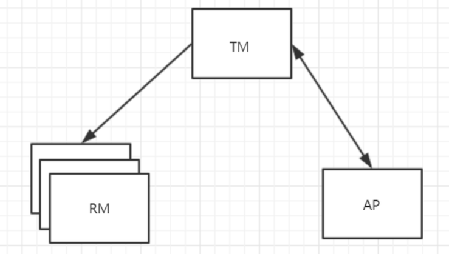

# 分布式事务

- 事务：事务是由一组操作构成的可靠的独立的工作单元，事务具备ACID的特性，即原子性、一致性、隔离性和持久性。
- 本地事务：当事务由资源管理器本地管理时被称作本地事务。本地事务的优点就是支持严格的ACID特性，高效，可靠，状态可以只在资源管理器中维护，而且应用编程模型简单。但是本地事务不具备分布式事务的处理能力，隔离的最小单位受限于资源管理器。
- 全局事务：当事务由全局事务管理器进行全局管理时成为全局事务，事务管理器负责管理全局的事务状态和参与的资源，协同资源的一致提交回滚。
- TX协议：应用或者应用服务器与事务管理器的接口。
- XA协议：全局事务管理器与资源管理器的接口。XA是由X/Open组织提出的分布式事务规范。该规范主要定义了全局事务管理器和局部资源管理器之间的接口。主流的数据库产品都实现了XA接口。XA接口是一个双向的系统接口，在事务管理器以及多个资源管理器之间作为通信桥梁。之所以需要XA是因为在分布式系统中从理论上讲两台机器是无法达到一致性状态的，因此引入一个单点进行协调。由全局事务管理器管理和协调的事务可以跨越多个资源和进程。全局事务管理器一般使用XA二阶段协议与数据库进行交互。
- AP：应用程序，可以理解为使用DTP（Data Tools Platform）的程序。
- RM：资源管理器，这里可以是一个DBMS或者消息服务器管理系统，应用程序通过资源管理器对资源进行控制，资源必须实现XA定义的接口。资源管理器负责控制和管理实际的资源。
- TM：事务管理器，负责协调和管理事务，提供给AP编程接口以及管理资源管理器。事务管理器控制着全局事务，管理事务的生命周期，并且协调资源。
- 两阶段提交协议：XA用于在全局事务中协调多个资源的机制。TM和RM之间采取两阶段提交的方案来解决一致性问题。两节点提交需要一个协调者（TM）来掌控所有参与者（RM）节点的操作结果并且指引这些节点是否需要最终提交。两阶段提交的局限在于协议成本，准备阶段的持久成本，全局事务状态的持久成本，潜在故障点多带来的脆弱性，准备后，提交前的故障引发一系列隔离与恢复难题。
- BASE理论：BA指的是基本业务可用性，支持分区失败，S表示柔性状态，也就是允许短时间内不同步，E表示最终一致性，数据最终是一致的，但是实时是不一致的。原子性和持久性必须从根本上保障，为了可用性、性能和服务降级的需要，只有降低一致性和隔离性的要求。
- CAP定理：对于共享数据系统，最多只能同时拥有CAP其中的两个，任意两个都有其适应的场景，真是的业务系统中通常是ACID与CAP的混合体。分布式系统中最重要的是满足业务需求，而不是追求高度抽象，绝对的系统特性。C表示一致性，也就是所有用户看到的数据是一样的。A表示可用性，是指总能找到一个可用的数据副本。P表示分区容错性，能够容忍网络中断等故障。

# 什么是分布式事务？

对于分布式系统而言，需要保证分布式系统中的数据一致性，保证数据在子系统中始终保持一致，避免业务出现问题。分布式系统中对数要么一起成功，要么一起失败，必须是一个整体性的事务。

分布式事务指事务的参与者、支持事务的服务器、资源服务器以及事务管理器分别位于不同的分布式系统的不同节点之上。

**简单的说，在分布式系统上一次大的操作由不同的小操作组成，这些小的操作分布在不同的服务节点上，且属于不同的应用，分布式事务需要保证这些小操作要么全部成功，要么全部失败。**

举个例子：在电商网站中，用户对商品进行下单，需要在订单表中创建一条订单数据，同时需要在库存表中修改当前商品的剩余库存数量，两步操作一个添加，一个修改，我们一定要保证这两步操作一定同时操作成功或失败，否则业务就会出现问题。

任何事务机制在实现时，都应该考虑事务的ACID特性，包括：本地事务、分布式事务。对于分布式事务而言，即使不能都很好的满足，也要考虑支持到什么程度。

# 分布式事务分类：柔性事务和刚性事务

分布式事务实现方案从类型上去分刚性事务、柔型事务：

- 刚性事务满足CAP的CP理论
- 柔性事务满足BASE理论（基本可用，最终一致）

## 刚性事务

刚性事务：通常无业务改造，强一致性，原生支持回滚/隔离性，低并发，适合短事务。

**原则：刚性事务满足足CAP的CP理论**

> 刚性事务指的是，要使分布式事务，达到像本地式事务一样，具备数据强一致性，从CAP来看，就是说，要达到CP状态。

**刚性事务：XA 协议（2PC、JTA、JTS）、3PC，但由于同步阻塞，处理效率低，不适合大型网站分布式场景。**

## 柔性事务

**柔性事务指的是，不要求强一致性，而是要求最终一致性**，允许有中间状态，也就是Base理论，换句话说，就是AP状态。

> 与刚性事务相比，柔性事务的特点为：有业务改造，最终一致性，实现补偿接口，实现资源锁定接口，高并发，适合长事务。

柔性事务分为：

- 补偿型
- 异步确保型
- 最大努力通知型。

**柔型事务：TCC/FMT、Saga（状态机模式、Aop模式）、本地事务消息、消息事务（半消息）**

# 刚性事务：XA模型、XA接口规范、XA实现

## XA模型 或者 X/Open DTP模型

X/Open **DTP(Distributed Transaction Process)** 是一个分布式事务模型。这个模型主要使用了两段提交(2PC - Two-Phase-Commit)来保证分布式事务的完整性。

在X/Open **DTP(Distributed Transaction Process)**模型里面，有三个角色：

 AP: Application，应用程序。也就是业务层。哪些操作属于一个事务，就是AP定义的。

 TM: Transaction Manager，事务管理器。接收AP的事务请求，对全局事务进行管理，管理事务分支状态，协调RM的处理，通知RM哪些操作属于哪些全局事务以及事务分支等等。这个也是整个事务调度模型的核心部分。

 RM：Resource Manager，资源管理器。一般是数据库，也可以是其他的资源管理器，如消息队列(如JMS数据源)，文件系统等。

XA把参与事务的角色分成AP，RM，TM。AP即应用，也就是我们的业务服务。RM指的是资源管理器，即DB，MQ等。TM则是事务管理器。

AP自己操作TM，当需要事务时，AP向TM请求发起事务，TM负责整个事务的提交，回滚等。

XA规范主要定义了(全局)事务管理器(Transaction Manager)和(局部)资源管理器(Resource Manager)之间的接口。XA接口是双向的系统接口，在事务管理器（Transaction Manager）以及一个或多个资源管理器（Resource Manager）之间形成通信桥梁。

XA之所以需要引入事务管理器是因为，在分布式系统中，从理论上讲（参考Fischer等的论文），两台机器理论上无法达到一致的状态，需要引入一个单点进行协调。事务管理器控制着全局事务，管理事务生命周期，并协调资源。资源管理器负责控制和管理实际资源（如[数据库](http://lib.csdn.net/base/mysql)或JMS队列）

## XA规范

- XA 规范 是 X/Open 组织定义的分布式事务处理（DTP，Distributed Transaction Processing）标准。
- XA 规范 描述了全局的事务管理器与局部的资源管理器之间的接口。 XA规范 的目的是允许的多个资源（如数据库，应用服务器，消息队列等）在同一事务中访问，这样可以使 ACID 属性跨越应用程序而保持有效。
- XA 规范 使用两阶段提交（2PC，Two-Phase Commit）协议来保证所有资源同时提交或回滚任何特定的事务