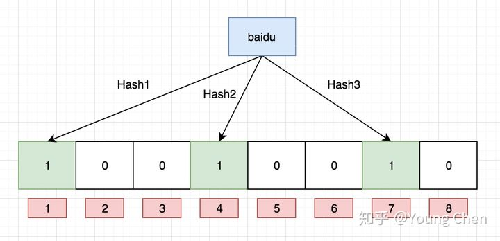
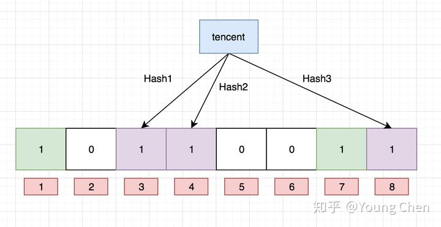

# 一. 什么是布隆过滤器

本质上布隆过滤器是一种数据结构，比较巧妙的概率型数据结构（probabilistic data structure）

特点是高效地插入和查询，可以用来告诉你 **“某样东西一定不存在或者可能存在”**。

相比于传统的 List、Set、Map 等数据结构，它更高效、占用空间更少，但是缺点是其返回的结果是概率性的，而不是确切的。

在大数据的情况下如果使用HashSet保存的话，在40亿的数据量情况下，40亿*4字节=160B，需要16G的内存，内存过大不太适合。如果用布隆过滤器的话，其实需要就是N个bit位的内存大小。

**布隆过滤器会出现误判的情况，误判这个key已经存在**

# 二. 数据结构

布隆过滤器是一个bitmap，每一位的数值只有0和1。分别表示存在或者不在。

# 三. 算法原理

## 1. 插入原理

1. 我们需要使用多个不同的hash函数生成多个哈希值，
2. 每个hash值再取模bitmap的大小就知道这个hash值是存到bitmap的哪个位上了
3. 再把对应bitmap上的位设置成1。
4. 会出现多个hash值取模后会到同一个bitmap位上

例如：

## 2. 查询原理

1. 查询某个key是否存在也是使用插入的hash函数进行生成多个hash值
2. 然后这个hash值取模得到bitmap上位的值
3. 判断所有hash值的bitmap数值是否都为1
4. 只要有1个hash值不为0就认为不存在，如果都为1则**可能**存在

## 3. 如何选择哈希函数个数和布隆过滤器长度

过小的布隆过滤器很快所有的 bit 位均为 1，那么查询任何值都会返回“可能存在”，起不到过滤的目的了。布隆过滤器的长度会直接影响误报率，布隆过滤器越长其误报率越小。

哈希函数的个数也需要权衡，个数越多则布隆过滤器 bit 位置位 1 的速度越快，且布隆过滤器的效率越低；但是如果太少的话，那我们的误报率会变高。

# 四. 问题

## 1. 存在误判的情况

上面的插入例子中，我们可以得到现在bitmap位的情况（10110011）

假设我们要查询alibaba，则alibaba通过几个hash函数算出的几个hash值分别是bitmap上的1，3，4。

那么我们会认为这个alibaba已经存在布隆过滤器中，因为bitmap上的1，3，4的值都1。但是这个3个1都是baidu和tencent造成的。从而导致误判

## 2. 不能删除

因为要删除某个key，需要将bitmap上的位设置成0，但是你并不知道这个位上是否还有其他key再使用，所以不能删除

布隆过滤器还有个缺点就是某个key插入之后就不支持删除了。如果需要支持操作可以通过布谷鸟过滤器