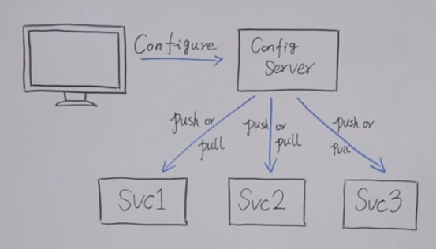

# 一. 微服务介绍

## 1. 介绍

### 1.1 什么是微服务

总结起来微服务就是将一个单体架构的应用按业务划分为一个个的独立运行的程序即服务，它们之间通过HTTP协议进行通信（也可以采用消息队列来通信，如RoocketMQ，Kafaka等），可以采用不同的编程语言，使用不同的存储技术，自动化部署（如Jenkins）减少人为控制，降低出错概率。服务数量越多，管理起来越复杂，因此采用集中化管理。例如Eureka，Zookeeper等都是比较常见的服务集中化管理框架。

### 1.2 微服务的优点

1. **成本低**：将复杂的业务拆分成多个小的业务，每个业务拆分成一个服务，将复杂的问题简单化。利于分工，降低新人的学习成本。
2. **隔离性**：微服务系统是分布式系统，业务与业务之间完全解耦，随着业务的增加可以根据业务再拆分，具有极强的横向扩展能力。面对搞并发的场景可以将服务集群化部署，加强系统负载能力。
3. **轻量级的通信**：服务间采用HTTP协议通信（或者其他通信协议rpc等），服务与服务之间完全独立。每个服务可以根据业务场景选取合适的编程语言和数据库。
4. **单一职责**：微服务每个服务都是独立部署的，每个服务的修改和部署对其他服务没有影响。

### 1.3 微服务框架特点

1. 将系统服务层完全独立出来，并将服务层抽取为一个个的微服务
2. 采用一些轻量协议进行传输
3. 服务拆分粒度更细，有利于资源重复利用，提高开发效率
4. 可以更加精准的指定每个服务的优化方案，提高系统的可维护性
5. 一组小的服务
6. 独立的进程
7. 基于业务能力
8. 独立部署
9. 无集中式管理

### 1.4 微服务的弊端

1. 分布式复杂性
2. 最终一致性
3. 运维复杂性
4. 测试复杂性

# 二. 架构演进

## 1. 单体架构

所有功能集成到一个项目中。整个项目打包就可以部署到服务器运行。应用与数据库可以分开部署，提高性能

### 1.1 优点

1. 开发成本低
2. 架构简单

### 1.2 缺点

1. 项目复杂后，很难维护和扩展
2. 扩展成本高，有瓶颈
3. 技术栈受限

## 2. 垂直架构

对单体架构进行拆分，大项目拆成单个的项目结构。项目之间需要处理数据同步，通过数据库同步

### 2.1 优点

1. 避免了单体架构的无限扩大
2. 技术不再受限制

### 2.2 缺点

1. 存在数据冗余
2. 很多功能放在一个工程中，有一定瓶颈
3. 系统性能拓展要通过集群节点扩展，成本较高

## 3. SOA架构（面向服务的架构）

将重复性功能进行抽取，抽取成对应的服务。需要通过ESB服务总线去访问

### 3.1 优点

1. 提供系统的重用性
2. ESB减少系统接口的耦合问题

### 3.2 缺点

1. 系统与服务界限模糊，不利于开发
2. ESB服务接口协议不固定，不利于系统维护
3. 抽取粒度较大，有一些耦合性

## 4. 微服务架构

将服务层一个一个抽取为单个服务，微服务之间采用轻量之间的协议传输数据。

### 4.1 优点

1. 每个服务单一原则
2. 服务拆分粒度非常细，利于开发
3. 提供系统的可维护性
4. 适用于更新换代快的情况

### 4.2 缺点

1. 服务过多，服务治理成本较高
2. 技术要求过高

# 三. 微服务考虑的问题

## 1. 微服务之间如何通信

### 1.1 从通信模式考虑

|      | 一对一            | 一对多                |
| ---- | ----------------- | --------------------- |
| 同步 | 最常见            |                       |
| 异步 | 通知-请求异步响应 | 发布订阅-发布异步响应 |

### 1.2 从通信协议考虑

|            | RPC                              | REST                                         |
| ---------- | -------------------------------- | -------------------------------------------- |
| 耦合性     | 强耦合                           | 松散耦合                                     |
| 消息协议   | 二进制（thrift，protobuf）       | 文本XML，JSON                                |
| 通信协议   | TPC/HTTP                         | HTTP/HTTP2                                   |
| 性能       | 高                               | 一般低于RPC                                  |
| 客户端     | 强类型客户端，一般自动生成多语言 | 一般HTTP客户端可访问，可自动生成强类型客户端 |
| 开发者友好 | 客户端比较方便，但是二进制不可读 | 文本消息开发者可读                           |
| 案例       | Duboo，tars，grpc，thrift        | SpringMVC                                    |

## 2. 服务发现

微服务发现有两个方式：客户端发现和服务端发现

### 2.1 客户端发现

1. 微服务启动后，将自己的IP和端口号进行注册
2. 客户端查询注册信息，得到提供服务的IP和端口
3. 通过负载均衡，进行访问微服务

### 2.2 服务端发现

1. 微服务启动后，将自己的IP和端口号进行注册
2. 客户端直接通过服务代理进行访问
3. 服务代理内部通过负载均衡算法，进行微服务访问

# 三. 微服务一些常用概念

## 1. RPC服务部署

当 RPC 服务部署在多个节点上时，客户端得到的是一个服务列表，有多个 IP 端口对。客户端的连接池可以随机地挑选任意的 RPC 服务节点进行连接。

每个服务节点应该有个权重值，当所有节点的权重值一样时，它们的流量分配就是均匀的。如果某个节点的相对权重值较小，它被客户端选中的概率也会相对比较小。

## 2. 容灾

当有一个服务节点挂掉时，客户端需要采取一定的策略避免请求失败。当请求失败时，客户端还要进行重试，但是也不可以无限重试，要有一定的重试策略。

比如当节点挂掉时，将失效节点摘除，放置到失效节点列表中。然后每隔一段时间检查失效节点是否恢复了，如果恢复了，那就从失效节点中移除，再将节点地址重新加入到有效节点列表中。那如何判断节点真的挂掉了呢，一般需要设置一个时间窗口，统计在一定时间窗口里出现的错误数量。如果这个数量过大，那就意味着失效了。这也是为了防止网络偶然抖动导致服务节点流量的大幅波动。

## 3. 降权法

上面提到客户端会为每个节点赋予一个权值，改变权值就可以改变节点的相对流量。如果某个节点出现了一次调用错误，可以对该节点进行降权。如果错误次数过多，降权会降的很快，最终达到一个最小值。之所以不应该降到零，那是为了给节点提供一个恢复的机会。被降权的节点后来只要有一次调用成功，那么 weight 值就应该尽快被还原，这样节点就可以快速恢复为正常节点。

客户端一次调用失败会尝试重试。如果降权太慢，会导致重试次数太多，因为第二次随机挑选节点时还是很有可能再次挑选到失效节点。降权太快也不好，网络抖动会导致节点流量分配的快速抖动，瞬间从正常降到近零，又可以瞬间从近零恢复到正常。

一个简单的策略是权重减半法。错误一次权重减半，连续错误两次权重就降到 1/4，如此直到降到最小值。如果初始权重值是 1024，那么权重值就会逐渐衰减1024=>512=>256=>128=>64=>32=>16=>8=>4=>2=>1。如果节点恢复了，那么调用会成功，权重就可以直接恢复到正常值，也可以通过加倍法逐渐恢复到正常值1=>2=>4=>8=>16=>32=>64=>128=>256=>512=>1024。如果希望恢复的更快一点，可以通过乘 4 法，乘 8 法。

## 4. 服务注册与发现

健壮的服务应该是可以支持动态扩容的服务。比如 RPC 服务压力过大，希望通过增加节点的方式来减小单个 RPC 服务的压力。如果使用的是前面的静态 RPC 服务地址列表，那么当节点增加时，我们需要修改客户端的配置重启才能生效。

通过服务注册的方式，动态新增的RPC服务节点添加到注册中心，实现不用重启服务器实现动态增加节点

通过服务发现技术，当 RPC 服务节点增加或减少时，客户端可以动态快速收到服务列表的变更信息，从而可以实时调整连接配置，这样无需重启就可以完成服务的扩容和缩容。

服务发现技术依赖于服务之间的特殊中间节点。**这个节点的作用就是接受服务的注册，提供服务的查找，以及服务列表变更的实时通知功能**。它一般使用支持高可用的分布式配置数据库作为解决方案，如 `zookeeper/etcd` 等。

- 服务注册——服务节点在启动时将自己的服务地址注册到注册中心
- 服务发现——客户端启动时去注册中心查询服务地址列表
- 服务变更通知——客户端在注册中心上订阅依赖服务列表的变更事件。当依赖的服务列表变更时，中间节点负责将变更信息实时通知给客户端。

## 5. API网关

屏蔽内部服务的多样性，对外透露只有一个服务的情况

内部网关作用：

1. 反向路由
2. 认证安全
3. 限流熔断
4. 日志监控

## 6. 配置中心

全局统一配置管理服务。管理多个服务的配置信息，达到配置统一性。能够动态修改配置中心的配置，并且将配置信息推送或者服务拉取配置。

## 7. 服务治理

1. 服务注册发现
2. 服务负载均衡
3. 监控：
   1. 日志监控
   2.  流量监控
   3. 调用链埋点
   4. 限流熔断
4. 安全&访问能控制
5. REST/RPC
6. 序列化（XML/JSON/二进制）
7. 统一异常处理
8. 文档输出
9. 配置集成
10. 后台服务集成（DB,MQ,Cache）

## 8. 熔断，隔离，限流，降级

https://www.cnblogs.com/shijingxiang/articles/12175033.html

### 8.1 熔断

**牺牲局部，保全全局，服务出问题时，切断该服务与系统的联系。**

重试是为了应付偶尔抖动的情况，以求更多地挽回损失。

可是如果provider持续的响应时间超长呢?

如果provider是核心路径的服务，down掉基本就没法提供服务了，那我们也没话说。 如果是一个不那么重要的服务，却因为这个服务一直响应时间长导致consumer里面的核心服务也拖慢，那么就得不偿失了。

单纯超时也解决不了这种情况了，因为一般超时时间，都比平均响应时间长一些，现在所有的打到provider的请求都超时了，那么consumer请求provider的平均响应时间就等于超时时间了，负载也被拖下来了。

而重试则会加重这种问题，使consumer的可用性变得更差。

**因此就出现了熔断的逻辑，也就是，如果检查出来频繁超时，就把consumer调用provider的请求，直接短路掉，不实际调用，而是直接返回一个mock的值。**

等provider服务恢复稳定之后，重新调用。

### 8.2 限流

而provider有时候也要防范来自consumer的流量突变问题。

这样一个场景，provider是一个核心服务，给N个consumer提供服务，突然某个consumer抽风，流量飙升，占用了provider大部分机器时间，导致其他可能更重要的consumer不能被正常服务。

所以，provider端，需要根据consumer的重要程度，以及平时的QPS大小，来给每个consumer设置一个流量上线，同一时间内只会给A consumer提供N个线程支持，超过限制则等待或者直接拒绝。

### 8.3 隔离

使服务之间相互隔离，防止出现**雪崩效应**。

provider可以对consumer来的流量进行限流，防止provider被拖垮。 

同样，consumer 也需要对调用provider的线程资源进行隔离。 这样可以确保调用某个provider逻辑不会耗光整个consumer的线程池资源。

### 8.4 降级

如果说系统后台无法提供足够的支撑能力，那么需要一个降级能力，保护系统不会被进一步恶化，而且可以对用户提供比较友好的柔性方案，例如告知用户暂时无法访问，请在一段时候后重试等等。

#### 8.4.1 consumer 端

consumer 如果发现某个provider出现异常情况，比如，经常超时(可能是熔断引起的降级)，数据错误，这是，consumer可以采取一定的策略，降级provider的逻辑，基本的有直接返回固定的数据。

#### 8.4.2 **provider** 端

当provider 发现流量激增的时候，为了保护自身的稳定性，也可能考虑降级服务。 

比如，1，直接给consumer返回固定数据，2，需要实时写入数据库的，先缓存到队列里，异步写入数据库

### 8.5 服务熔断和服务降级的区别

**服务熔断通常是某个服务（下游服务）故障引发，而服务降级通常是从总体负荷考虑；**
熔断实际上是一个框架级的处理，每一个微服务都须要（无层级之分），而降级通常须要对业务有层级之分（好比降级通常是从最外围服务开始）
实现方式不太同样；服务降级具备代码侵入性(由控制器完成/或自动降级)，熔断通常称为自我熔断。

# 四. Service Mesh

## 1. 介绍

关于Service mesh的定义，最为广泛接受的观点是：它是一种控制应用程序不同部分彼此共享数据的方式。这一描述包含了service mesh的方方面面。事实上，**它听起来更像是大多数开发人员从客户端-服务器应用程序中熟悉的中间件。**

Service mesh也有其独特之处：它能够适应分布式[微服务](https://so.csdn.net/so/search?q=微服务&spm=1001.2101.3001.7020)环境的独特性质。在搭建在微服务中的大规模应用程序中，有许多既定的服务实例，它们跨本地和云服务器运行。所有这些移动部件显然使得各个微服务难以找到他们需要与之通信的其他服务。Service mesh可以在短时间内自动处理发现和连接服务，而无需开发人员以及各个微服务自行匹配。

service mesh将解耦在抽象架构中的与你交互的应用程序的底层基础架构。

## 2. 架构

目前，确定了三种service mesh创建的通信层可能存在的位置：

- 每个微服务导入的library
- 在特定节点提供服务给所有容器的节点agent
- **与应用程序容器一起运行的sidecar容器**

基于sidecar的模式目前是service mesh最受欢迎的模式之一，以至于它在某种程度上已经成为了service mesh的代名词。尽管这种说法并不严谨，但是sidecar已经引起了很大的关注，我们将在下文更详细地研究这一架构。

### 2.1 Sidecar

Sidecar容器与你的应用程序容器一起运行意味着什么呢？**在这类service mesh中每个微服务容器都有另一个proxy容器与之相对应。所有的服务间通信的需求都会被抽象出微服务之外并且放入sidecar。**

这似乎很复杂，毕竟你有效地将应用程序中的容器数量增加了1倍。但你使用的这一种设计模式对于简化分布式应用程序至关重要。通过将所有的网络和通信代码放到单独的容器中，将其作为基础架构的一部分，并使开发人员无需将其作为应用程序的一部分实现。

本质上，你所留下的是一个聚焦于业务逻辑的微服务。这个微服务不需要知道如何在其运行的环境中与所有其他服务进行通信。它只需要知道如何与sidecar进行通信即可，剩下的将由sidecar完成。

## 3. 总结

服务网格是一个**基础设施层**，用于处理服务间通信。云原生应用有着复杂的服务拓扑，服务网格保证**请求在这些拓扑中可靠地穿梭**。在实际应用当中，服务网格通常是由一系列轻量级的**网络代理**组成的，它们与应用程序部署在一起，但**对应用程序透明**。

+ **基础设施层**+**请求在这些拓扑中可靠穿梭**：这两个词加起来描述了Service Mesh的定位和功能，是不是似曾相识？没错，你一定想到了TCP；

+ **网络代理**：这描述了Service Mesh的实现形态；

+ **对应用透明**：这描述了Service Mesh的关键特点，正是由于这个特点，Service Mesh能够解决以Spring Cloud为代表的第二代微服务框架所面临的三个本质问题；

总结一下，Service Mesh具有如下优点：

- 屏蔽分布式系统通信的复杂性(负载均衡、服务发现、认证授权、监控追踪、流量控制等等)，服务只用关注业务逻辑；
- 真正的语言无关，服务可以用任何语言编写，只需和Service Mesh通信即可；
- 对应用透明，Service Mesh组件可以单独升级；

当然，Service Mesh目前也面临一些挑战：

- Service Mesh组件以代理模式计算并转发请求，一定程度上会降低通信系统性能，并增加系统资源开销；
- Service Mesh组件接管了网络流量，因此服务的整体稳定性依赖于Service Mesh，同时额外引入的大量Service Mesh服务实例的运维和管理也是一个挑战；

------

参考：

https://blog.csdn.net/wohu1104/article/details/115764681

https://blog.csdn.net/sunming709424/article/details/80578559

https://www.bilibili.com/video/BV1em4y1Q7nQ?p=1

https://www.bilibili.com/video/BV137411H7t9?p=1

https://www.cnblogs.com/shijingxiang/articles/12175033.html

https://zhuanlan.zhihu.com/p/61901608

https://blog.csdn.net/cenmeng8703/article/details/100959467