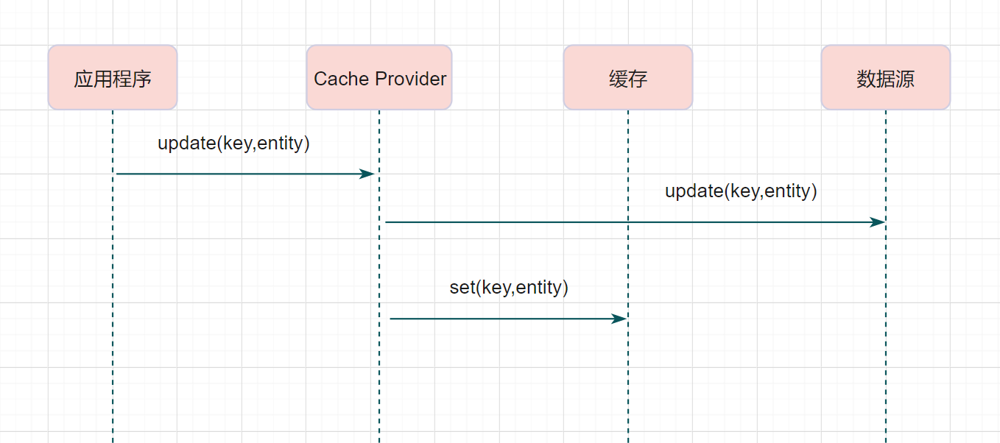
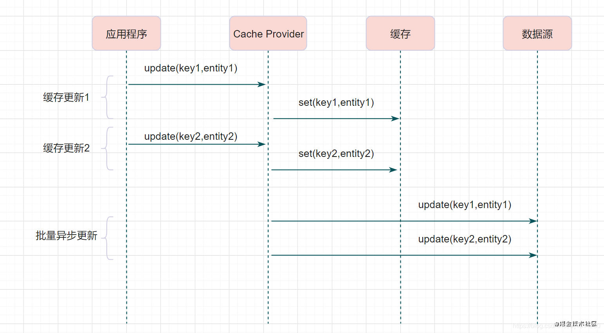
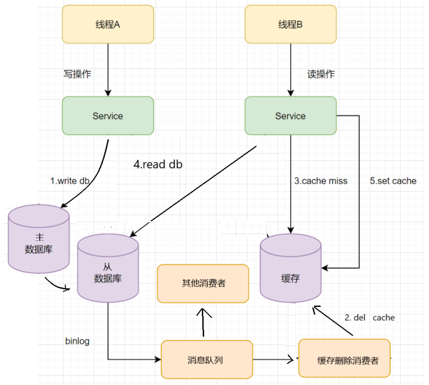
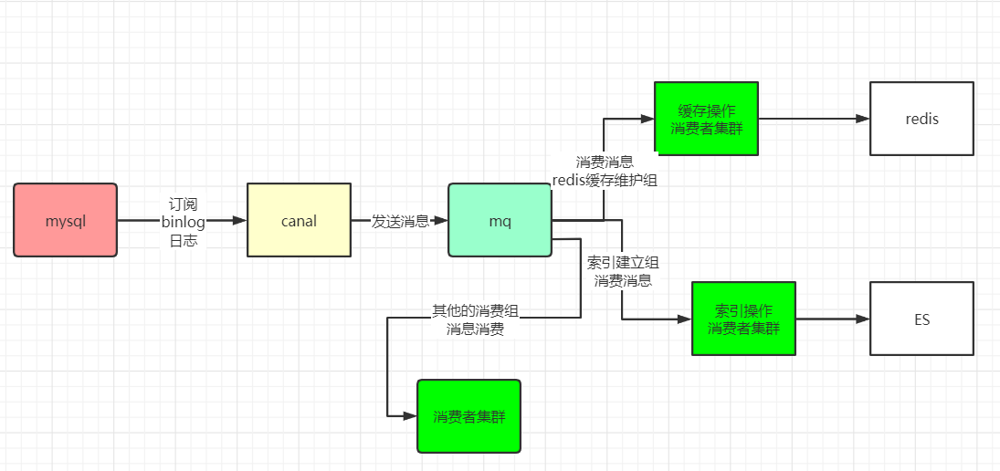
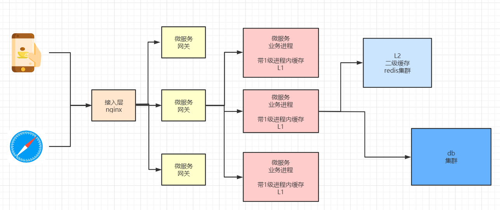
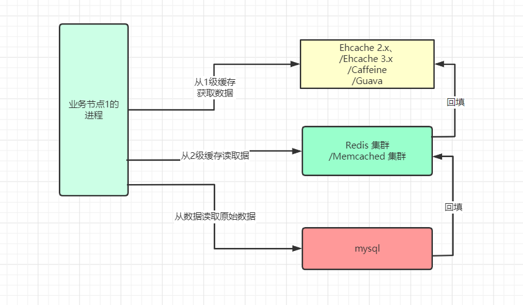
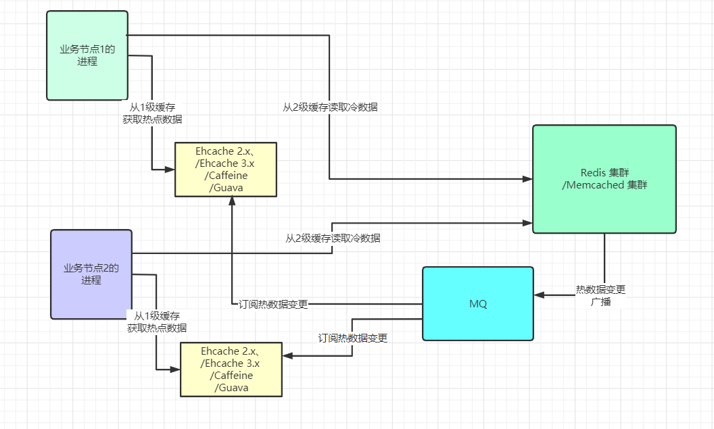
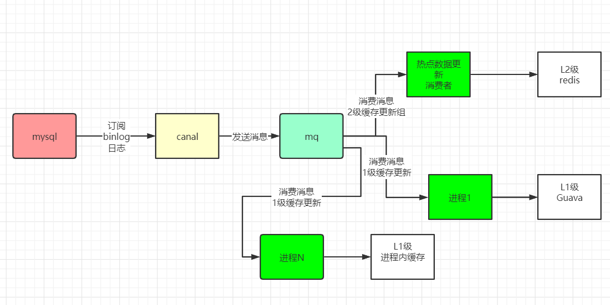

# 一. 数据一致性解决方案概述

**数据一致性分为多副本数据一致性和分布式事务数据一致性**，两者的差别在于：

多副本数据一致性：同个系统多副本下不同节点之间的数据内容是一样的。数据多副本一般用于容灾及高可用，副本之间通过同步复制或者异步复制的方式达到数据一致。

分布式事务数据一致性：不同系统之间的数据内容是不一样的，分布式事务数据一致性，一般通过分布式事务来保证。

事务提供了一种机制，将一个活动涉及的所有操作纳入一个不可分割的执行单元，组成事务的所有操作只有在所有操作均能正常执行的情况下才能提交，其中任一操作执行失败，都将导致整个事务的回滚。按参与方的个数和性质，事务分为本地事务和分布式事务。

本地事务指数据库单机的事务处理，优点是支持严格的ACID特性：高效、可靠、状态可以只在资源管理器中维护、应用编程模型简单。但是本地事务不具备分布式事务的处理能力，隔离的最小单位受限于资源管理器。一般的关系型数据库可以较好实现本地事务的ACID特性。

分布式事务指事务的参与者、支持事务的服务器、资源服务器以及事务管理器分别位于不同的分布式系统的不同节点上。简单来说，就是一次大的操作由不同的小操作组成，这些小操作分布在不同的服务器上，且属于不同的应用，分布式事务需要保证这些小操作要么全部成功，要么全部失败。本质上来说，分布式事务就是为了保证不同数据库的数据一致性。

事务的参与方可能不仅是数据库，还包括消息队列、缓存、对象存储等其他异构的数据源，当事务由全局事务管理器进行全局管理时成为全局事务，事务管理器负责管理全局的事务状态和参与的资源，协同资源的一致提交回滚。

在强一致性的分布式环境下，一次交易请求对多个数据源的数据执行完整性以及一致性的操作，满足事务的特性，要么全部成功，要么全部失败，保证原子性以及可见性。强一致性通过锁定资源的方式确保分布式并发下数据不会产生脏读脏写的情况，但以牺牲性能为代价。一般来说，强一致性的分布式事务会比单机的本地事务性能下降一个数量级左右，因此在实际应用场景中使用时，需要谨慎评估业务上是否一定要求强一致性事务，可否在业务上做一些取舍和折中，或者改为性能更强一点的最终一致性方案。

**所谓强一致性，即复制是同步的；弱一致性，即复制是异步的。弱一致性主要针对数据读取而言，为了提升系统的数据吞吐量，允许一定程度上的数据“脏读”。某个进程更新了副本的数据，但是系统不能保证后续进程能够读取到最新的值。典型场景是读写分离，例如对于一主一备异步复制的关系型数据库，如果读的是备库（或者只读库），就可能无法读取主库已经更新过的数据，所以是弱一致性。**

最终一致性不追求任意时刻系统都能满足数据完整且一致的要求，系统本身具有一定的“自愈”能力，通过一段业务上可接受的时间之后，系统能够达到数据完整且一致的目标。最终一致性有很多解决方案，如通过消息队列实现分布式订阅处理、数据复制、数据订阅、事务消息、尝试-确认-取消（Try-Confirm- Cancel，TCC）事务补偿等不同的方案
https://blog.51cto.com/key3feng/5286284

# 二. 数据一致性

一致性就是数据保持一致，在分布式系统中，可以理解为多个节点中数据的值是一致的。

- 强一致性：这种一致性级别是最符合用户直觉的，它要求系统写入什么，读出来的也会是什么，用户体验好，但实现起来往往对系统的性能影响大
- 弱一致性：这种一致性级别约束了系统在写入成功后，不承诺立即可以读到写入的值，也不承诺多久之后数据能够达到一致，但会尽可能地保证到某个时间级别（比如秒级别）后，数据能够达到一致状态
- 最终一致性：最终一致性是弱一致性的一个特例，系统会保证在一定时间内，能够达到一个数据一致的状态。这里之所以将最终一致性单独提出来，是因为它是弱一致性中非常推崇的一种一致性模型，也是业界在大型分布式系统的数据一致性上比较推崇的模型

# 三. Redis和MySQL数据一致性

缓存可以提升性能、缓解数据库压力，但是使用缓存也会导致数据不一致性的问题。一般我们是如何使用缓存呢？有三种经典的缓存模式：

- Cache-Aside Pattern
- Read-Through/Write through
- Write behind

## 1. Cache-Aside Pattern（旁路缓存模式）

Cache-Aside Pattern，即旁路缓存模式，它的提出是为了尽可能地解决缓存与数据库的数据不一致问题。

> 读流程
>
> 读的时候，先读缓存，缓存命中的话，直接返回数据;
>
> 缓存没有命中的话，就去读数据库，从数据库取出数据，放入缓存后，同时返回响应。

> 写流程
>
> 更新的时候，先更新数据库，然后再删除缓存。

## 2. Read-Through/Write-Through（读写穿透）

Read/Write Through模式中，服务端把缓存作为主要数据存储。应用程序跟数据库缓存交互，都是通过抽象缓存层完成的。

### 2.1 读流程

1. 从缓存读取数据，读到直接返回
2. 如果读取不到的话，从数据库加载，写入缓存后，再返回响应。

Read-Through实际只是在Cache-Aside之上进行了一层封装，它会让程序代码变得更简洁，同时也减少数据源上的负载。

### 2.2 写流程

Write-Through模式下，当发生写请求时，也是由缓存抽象层完成数据源和缓存数据的更新（同步）

## 3. Write behind （异步缓存写入）

Write behind跟Read-Through/Write-Through有相似的地方，都是由Cache Provider来负责缓存和数据库的读写。

**它两又有个很大的不同：Read/Write Through是同步更新缓存和数据的，Write Behind则是只更新缓存，不直接更新数据库，通过批量异步的方式来更新数据库。**

**这种方式下，缓存和数据库的一致性不强，对一致性要求高的系统要谨慎使用。**

> 但是它适合频繁写的场景，MySQL的InnoDB Buffer Pool机制就使用到这种模式。

## 4. 三种模式的比较

Cache Aside 更新模式实现起来比较简单，但是需要维护两个数据存储:

- 一个是缓存（Cache）
- 一个是数据库（Repository）。

Read/Write Through 的写模式需要维护一个数据存储（缓存），实现起来要复杂一些。

Write Behind Caching 更新模式和Read/Write Through 更新模式类似，区别是Write Behind Caching 更新模式的数据持久化操作是**异步的**，但是Read/Write Through 更新模式的数据持久化操作是**同步的**。

Write Behind Caching 的优点是直接**操作内存速度快**，多次操作可以合并持久化到数据库。缺点是数据可能会丢失，例如系统断电等。

## 5. Cache-Aside的问题

### 5.1 更新数据的时候，Cache-Aside是删除缓存呢，还是应该更新缓存？

**删除缓存更好**

操作的次序如下：

+ 线程A先发起一个写操作，第一步先更新数据库
+ 线程B再发起一个写操作，第二步更新了数据库
+ 现在，由于网络等原因，线程B先更新了缓存, 线程A更新缓存。
+ 这时候，缓存保存的是A的数据（老数据），数据库保存的是B的数据（新数据），数据不一致了，脏数据出现啦。如果是删除缓存取代更新缓存则不会出现这个脏数据问题。

更新缓存相对于删除缓存，还有两点劣势：

1. 如果你写入的缓存值，是经过复杂计算才得到的话。 更新缓存频率高的话，就浪费性能啦。
2.  在写多读少的情况下，数据很多时候还没被读取到，又被更新了，这也浪费了性能呢(实际上，写多的场景，用缓存也不是很划算了)

任何的措施，也不是绝对的好， 只有分场景看是不是适合，更新缓存的措施，也是有用的：

> 在读多写少的场景，价值大。

### 5.2 双写的情况下，先操作数据库还是先操作缓存？

假设有A、B两个请求，请求A做更新操作，请求B做查询读取操作。

A、B两个请求的操作流程如下：

1. 线程A发起一个写操作，第一步del cache
2. 此时线程B发起一个读操作，cache miss
3. 线程B继续读DB，读出来一个老数据
4. 然后线程B把老数据设置入cache
5. 线程A写入DB最新的数据

酱紫就有问题啦，缓存和数据库的数据不一致了。

**缓存保存的是老数据，数据库保存的是新数据。因此，Cache-Aside缓存模式，选择了先操作数据库而不是先操作缓存。**

## 6. 3种方案保证数据库与缓存的一致性

3种方案保证数据库与缓存的一致性，都能保证**最终一致性**

- 延时双删策略
- 删除缓存重试机制
- 读取biglog异步删除缓存

### 6.1 缓存延时双删

1. 先删除缓存
2. 再更新数据库
3. 休眠一会（比如1秒），再次删除缓存。

> 这个休眠时间 = 读业务逻辑数据的耗时 + 几百毫秒。

为了确保读请求结束，写请求可以删除读请求可能带来的缓存脏数据。

### 6.2 删除缓存重试机制

不管是延时双删还是Cache-Aside的先操作数据库再删除缓存，如果第二步的删除缓存失败，删除失败会导致脏数据。

删除失败就多删除几次呀,保证删除缓存成功呀~ 所以可以引入删除缓存重试机制

**删除缓存重试机制的大致步骤：**

- 写请求更新数据库
- 缓存因为某些原因，删除失败
- 把删除失败的key放到消息队列
- 消费消息队列的消息，获取要删除的key
- 重试删除缓存操作

### 6.3 同步biglog异步删除缓存

重试删除缓存机制还可以，就是会造成好多业务代码入侵。

**其实，还可以通过数据库的binlog来异步淘汰key。**

以mysql为例 可以使用阿里的canal将binlog日志采集发送到MQ队列里面，然后编写一个简单的缓存删除消息者订阅binlog日志，根据更新log删除缓存，并且通过ACK机制确认处理这条更新log，保证数据缓存一致性

**为了保证消息是肯定被至少消费成功一次，RocketMQ会把这批消费失败的消息重发回Broker（topic不是原topic而是这个消费租的RETRY topic），在延迟的某个时间点（默认是10秒，业务可设置）后，再次投递到这个ConsumerGroup。而如果一直这样重复消费都持续失败到一定次数（默认16次），就会投递到DLQ死信队列。应用可以监控死信队列来做人工干预。**

因为主从DB同步存在延时时间。如果删除缓存之后，数据同步到备库之前已经有请求过来时， **「会从备库中读到脏数据」**

## 7. 缓存与数据的一致性的保障策略总结

在分布式系统中，缓存和数据库同时存在时，**如果有写操作的时候，「先操作数据库，再操作缓存」**。如下：

读流程：

1. 读取缓存中是否有相关数据
2. 如果缓存中有相关数据value，则返回
3. 如果缓存中没有相关数据，则从数据库读取相关数据放入缓存中key->value，再返回

写流程：

1. 如果有更新数据，则先更新数据库，再删除缓存
2. 为了保证第四步删除缓存成功，使用binlog异步删除
3. 如果是主从数据库，binglog取自于从库
4. 如果是一主多从，每个从库都要采集binlog，然后消费端收到最后一台binlog数据才删除缓存，或者为了简单，收到一次更新log，删除一次缓存

## 8. canal原理

canal是一个伪装成slave订阅mysql的binlog，实现数据同步的中间件。

- canal 模拟 MySQL slave 的交互协议，伪装自己为 MySQL slave ，向 MySQL master 发送 dump 协议
- MySQL master 收到 dump 请求，开始推送 binary log 给 slave (即 canal )
- canal 解析 binary log 对象(原始为 byte 流)

# 四. L2级缓存与数据库的数据一致性

## 1. 集中式缓存需要考虑的问题

如果只是单纯的整合Redis缓存，那么可能出现如下的问题

- 热点数据的大量访问，能对系统造成各种网络开销，影响系统的性能
- 一旦集中式缓存发生雪崩了，或者缓存被击穿了，能造成数据库的压力增大，可能会被打死，造成数据库挂机状态，进而造成服务宕机
- 缓存雪崩，访问全部打在数据库上，数据库也可能会被打死

为了解决以上可能出现的问题，让缓存层更稳定，健壮，我们使用二级缓存架构

- 1级为本地缓存，或者进程内的缓存（如 Ehcache） —— 速度快，进程内可用
- 2级为集中式缓存（如 Redis）—— 可同时为多节点提供服务

**本地缓存相对于IO操作** 速度快，效率高 **相对于Redis** 是一种优秀的分布式缓存实现，受限于网卡等原因，远水救不了近火

所以：DB + Redis + LocalCache = 高效存储，高效访问

## 2. 本地缓存的适用场景

**本地缓存一般适合于缓存只读、量少、高频率访问的数据。如秒杀商品数据。**

或者每个部署节点独立的数据，如长连接服务中，每个部署节点由于都是维护了不同的连接，每个连接的数据都是独立的，并且随着连接的断开而删除。如果数据在集群的不同部署节点需要共享和保持一致，则需要使用分布式缓存来统一存储，实现应用集群的所有应用进程都在该统一的分布式缓存中进行数据存取即可。

## 3. 本地缓存的优缺点

### 3.1 优点 

**访问速度快，但无法进行大数据存储**

- 本地缓存位于同一个进程的堆中，相对于分布式缓存的好处是，故性能更好，减少了跨网络传输，
- 但是本地缓存由于占用 进程内存空间 （或者进程的内存空间），故不能进行大数据量的数据存储。

### 3.2 缺点

**数据一致性问题**

本地缓存只支持被该应用进程访问，一般无法被其他应用进程访问，如果对应的数据库数据，存在数据更新，则需要同步更新不同节点的本地缓存副本，来保证数据一致性

本地缓存的更新，复杂度较高并且容易出错，如基于 Redis 的发布订阅机制、或者消息队列MQ来同步更新各个部署节点。

### 3.3 对比

| 数据库   | 本地缓存             | 分布式缓存                       |                                                              |
| -------- | -------------------- | -------------------------------- | ------------------------------------------------------------ |
| 存储位置 | 存盘，数据不丢失     | 不存盘，之前的数据丢失           | 不存盘，数据丢失                                             |
| 持久化   | 可以                 | 不可以                           | 不可以                                                       |
| 访问速度 | 慢                   | 最快                             | 快                                                           |
| 可扩展   | 可存在其他机器的硬盘 | 只能存在本机内存                 | 可存在其他机器的内存                                         |
| 使用场景 | 需要实现持久化保存   | 需要快速访问，但需要考虑内存大小 | 1）需要快速访问，不需要考虑内存大小 2）需要实现持久化，但会丢失一些数据 3）需要让缓存集中在一起，访问任一机器上内存中的数据都可以从缓存中得到 |

## 4. 本地缓存与集中式缓存的结合的需求场景

单独使用本地缓存与集中式缓存，都会有各自的短板。

1. 使用本地缓存时，一旦应用重启后，由于缓存数据丢失，缓存雪崩，给数据库造成巨大压力，导致应用堵塞
2. 使用本地缓存时，多个应用节点无法共享缓存数据
3. 使用集中式缓存，由于大量的数据通过缓存获取，导致缓存服务的数据吞吐量太大，带宽跑满。现象就是 Redis 服务负载不高，但是由于机器网卡带宽跑满，导致数据读取非常慢

按照80/20原则，如果我们把20%的热点数据，放在本地缓存，如果我们不用每次页面访问的时候都去 Redis 读取数据，那么 Redis 上的数据流量至少降低 80%的带宽流量，甚至于一个很小的 Redis 集群可以轻松应付。

## 5. L2级缓存的数据读取和更新

### 5.1 数据读取

1. 先从本地缓存（1级缓存）读取数据
2. 如果有则直接返回
3. 如果没有则从分布式缓存中读取（2级缓存），并且回写到本地缓存

### 5.2 数据更新

通过消息队列，或者其他广播模式的发布订阅，保持各个一级缓存的数据一致性。

> 这一点，与Cache-Aside模式不同，Cache-Aside只是删除缓存即可。但是热点数据，如果删除，很容易导致缓存击穿。

对于秒杀这样的场景，瞬间有十几万甚至上百万的请求要同时读取商品。如果没有缓存，每一个请求连带的数据操作都需要应用与数据库生成connection，而数据库的最大连接数是有限的，一旦超过数据库会直接宕机。这就是缓存击穿。

缓存击穿与 缓存穿透的简单区别：

- 缓存击穿是指数据库中有数据，但是缓存中没有，大量的请求打到数据库；
- 缓存穿透是指缓存和数据库中都没有的数据，而用户不断发起请求，如发起为id为“-1”的数据或id为特别大不存在的数据。这时的用户很可能是攻击者，攻击会导致数据库压力过大。

## 6. 二级缓存缓存击穿解决方案

1. 设置热点数据永远不过期。
2. 如果过期则或者在快过期之前更新，如有变化，主动刷新缓存数据，同时也能保障数据一致性
3. 加互斥锁，保障缓存中的数据，被第一次请求回填。此方案不适用于超高并发场景

## 7. L2级缓存与数据库的数据一致性保障方案：

- 方案1：biglog同步保障数据一致性
- 方案2：使用程序方式发送更新消息，保障数据一致性

### 7.1 方案1：biglog同步保障数据一致性的架构：

可以通过biglog同步，来保障二级缓存的数据一致性，具体的架构如下

`rocketMQ`是支持广播消费的，只需要在消费端进行配置即可，`rocketMQ`默认情况下使用的是集群消费，这就意味着如果我们配置了多个消费者实例，只会有一个实例消费消息。

https://www.cnblogs.com/crazymakercircle/p/14853622.html