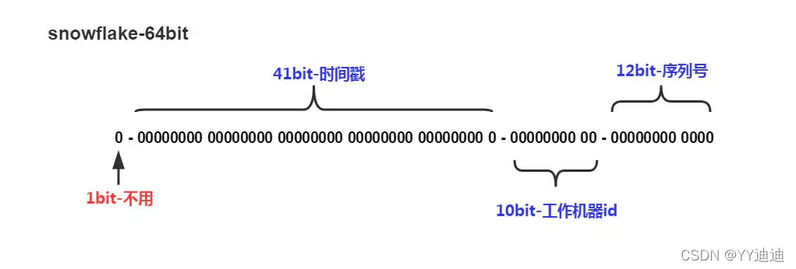

# 一. 要求

1. 自增：用于数据库主键，分库分表场景
2. 尽可能无规律：安全

# 二. 解决方案

## 1. 数据库自增id

利用数据库行锁机制，每次只有一个能操作成功。基于数据库的`auto_increment`自增ID完全可以充当`分布式ID`，具体实现：需要一个单独的MySQL实例用来生成ID，建表结构如下：

```mysql
CREATE DATABASE `SEQ_ID`;
CREATE TABLE SEQID.SEQUENCE_ID (
    id bigint(20) unsigned NOT NULL auto_increment, 
    value char(10) NOT NULL default '',
    PRIMARY KEY (id),
) ENGINE=MyISAM;

insert into SEQUENCE_ID(value)  VALUES ('values');
```

当我们需要一个ID的时候，向表中插入一条记录返回`主键ID`，但这种方式有一个比较致命的缺点，访问量激增时MySQL本身就是系统的瓶颈，用它来实现分布式服务风险比较大，不推荐！

**优点：**

- 实现简单，ID单调自增，数值类型查询速度快

**缺点：**

- 系统不能水平扩展，DB单点存在宕机风险
- 每次获取ID都需要获取数据库字段，加表锁，无法扛住高并发场景

## 2. 预分配ID（mysql版本）

从数据库批量的获取自增ID，每次从数据库取出一个号段范围，例如 (1,1000] 代表1000个ID，具体的业务服务将本号段，生成1~1000的自增ID并加载到内存。等这批号段ID用完，再次向数据库申请新号段，对`max_id`字段做一次`update`操作，`update max_id= max_id + step`，update成功则说明新号段获取成功，新的号段范围是`(max_id ,max_id +step]`。

由于多业务端可能同时操作，所以采用版本号`version`乐观锁方式更新，这种`分布式ID`生成方式不强依赖于数据库，不会频繁的访问数据库，对数据库的压力小很多

```mysql
CREATE TABLE id_generator (
  id int(10) NOT NULL,
  max_id bigint(20) NOT NULL COMMENT '当前最大id',
  step int(20) NOT NULL COMMENT '号段的布长',
  biz_type	int(20) NOT NULL COMMENT '业务类型',
  version int(20) NOT NULL COMMENT '版本号',
  PRIMARY KEY (`id`)
) 


BEGIN 
	UPDATE table SET max_id=max_id+step WHERE biz_tag=xxx an dversion = version + 1 where version = #{version}
    SELECT tag,max_id,step FROM table WHERE biz_tag=xxx
COMMIT
```

## 3. 预分配ID（redis版本）

当使用数据库来生成ID性能不够要求的时候，我们可以尝试使用Redis来生成ID。这主要依赖于Redis是单线程的，所以也可以用生成全局唯一的ID。可以用Redis的原子操作 INCR和INCRBY来实现。redis incr操作最大支持在64位有符号的整型数字。

**缺点：**

+ redis 宕机后不可用，RDB重启数据丢失会重复ID
+ 自增，数据量易暴露。

**优点：**

+ 使用内存，并发性能好

```redis
INCRBY KEY_NAME INCR_AMOUNT
```

## 4.  雪花算法

### 4.1 算法

SnowFlake可以保证所有生成的ID按时间趋势递增整个分布式系统内不会产生重复ID



1. **第一位**：占用1bit，其值始终是0，确保ID是正数。
2. **时间戳**：占用41bit，精确到毫秒，总共可以容纳约69年的时间。
3. **工作机器id**：占用10bit，其中高位5bit是数据中心ID，低位5bit是工作节点ID，做多可以容纳1024个节点。（简单理解成机器的唯一ID）
4. **序列号**：占用12bit，每个节点每毫秒0开始不断累加，最多可以累加到4095，一共可以产生4096个ID。以表示的最大正整数是4095，即可以用0、1、2、3、…4094这4095个数字，来表示同一机器同一时间截（毫秒)内产生的4095个ID序号。用来表示在同一毫秒内产生ID的个数，最多产生4095个ID，多余的需要等到下一毫秒生成

### 4.2 雪花算法缺点：

1. 依赖机器时钟，如果机器时钟回拨，会导致重复ID生成

2. 在单机上是递增的，但是由于设计到分布式环境，每台机器上的时钟不可能完全同步，有时候会出现不是全局递增的情况（此缺点可以认为无所谓，一般分布式ID只要求趋势递增，并不会严格要求递增～90%的需求都只要求趋势递增）

### 4.3 时钟回拨解决方案：


1. 算法中记录上一次**生成的时间戳**，发现有时间回退时，将时间回拨位加 1，继续生成 ID。这样虽然时间戳字段的值可能和之前的一样，但是回拨位的值不一样，生成的 ID 是不会重复的。
2. 如果系统的时间超过了上一次的回退时间后可以把回拨位归 0。一位回拨位可以允许系统时间回退一次，两位回拨位可以允许系统时间连续回退三次。一般设置一位回拨位就够用了。
   算法记录上一次生成的时间戳，发现有时间回退时，降级为数据库形式获取。

# 三. 参考

https://blog.csdn.net/u014618114/article/details/122737977
