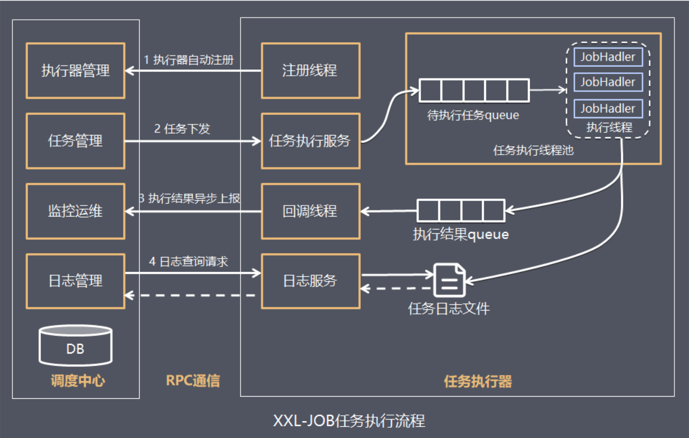
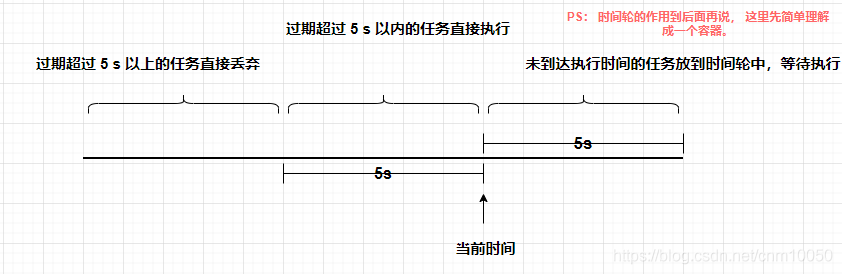
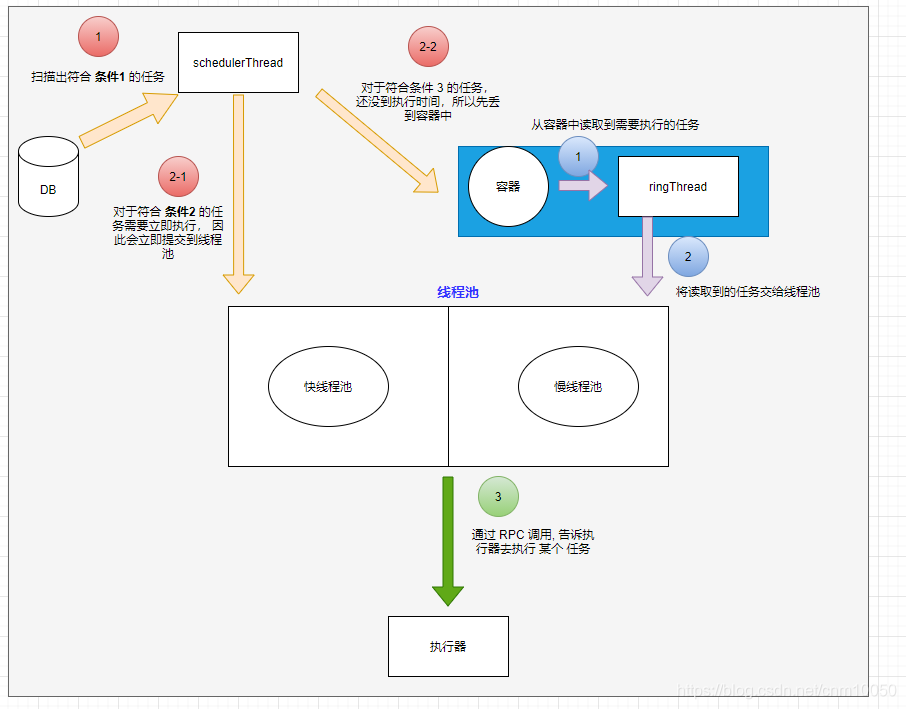
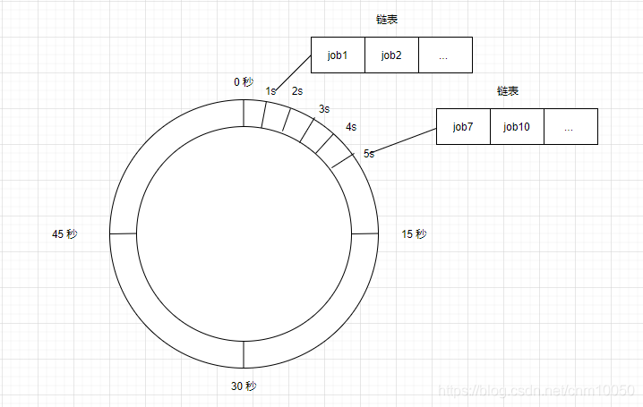

# 一. XXL-JOB

XXL-JOB是一个分布式任务调度平台，其核心设计目标是开发迅速、学习简单、轻量级、易扩展。现已开放源代码并接入多家公司线上产品线，开箱即用。在众多XXL-Job平台的特征中，有如下几条需要关注的：

1、使用简单：支持通过Web页面对任务配置，降低操作任务的难度；

2、动态：支持动态修改任务状态、启动/停止任务，以及终止运行中任务，即时生效；

3、调度中心HA（中心式）：调度采用中心式设计，“调度中心”自研调度组件并支持集群部署，可保证调度中心HA；

4、执行器HA（分布式）：任务分布式执行，任务”执行器”支持集群部署，可保证任务执行HA；

5、注册中心: 执行器会周期性自动注册任务, 调度中心将会自动发现注册的任务并触发执行。同时，也支持手动录入执行器地址；

6、弹性扩容缩容：一旦有新执行器机器上线或者下线，下次调度时将会重新分配任务；

7、触发策略：提供丰富的任务触发策略，包括：Cron触发、固定间隔触发、固定延时触发、API（事件）触发、人工触发、父子任务触发；

其他的特性这里不赘述了，有兴趣的同学可以去[官网](https://www.xuxueli.com/)查看。

# 二. 整体架构

## 1. 组成

在XXL-Job的设计思路中将调度行为抽象形成“调度中心”公共平台，而平台自身并不承担业务逻辑，“调度中心”负责发起调度请求。将任务抽象成分散的JobHandler，交由“执行器”统一管理，“执行器”负责接收调度请求并执行对应的JobHandler中业务逻辑。因此，“调度”和“任务”两部分可以相互解耦，提高系统整体稳定性和扩展性。

我们来分别描述调度中心和执行器肩负的工作：

- 调度中心： 负责管理调度信息，按照调度配置发出调度请求，自身不承担业务代码。调度系统与任务解耦，提高了系统可用性和稳定性，同时调度系统性能不再受限于任务模块； 支持可视化、简单且动态的管理调度信息，包括任务新建，更新，删除，任务报警等，所有上述操作都会实时生效，同时支持监控调度结果以及执行日志，支持执行器Failover
- 执行器： 负责接收调度请求并执行任务逻辑。任务模块专注于任务的执行等操作，开发和维护更加简单和高效； 接收“调度中心”的执行请求、终止请求和日志请求等

## 2. 调度模块

### 2.1 自研调度模块

XXL-JOB最终选择自研调度组件（早期调度组件基于Quartz）；一方面是为了精简系统降低冗余依赖，另一方面是为了提供系统的可控度与稳定性；

XXL-JOB中“调度模块”和“任务模块”完全解耦，调度模块进行任务调度时，将会解析不同的任务参数发起远程调用，调用各自的远程执行器服务。这种调用模型类似RPC调用，调度中心提供调用代理的功能，而执行器提供远程服务的功能。

### 2.2 调度中心HA（集群）

基于数据库的集群方案，数据库选用Mysql；集群分布式并发环境中进行定时任务调度时，会在各个节点会上报任务，存到数据库中，执行时会从数据库中取出触发器来执行，如果触发器的名称和执行时间相同，则只有一个节点去执行此任务。

### 2.3 调度线程池

调度采用线程池方式实现，避免单线程因阻塞而引起任务调度延迟。

### 2.4 并行调度

XXL-JOB调度模块默认采用并行机制，在多线程调度的情况下，调度模块被阻塞的几率很低，大大提高了调度系统的承载量。

XXL-JOB的不同任务之间并行调度、并行执行。
XXL-JOB的单个任务，针对多个执行器是并行运行的，针对单个执行器是串行执行的。同时支持任务终止。

### 2.5 过期处理策略

任务调度错过触发时间时的处理策略：

- 可能原因：服务重启；调度线程被阻塞，线程被耗尽；上次调度持续阻塞，下次调度被错过；
- 处理策略：
  - 过期超5s：本次忽略，当前时间开始计算下次触发时间
  - 过期5s内：立即触发一次，当前时间开始计算下次触发时间

### 2.6 任务依赖

原理：XXL-JOB中每个任务都对应有一个任务ID，同时，每个任务支持设置属性“子任务ID”，因此，通过“任务ID”可以匹配任务依赖关系。

当父任务执行结束并且执行成功时，将会根据“子任务ID”匹配子任务依赖，如果匹配到子任务，将会主动触发一次子任务的执行。

# 三. 原理

## 1. 任务执行器

### 1.1 概述

1. 任务执行器根据配置的调度中心的地址，启动注册线程向调度中心的执行器管理发起自动注册。调度中心保存着注册执行器，后续会根据这个注册信息给执行器下发任务。
2. 如果此时有需要执行的任务，任务管理模块会根据执行器管理中注册的执行器信息，向任务执行器下发任务。任务执行器中的任务执行服务接受到任务以后会将任务发送到待执行任务的队列中，队列中的任务会由执行线程JobHandler依次获取并且执行。这里会维护一个任务执行的线程池，池中就是一个个JobHandler线程，它们是执行任务的主力军。
3. JobHandler执行器基于线程池执行任务，并把执行结果放入执行结果队列中，同时会把执行日志写入任务日志文件中，以供日志查询。然后通知毁掉线程，告知任务执行完毕，回调线程会通知调度中心的监控运维模块，任务执行完毕。
4. 用户可以在调度中心查看任务日志，其过程是通过发送日志查询请求给任务执行器中的日志服务，然后查询任务日志文件实现的。

### 1.2 总结

1. 执行器内部有任务队列，任务线程池，结果队列和日志文件
2. 任务队列：接收调度中心发来的任务
3. 任务线程池：从任务队列中获取任务并发给某个任务线程执行
4. 结果队列：任务线程执行完成后会将结果保存到结果队列，由结果队列异步定时上报给调度中心
5. 日志文件：每个任务执行情况发给调度中心

## 2. 调度中心

### 2.1 概述

系统主要通过MySQL管理各种定时任务信息，当到了定时任务的触发时间，就把任务信息从db中拉进内存，对任务执行器发起触发请求。

定时触发任务是如何实现：使用时间轮实现

1. xxl_job_info表是记录定时任务的db表，里面有个trigger_next_time（Long）字段，表示下一次触发的时间点
2. 任务时间被修改 / 每一次任务触发后，可以根据cronb表达式计算下一次触发时间戳：Date nextValidTime = new CronExpression(jobInfo.getJobCron()).getNextValidTimeAfter(new Date())），更新trigger_next_time字段

定时执行任务逻辑：

1. 定时任务scheduleThread：不断从db把5秒内要执行的任务读出，立即触发 / 放到时间轮等待触发，并更新trigger_next_time
   1. 获取当前时间now
   2. 轮询db，找出trigger_next_time在距now 5秒内的任务
      1. 对到达now时间后的任务（超出now 5秒外）：`过期处理策略1`
         1. 直接跳过不执行；
         2. 重置trigger_next_time
      2. 对到达now时间后的任务（超出now 5秒内）：`过期处理策略2`
         1. 开线程执行触发逻辑；
         2. 若任务下一次触发时间是在5秒内，则放到时间轮内（Map<Integer, List<Integer>> 秒数(1-60) => 任务id列表）；
         3. 重置trigger_next_time
      3. 对未到达now时间的任务：
         1. 直接放到时间轮内；
         2. 重置trigger_next_time
2. 定时任务ringThread：时间轮实现到点触发任务，时间轮实现了 延迟执行 的功能，它在 xxl-job 中的作用就是让 还未到达执行时间 的任务，按照预计的时间通过 快慢线程池 一个一个送到 执行器 中去执行。
   1. 时间轮数据结构：Map<Integer, List<Integer>> key是秒数(1-60) ，value是任务id列表
   2. 获取当前时间秒数
   3. 从时间轮内移出当前秒数前2个秒数（避免处理耗时太长，跨过刻度，向前校验一个刻度）的任务列表id，
   3. 让任务扔到任务线程池进行执行

### 2.2 总结

1. 调度中心内部有定时调度线程，定时轮询线程和一个任务线程
2. 定时调度线程：每隔5s扫描任务表，从任务表中获取距离当前时间5s内的所有任务，加入到时间轮中
3. 定时轮询线程：每隔1s扫描【now-2,now】内的任务，并且触发任务
3. 任务线程：负责路由一个执行器，让执行器执行任务

## 3. 如何避免集群中的多个服务器同时调度任务？

通过mysql悲观锁实现分布式锁（for update语句）

- setAutoCommit(false)关闭隐式自动提交事务，启动事务
- select lock for update（显式排他锁，其他事务无法进入&无法实现for update）
- 读db任务信息 -> 拉任务到内存时间轮 -> 更新db任务信息
- commit提交事务，同时会释放for update的排他锁（悲观锁）

## 4. 如何实现任务执行器的路由

执行器集群部署时提供丰富的路由策略，包括：第一个、最后一个、轮询、随机、一致性HASH、最不经常使用、最近最久未使用、故障转移、忙碌转移等；

- **第一个、最后一个、轮询、随机**：都是简单读address_list即可
- **一致性HASH**：TreeSet实现一致性hash算法
- **最不经常使用、最近最久未使用**：HashMap、LinkedHashMap
- **故障转移**：遍历address_list获取address时，逐个检查该address的心跳（请求返回状态）；只有心跳正常的address才返回使用
- **忙碌转移**：遍历address_list获取address时，逐个检查该address是否忙碌（请求返回状态）；只有状态为idle的address才返回使用

# 参考

https://www.cnblogs.com/gaoqiaoliangjie/p/15390703.html

https://zhuanlan.zhihu.com/p/91862341

http://t.zoukankan.com/yuarvin-p-14445597.html