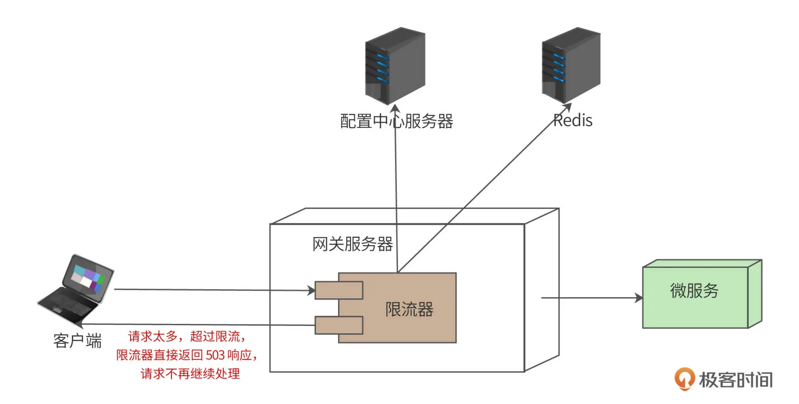

# 1. 背景

在互联网高可用架构设计中，限流是一种经典的高可用架构模式。因为某些原因，大量用户突然访问我们的系统时，或者有黑客恶意用 DoS（Denial of Service，拒绝服务）方式攻击我们的系统时，这种未曾预期的高并发访问对系统产生的负载压力可能会导致系统崩溃。

解决这种问题的一个主要手段就是限流，即拒绝部分访问请求，使访问负载压力降低到一个系统可以承受的程度。这样虽然有部分用户访问失败，但是整个系统依然是可用的，依然能对外提供服务，而不是因为负载压力太大而崩溃，导致所有用户都不能访问。

为此，我们准备开发一个限流器，产品名称为“Diana”。

# 2. 需求分析

我们将 Diana 定位为一个限流器组件，即 Diana 的主要应用场景是部署在微服务网关或者其他 HTTP 服务器入口，以过滤器的方式对请求进行过滤，对超过限流规则的请求返回“服务不可用”HTTP 响应。

Diana 的限流规则可通过配置文件获取，并需要支持本地配置和远程配置两种方式，远程配置优先于本地配置。限流方式包括：

+ 全局限流：针对所有请求进行限流，即保证整个系统处理的请求总数满足限流配置。
+ 账号限流：针对账号进行限流，即对单个账号发送的请求进行限流。
+ 设备限流：针对设备进行限流，即对单个客户端设备发送的请求进行限流。
+ 资源限流：针对某个资源（即某个 URL）进行限流，即保证访问该资源的请求总数满足限流配置。

并且 Diana 设计应遵循开闭原则，能够支持灵活的限流规则功能扩展，即未来在不修改现有代码和兼容现有配置文件的情况下，支持新的配置规则。

# 3. 概要设计

## 3.1 整体架构



用户请求（通过负载均衡服务器）到达网关服务器。网关服务器本质也是一个 HTTP 服务器，限流器是部署在网关中的一个过滤器（filter）组件，和网关中的签名校验过滤器、用户权限过滤器等配置在同一个过滤器责任链（Chain of Responsibility）上。限流器应该配置在整个过滤器责任链的前端，也就是说，如果请求超过了限流，请求不需要再进入其他过滤器，直接被限流器拒绝。

用户请求进入限流器后，根据限流策略，判断该请求是否已经超过限流，如果超过，限流器直接返回状态码为 503（Too Many Requests）的响应；如果没有超过限流，请求继续向下处理（经过其他网关过滤器），并最终调用微服务完成处理。

限流器的策略可以在本地配置，也可以通过远程的配置中心服务器加载，即远程配置。远程配置优先于本地配置。

## 3.2 限流模式设计

请求是否超过限流，主要就是判断单位时间请求数量是否超过配置的请求限流数量。单位时间请求数量，可以本地记录，也可以远程记录。方便起见，本地记录称作**本地限流**，远程记录称作远程限流（也叫**分布式限流**）。

### 3.2.1 本地限流

本地限流意味着，每个网关服务器需要根据本地记录的单位时间请求数量进行限流。假设限流配置为每秒限流 50 请求，如果该网关服务器本地记录的当前一秒内接受请求数量达到 50，那么这一秒内的后续请求都返回 503 响应。如果整个系统部署了 100 台网关服务器，每个网关配置本地限流为每秒 50，那么，整个系统每秒最多可以处理 5000 个请求。

### 3.2.2 分布式限流

远程限流意味着，所有网关共享同一个限流数量，每个网关服务器收到请求后，从远程服务器中获取单位时间内已处理请求数，如果超过限流，就返回 503 响应。也就是说，可能某个网关服务器一段时间内根本就没有请求到达，但是远程的已处理请求数已经达到了限流上限，那么这台网关服务器也必须拒绝请求。**我们使用 Redis 作为记录单位时间请求数量的远程服务器**

用Redis+Lua作为统计数量。Lua脚本执行增加技术或者重新设置时间技术

### 3.2.3 高可用设计

为了保证配置中心服务器和 Redis 服务器宕机时，限流器组件的高可用。限流器应具有自动降级功能，即配置中心不可用，则使用本地配置；Redis 服务器不可用，则降级为本地限流。

# 4. 常见的算法

## 4.1 计数器法

1. 将时间划分为固定窗口大小，例如：1s
2. 在窗口时间内，每来一个请求，对计数器+1
3. 当计数器达到设定限制后，该窗口时间内的之后请求都会被**丢弃处理**
4. 该窗口时间结束后，计数器清零，从新开始计数

缺点：200个请求是最大阈值。在0~900ms 0个请求，900ms~1000ms 100个请求。在1000ms~1900ms 100个请求，1900ms~2000ms0个请求。这种场景下0~1s是100个请求，1~2秒也是100个请求。但是0~2s中间段已经出现了200个请求，达到最大阈值

## 4.2 滑动窗口计数法：

1. 将时间划分为细粒度的区间，每个区间维护一个计数器，每进入一个请求则将计数器加一
2. 多个区间组成时间窗口，每流逝一个区间时间，则抛弃最老的区间，纳入新区建
3. 若当前窗口的区间计数器总和超过设定的限制数量，则本窗口内的后续请求都被丢弃

## 4.3 漏桶算法：

如果外部请求超过当前阈值，则会容易堆积，一直到溢出，溢出则丢弃，系统并不关心溢出流量。从出口处限定了请求速率，并不存在计数器的临界值问题，请求曲线始终是平滑，**无法应对突发流量**。

**相当于一个空桶（固定请求数量）+固定处理线程，当请求超过桶大小时，则抛弃，否则以固定线程数量进行处理请求**

## 4.4 令牌桶算法

假设一个大小固定的桶，这个桶的容量和设定的阈值有关，桶里面放了很多令牌，通过一定固定的速率往桶里面放入令牌。如果桶满了，则丢弃令牌，最后桶中可保存的最大令牌数量永远不会大于桶的大小。

当有请求进入时，就尝试从桶里面取走一个令牌，如果桶里面是空的，那么这个请求就会被拒绝。**（不是固定处理线程数）**

# 5. 分布式实现

参考：https://www.51sjk.com/b99b129202/

## 5.1 计数器法

所使用的 redis+Lua 脚本，返回 -1 表示超过限流, 否则返回当前单位时间已通过的请求数

```lua
-- 计数器限流
-- 此处支持的最小单位时间是秒, 若将 expire 改成 pexpire 则可支持毫秒粒度.
-- KEYS[1] string 限流的key
-- ARGV[1] int  限流数
-- ARGV[2] int  单位时间(秒)

local cnt = tonumber(redis.call("incr", KEYS[1]))

if (cnt == 1) then
 -- cnt 值为1说明之前不存在该值, 因此需要设置其过期时间
 redis.call("expire", KEYS[1], tonumber(ARGV[2]))
elseif (cnt > tonumber(ARGV[1])) then
 return -1
end

return cnt
```

+ key 可以但不限于以下的情况

  - ip + 接口

  - user_id + 接口

+ 优点：实现简单

+ 缺点：粒度不够细的情况下, 会出现在同一个窗口时间内出现双倍请求数

+ 注意：尽量保持时间粒度精细

## 5.2 令牌桶

```lua
-- 令牌桶限流: 不支持预消费, 初始桶是满的
-- KEYS[1] string 限流的key

-- ARGV[1] int  桶最大容量
-- ARGV[2] int  每次添加令牌数
-- ARGV[3] int  令牌添加间隔(秒)
-- ARGV[4] int  当前时间戳

local bucket_capacity = tonumber(ARGV[1])
local add_token = tonumber(ARGV[2])
local add_interval = tonumber(ARGV[3])
local now = tonumber(ARGV[4])

-- 保存上一次更新桶的时间的key
local LAST_TIME_KEY = KEYS[1].."_time";   
-- 获取当前桶中令牌数
local token_cnt = redis.call("get", KEYS[1]) 
-- 桶完全恢复需要的最大时长
local reset_time = math.ceil(bucket_capacity / add_token) * add_interval;

if token_cnt then -- 令牌桶存在
 -- 上一次更新桶的时间
 local last_time = redis.call('get', LAST_TIME_KEY)
 -- 恢复倍数
 local multiple = math.floor((now - last_time) / add_interval)
 -- 恢复令牌数
 local recovery_cnt = multiple * add_token
 -- 确保不超过桶容量
 local token_cnt = math.min(bucket_capacity, token_cnt + recovery_cnt) - 1
 
 if token_cnt < 0 then
  return -1;
 end
 
 -- 重新设置过期时间, 避免key过期
 redis.call('set', KEYS[1], token_cnt, 'EX', reset_time)      
 redis.call('set', LAST_TIME_KEY, last_time + multiple * add_interval, 'EX', reset_time)
 return token_cnt
 
else -- 令牌桶不存在
 token_cnt = bucket_capacity - 1
 -- 设置过期时间避免key一直存在
 redis.call('set', KEYS[1], token_cnt, 'EX', reset_time);
 redis.call('set', LAST_TIME_KEY, now, 'EX', reset_time + 1); 
 return token_cnt 
end
```
