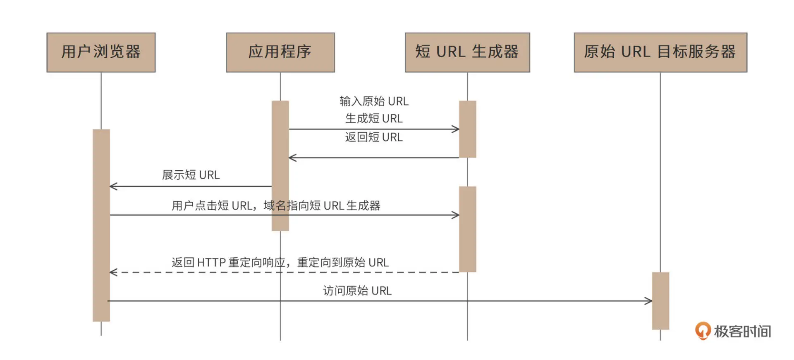

# 1. 背景

在社交媒体上，人们经常需要分享一些 URL，但是有些 URL 可能会很长，比如：https://time.geekbang.org/hybrid/pvip?utm_source=geektime-pc-discover-banner&utm_term=geektime-pc-discover-banner 这样长的 URL 显然体验并不友好。我们期望分享的是一些更短、更易于阅读的短 URL，比如像 http://1.cn/ScW4dt 这样的。当用户点击这个短 URL 的时候，可以重定向访问到原始的链接地址。为此我们将设计开发一个短 URL 生成器，产品名称是“Fuxi（伏羲）”。

# 2. 需求分析

## 2.1 时序图

短 URL 生成器，也称作短链接生成器，就是将一个比较长的 URL 生成一个比较短的 URL，当浏览器通过短 URL 生成器访问这个短 URL 的时候，重定向访问到原始的长 URL 目标服务器，访问时序图如下。

对于需要展示短 URL 的应用程序，由该应用调用短 URL 生成器生成短 URL，并将该短 URL 展示给用户，用户在浏览器中点击该短 URL 的时候，请求发送到短 URL 生成器（短 URL 生成器以 HTTP 服务器的方式对外提供服务，短 URL 域名指向短 URL 生成器），短 URL 生成器返回 HTTP 重定向响应，将用户请求重定向到最初的原始长 URL，浏览器访问长 URL 服务器，完成请求服务。

## 2.2 短 URL 生成器的用例图

1. 用户 client 程序可以使用短 URL 生成器 Fuxi 为每个长 URL 生成唯一的短 URL，并存储起来。
2. 用户可以访问这个短 URL，Fuxi 将请求重定向到原始长 URL。
3. 生成的短 URL 可以是 Fuxi 自动生成的，也可以是用户自定义的。用户可以指定一个长 URL 对应的短 URL 内容，只要这个短 URL 还没有被使用。
4. 管理员可以通过 web 后台检索、查看 Fuxi 的使用情况。
5. 短 URL 有有效期（2 年），后台定时任务会清理超过有效期的 URL，以节省存储资源，同时回收短 URL 地址链接资源。

# 3. 解决方案

## 3.1 单项散列函数生成短 URL

通常的设计方案是，将长 URL 利用 MD5 或者 SHA256 等单项散列算法，进行 Hash 计算，得到 128bit 或者 256bit 的 Hash 值。然后对该 Hash 值进行 Base64 编码，得到 22 个或者 43 个 Base64 字符，再截取前面的 6 个字符，就得到短 URL 了，但是这样得到的短URL，可能会发生 Hash 冲突，即不同的长 URL，计算得到的短 URL 是相同的（MD5 或者 SHA256 计算得到的 Hash 值几乎不会冲突，但是 Base64 编码后再截断的 6 个字符有可能会冲突）。

所以在生成的时候，需要先校验该短 URL 是否已经映射为其他的长 URL，如果是，那么需要重新计算（换单向散列算法，或者换 Base64 编码截断位置）。重新计算得到的短 URL 依然可能冲突，需要再重新计算。但是这样的冲突处理需要多次到存储中查找 URL，无法保证 Fuxi 的性能要求。

### 3.1.1 总结：

1. 将长URL进行hash得到hash值，校验冲突
2. 再用hash值进行base64编码随机截取6个字符，并且校验冲突
3. 如果都存在冲突则重新计算hash值，base64编码后随机截取6个字符
4. 上线实时计算存在性能问题

## 3.2 自增长短 URL

一种免冲突的算法是用自增长自然数来实现，即维持一个自增长的二进制自然数，然后将该自然数进行 Base64 编码即可得到一系列的短 URL。这样生成的的短 URL 必然唯一，而且还可以生成小于 6 个字符的短 URL，比如自然数 0 的 Base64 编码是字符“A”，就可以用 http://1.cn/A 作为短 URL。

但是这种算法将导致短 URL 是可猜测的，如果某个应用在某个时间段内生成了一批短 URL，那么这批短 URL 就会集中在一个自然数区间内。只要知道了其中一个短 URL，就可以通过自增（以及自减）的方式请求访问其他 URL。Fuxi 的需求是不允许短 URL 可预测。

### 3.2.1 总结

1. 用一个自增的自然数，进行base64编码，这样就能得到一个短url
2. 这个自增的自然数可以用mysql的唯一索引
3. 可能预测到短url

## 3.3 预生成短 URL

因此，Fuxi 采用预生成短 URL 的方案。即预先生成一批没有冲突的短 URL 字符串，当外部请求输入长 URL 需要生成短 URL 的时候，直接从预先生成好的短 URL 字符串池中获取一个即可。

预生成短 URL 的算法可以采用随机数来实现，6 个字符，每个字符都用随机数产生（用 0~63 的随机数产生一个 Base64 编码字符）。为了避免随机数产生的短 URL 冲突，需要在预生成的时候检查该 URL 是否已经存在（用布隆过滤器检查）。因为预生成短 URL 是离线的，所以这时不会有性能方面的问题。事实上，Fuxi 在上线之前就已经生成全部需要的 144 亿条短 URL 并存储在文件系统中（预估需要短 URL120 亿，Fuxi 预生成的时候进行了 20% 的冗余，即 144 亿。）

### 3.3.1 总结

1. 随机得到6个字符（用 0~63 的随机数）
2. 再对这个字符进行base64编码得到短url
3. 用布隆过滤器判断这个短url是否存在，如果不存在则插入
4. 如果存在则重新计算，因为这个是离线生成的，所以不存在性能问题

# 4. 整体架构

系统调用可以分成两种情况：

+ 一种是用户请求生成短 URL 的过程

> 对于用户请求生成短 URL 的过程，在短 URL 系统 Fuxi 上线前，已经通过随机数算法预生成 144 亿条短 URL 并将其存储在 HDFS 文件系统中。系统上线运行后，应用程序请求生成短 URL 的时候（即输入长 URL，请求返回短 URL），请求通过负载均衡服务器被发送到短 URL 服务器集群，短 URL 服务器再通过负载均衡服务器调用短 URL 预加载服务器集群。
>
> 短 URL 预加载服务器此前已经从短 URL 预生成文件服务器（HDFS）中加载了一批短 URL 存放在自己的内存中，这时，只需要从内存中返回一个短 URL 即可，同时将短 URL 与长 URL 的映射关系存储在 HBase 数据库中

+ 另一种是用户访问短 URL，通过 Fuxi 跳转到长 URL 的过程。

> 请求通过负载均衡服务器发送到短 URL 服务器集群，短 URL 服务器首先到缓存服务器中查找是否有该短 URL，如果有，立即返回对应的长 URL，短 URL 生成服务器构造重定向响应返回给客户端应用。
>
> 如果缓存没有用户请求访问的短 URL，短 URL 服务器将访问 HBase 短 URL 数据库服务器集群。如果数据库中存在该短 URL，短 URL 服务器会将该短 URL 写入缓存服务器集群，并构造重定向响应返回给客户端应用。如果 HBase 中没有该短 URL，短 URL 服务器将构造 404 响应返回给客户端应用

# 5. 参考

https://time.geekbang.org/column/article/488496