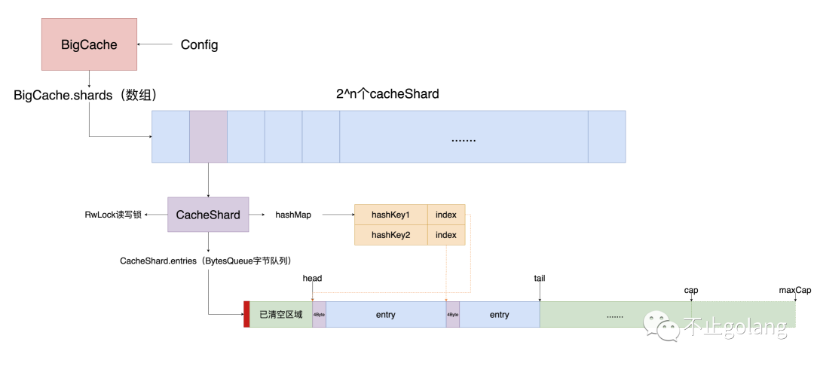
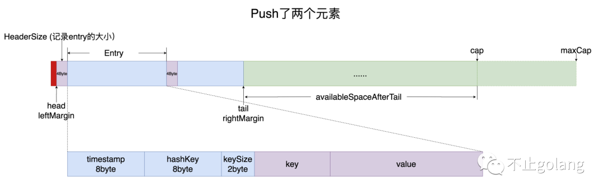

# 一. 背景

在并发场景下普通的LRU，有以下缺点：

1. 锁粒度过粗，造成CPU竞争，降低并发能力
2. GO原始map如果key和value中存在指针类型，会在GC遍历整个map的key value，相反，如果key-value是基本类型，则直接跳过GC扫描。gc会触发STW，频繁GC的话，会严重影响性能
3. map扩缩容可能导致大量元素移动，降低存取效率
4. LRU存储是根据item数量存储的，没办法对内存使用做限制。这样会导致如果存在大量item的value过大的话，造成pod内存爆掉引发各种问题。

# 二. BigCache

BigCache的内存结构层级相对简单，只有两层：

1. BigCache里的数据分片数组shards(大小为2^n次方)（**减少锁的粒度**）
2. shards中每个item为一个CacheShard对象(**实际加锁并发访问数据的对象**)，每个对象维护一个读写锁，hashMap，ByteQueue字节队列。

## 1 Share数组

对shards数组的访问是不需要加锁的，因为该数组在初始化时创建，后续大小就不会变了，即后续对数组的访问只有读。采用 shard (分片数组), 每个分片一把锁。对于每一个缓存对象，根据它的key计算它的哈希值: hash(key) % N, N是分片数量。降低并发N个 goroutine 每次请求落在同一个分片的概率，减少数据竞争，同时锁粒度被大幅度减小，因为锁范围从全局缓存缩小到了单个shard中。

## 2 CacheShare对象

+ entries: 字节队列，提供peek，get, pop，push操作
+ hashmap: 维护64位hashKey对应在entries(字节队列)的头部索引
+ lock: 读写锁，控制并发访问
+ entryBuffer: 全局临时变量，set的时候需创建key，value等信息的entry的[]byte临时空间，用户填充数据，这样可以防止每次set的时候都为每个value执行make([]byte,size)的操作

## 3 总结

1. 根据key计算hash值取模（桶个数）得到对应的hash桶
2. 每个hash桶有个hashmap记录hash冲突情况下对应的value的索引
3. 得到hash桶后插入到entries队列中（需要加锁）