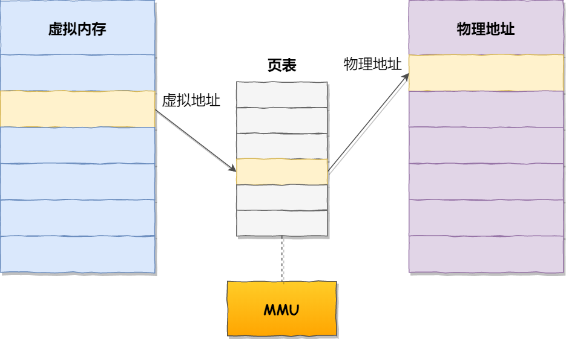
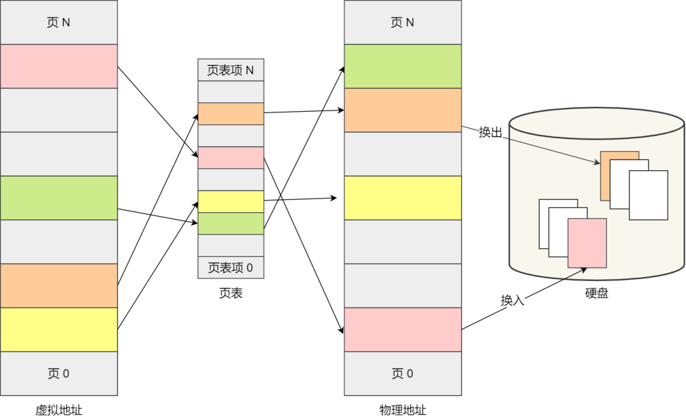
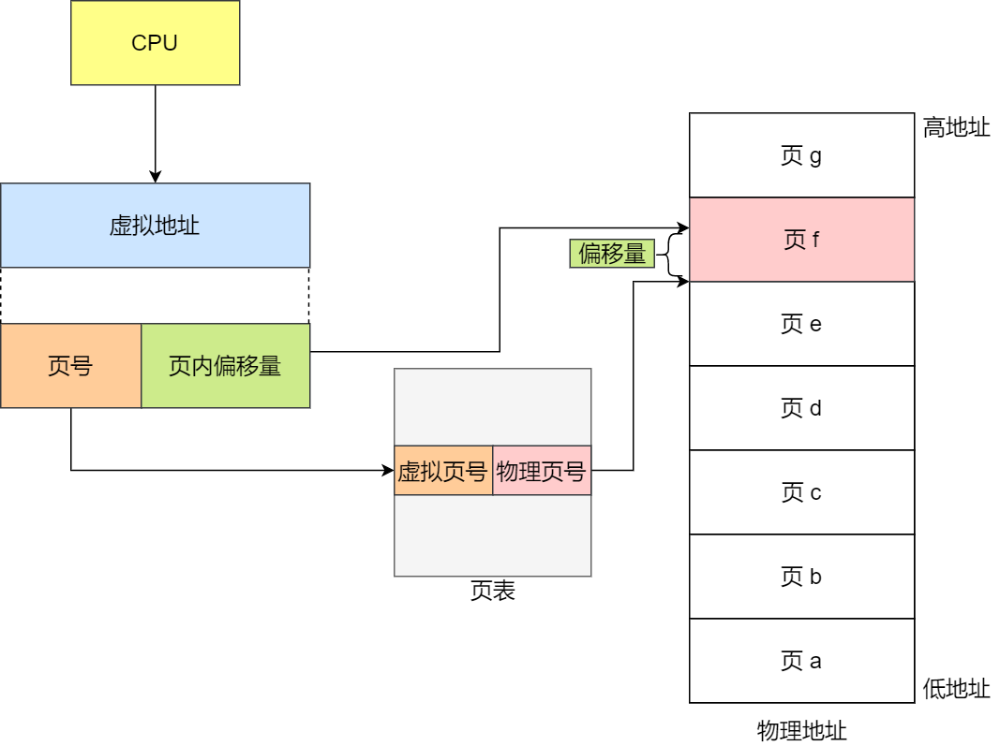
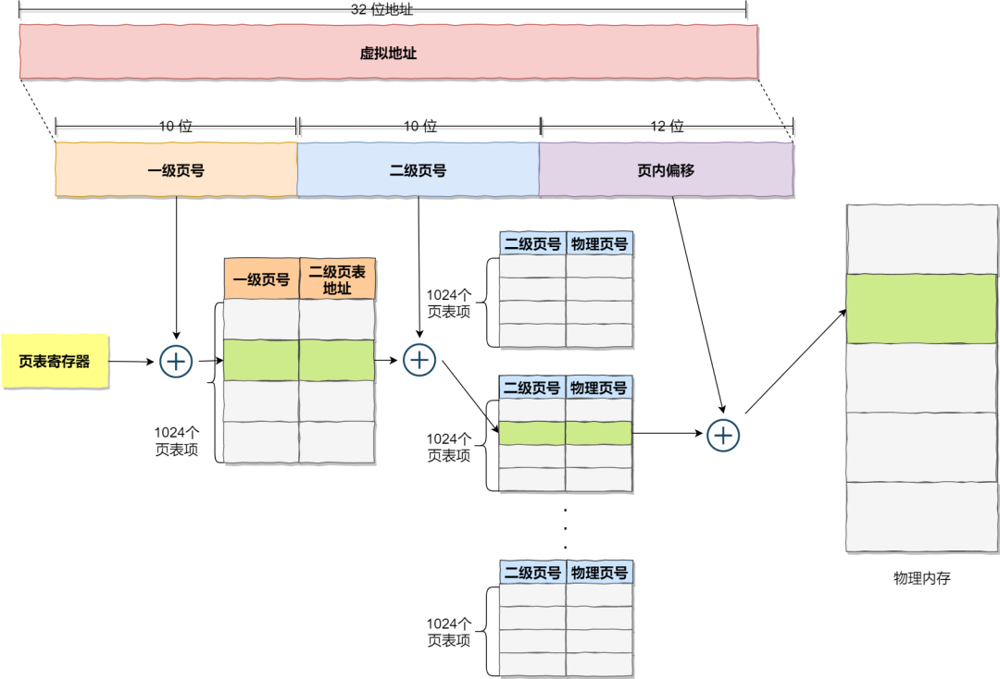

## 存储层次

百科如是说明：存储层次是在计算机体系结构下存储系统层次结构的排列顺序。每一层于下一层相比都拥有较高的速度和较低延迟性，以及较小的容量。大部分现今的中央处理器的速度都非常的快。

大部分程序工作量需要存储器访问。由于高速缓存的效率和存储器传输位于层次结构中的不同等级，所以实际上会限制处理的速度，导致中央处理器花费大量的时间等待存储器I/O完成工作。

简单来说，如果单一存储器无法满足全部的需求，那就通过各类存储器的组合使用，在一定程度上满足了各方面需求都达标的一种存储结构，即存储层次，或称内存的层次结构。

- 寄存器：（应该是）最快的访问。
- 高速缓存（L1-L3：SRAM）：高速缓存中的访问速度为纳秒级别，非常快。

第一级高速缓存（L1），通常访问只需要几个周期，通常是几十个KB。

第二级高速缓存（L2），比L1约有2到10倍较高延迟性，通常是几百个KB或更多。

第三级高速缓存（L3）不一定有，比L2更高的延迟性，通常有数MB之大。

第四级高速缓存（L4）不普遍，CPU外部的DRAM，但速度较主存高。

- 主存（DRAM）：访问需要几百个周期，可以大到数几十GB。
- 磁盘存储：需要成千上百个周期，容量非常大，持久化保存数据。

## 虚拟内存

把进程所使用的地址「隔离」开来，即让操作系统为每个进程分配独立的一套「**虚拟地址**」，人人都有，大家自己玩自己的地址就行，互不干涉。但是有个前提每个进程都不能访问物理地址，至于虚拟地址最终怎么落到物理内存里，对进程来说是透明的，操作系统已经把这些都安排的明明白白了。

**操作系统会提供一种机制，将不同进程的虚拟地址和不同内存的物理地址映射起来。**

如果程序要访问虚拟地址的时候，由操作系统转换成不同的物理地址，这样不同的进程运行的时候，写入的是不同的物理地址，这样就不会冲突了。

我们程序所使用的内存地址叫做**虚拟内存地址**（*Virtual Memory Address*）

实际存在硬件里面的空间地址叫**物理内存地址**（*Physical Memory Address*）。

操作系统引入了虚拟内存，进程持有的虚拟地址会通过 CPU 芯片中的内存管理单元（MMU）的映射关系，来转换变成物理地址，然后再通过物理地址访问内存

## 内存分页

**分页是把整个虚拟和物理内存空间切成一段段固定尺寸的大小**。这样一个连续并且尺寸固定的内存空间，我们叫**页**（*Page*）。在 Linux 下，每一页的大小为 `4KB`。

虚拟地址与物理地址之间通过**页表**来映射，如下图：

页表实际上存储在 CPU 的**内存管理单元** （*MMU*） 中，于是 CPU 就可以直接通过 MMU，找出要实际要访问的物理内存地址。

而当进程访问的虚拟地址在页表中查不到时，系统会产生一个**缺页异常**，进入系统内核空间分配物理内存、更新进程页表，最后再返回用户空间，恢复进程的运行。

**采用了分页，那么释放的内存都是以页为单位释放的，也就不会产生无法给进程使用的小内存。**

**只有在程序运行中，需要用到对应虚拟内存页里面的指令和数据时，再加载到物理内存里面去。**

## 内存分页寻址

在分页机制下，虚拟地址分为两部分，**页号**和**页内偏移**。页号作为页表的索引，**页表**包含物理页每页所在**物理内存的基地址**，这个基地址与页内偏移的组合就形成了物理内存地址，见下图。

总结一下，对于一个内存地址转换，其实就是这样三个步骤：

- 把虚拟内存地址，切分成页号和偏移量；
- 根据页号，从页表里面，查询对应的物理页号；
- 直接拿物理页号，加上前面的偏移量，就得到了物理内存地址。

## 多级页表

简单分页缺点：有空间上的缺陷。

因为操作系统是可以同时运行非常多的进程的，那这不就意味着页表会非常的庞大。

在 32 位的环境下，虚拟地址空间共有 4GB，假设一个页的大小是 4KB（2^12），那么就需要大约 100 万 （2^20） 个页，每个「页表项」需要 4 个字节大小来存储，那么整个 4GB 空间的映射就需要有 `4MB` 的内存来存储页表。

这 4MB 大小的页表，看起来也不是很大。但是要知道每个进程都是有自己的虚拟地址空间的，也就说都有自己的页表。

那么，`100` 个进程的话，就需要 `400MB` 的内存来存储页表，这是非常大的内存了，更别说 64 位的环境了。

要解决上面的问题，就需要采用的是一种叫作**多级页表**（*Multi-Level Page Table*）的解决方案。

在前面我们知道了，对于单页表的实现方式，在 32 位和页大小 `4KB` 的环境下，一个进程的页表需要装下 100 多万个「页表项」，并且每个页表项是占用 4 字节大小的，于是相当于每个页表需占用 4MB 大小的空间。

我们把这个 100 多万个「页表项」的单级页表再分页，将页表（一级页表）分为 `1024` 个页表（二级页表），每个表（二级页表）中包含 `1024` 个「页表项」，形成**二级分页**。如下图所示：

**如果某个一级页表的页表项没有被用到，也就不需要创建这个页表项对应的二级页表了，即可以在需要时才创建二级页表**。

**页表一定要覆盖全部虚拟地址空间，不分级的页表就需要有 100 多万个页表项来映射，而二级分页则只需要 1024 个页表项**（此时一级页表覆盖到了全部虚拟地址空间，二级页表在需要时创建）。

## TLB

把最常访问的几个页表项存储到访问速度更快的硬件，于是计算机科学家们，就在 CPU 芯片中，加入了一个专门存放程序最常访问的页表项的 Cache，这个 Cache 就是 TLB（*Translation Lookaside Buffer*） ，通常称为页表缓存、转址旁路缓存、快表等。

在 CPU 芯片里面，封装了内存管理单元（*Memory Management Unit*）芯片，它用来完成地址转换和 TLB 的访问与交互。

有了 TLB 后，那么 CPU 在寻址时，会先查 TLB，如果没找到，才会继续查常规的页表。

TLB 的命中率其实是很高的，因为程序最常访问的页就那么几个。

## 内存管理做一个简单介绍

linux kernel 通过把整个物理内存划分成以一个个page进行管理，管理器就是伙伴系统，它的最小分配单元就是page。但是对于小于page的内存分配，如果直接分配一个page，是一个很大的浪费。linux kernel 通过slab来实现对小于page大小的内存分配。slab把page按2的m次幂进行划分一个个字节块，当kmalloc申请内存时，通过slab管理器返回需要满足申请大小的最小空闲内存块。
slub主要是针对slab的对象管理数据的优化版本，相比于slab，slub提供更小的管理成本开销。而且slub对多核系统的支持也更加友好。细节这里就不展开讲。
所以kernel的内存管理是个2层分层系统，从下往上依次为：
第一层为全部物理内存：其管理器为伙伴系统，最小管理单位为page；
第二层为slab page：其管理器为slab/slub，最小管理单位为2的m次幂的字节块；

## 总结

为了在多进程环境下，使得进程之间的内存地址不受影响，相互隔离，于是操作系统就为每个进程独立分配一套的**虚拟地址空间**，每个程序只关心自己的虚拟地址就可以，实际上大家的虚拟地址都是一样的，但分布到物理地址内存是不一样的。作为程序，也不用关心物理地址的事情。

每个进程都有自己的虚拟空间，而物理内存只有一个，所以当启用了大量的进程，物理内存必然会很紧张，于是操作系统会通过**内存交换**技术，把不常使用的内存暂时存放到硬盘（换出），在需要的时候再装载回物理内存（换入）。

那既然有了虚拟地址空间，那必然要把虚拟地址「映射」到物理地址，这个事情通常由操作系统来维护。

那么对于虚拟地址与物理地址的映射关系，可以有**分段**和**分页**的方式，同时两者结合都是可以的。

内存分段是根据程序的逻辑角度，分成了栈段、堆段、数据段、代码段等，这样可以分离出不同属性的段，同时是一块连续的空间。但是每个段的大小都不是统一的，这就会导致内存碎片和内存交换效率低的问题。

于是，就出现了内存分页，把虚拟空间和物理空间分成大小固定的页，如在 Linux 系统中，每一页的大小为 `4KB`。由于分了页后，就不会产生细小的内存碎片。

同时在内存交换的时候，写入硬盘也就一个页或几个页，这就大大提高了内存交换的效率。

再来，为了解决简单分页产生的页表过大的问题，就有了**多级页表**，它解决了空间上的问题，但这就会导致 CPU 在寻址的过程中，需要有很多层表参与，加大了时间上的开销。

于是根据程序的**局部性原理**，在 CPU 芯片中加入了 **TLB**，负责缓存最近常被访问的页表项，大大提高了地址的转换速度。

**Linux 系统主要采用了分页管理，但是由于 Intel 处理器的发展史，Linux 系统无法避免分段管理**。于是 Linux 就把所有段的基地址设为 `0`，也就意味着所有程序的地址空间都是线性地址空间（虚拟地址），相当于屏蔽了 CPU 逻辑地址的概念，所以段只被用于访问控制和内存保护。

另外，Linxu 系统中虚拟空间分布可分为**用户态**和**内核态**两部分，其中用户态的分布：代码段、全局变量、BSS、函数栈、堆内存、映射区。

## 页面置换算法都有哪些

+ 当访问一个内存中不存在的页，并且内存已满，则需要从内存中调出一个页或将数据送至磁盘对换区，替换一个页，这种现象叫做缺页置换。当前操作系统最常采用的缺页置换算法如下：
  + 先进先出(FIFO)算法：置换最先调入内存的页面，即置换在内存中驻留时间最久的页面。按照进入内存的先后次序排列成队列，从队尾进入，从队首删除。
  + 最近最少使用（LRU）算法: 置换最近一段时间以来最长时间未访问过的页面。根据程序局部性原理，刚被访问的页面，可能马上又要被访问；而较长时间内没有被访问的页面，可能最近不会被访问。
+ 当前最常采用的就是LRU算法。

------

参考：

https://blog.csdn.net/aurorayqz/article/details/79671785

https://mp.weixin.qq.com/s?__biz=MzAwNDA2OTM1Ng==&mid=2453144334&idx=1&sn=82e4214887319630dc9bbc6b0da8116c&scene=21#wechat_redirect