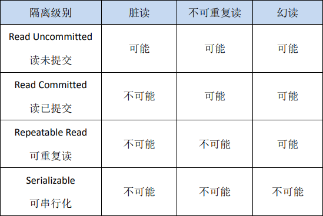

# 一. 事务和事务处理
+ **！！！例子查看：[例子查看](/数据库/MySQL/code/TCL.sql)！！！**

+ 事务：一个或一组sql语句组成的一个执行单元，这个执行单元要么全部执行，要么全部不执行

+ 特点：
    1. 整个单独单元作为一个不可分割的整体。
    2. 如果单元中某条sql语句一旦执行失败或者产生错误，那么整个单元会回滚。所有受到影响的数据将返回到事务最开始的状态
    3. 如果单元中的所有SQL语句执行成功，则事务被顺利执行
    
+ 在mysql中存储引擎有：innodb,myisam,memory等。**其中innodb支持事务**，而myisam，memory等不支持

+ 事务的ACID属性：
    1. 原子性（Atomicity）：指事务是不可分割的工作单元，事务中的操作要么都执行，要么都不执行（undo log）
    2. 一致性（Consistency）：事务必须使数据库从一个一致性状态转换成另外一个一致性状态（其他三个联合保证）
    3. 隔离性（Isolation）：指一个事务的执行不能被其他事务干扰，即一个事务内部的操作及使用的数据对并发的其他事务是隔离的。并发执行的各个事务之间不能互相干扰（mvcc+锁）
    4. 持久性（Durability）：指一个事务一旦被提交，他对数据库中数据的改变就是永久性的，接下来的其他操作和数据库故障都不应该对其有任何影响（redo log）

+ 事务的创建：
    1. 隐式事务：事务没有明显的开启和结束的标记。比如：insert，update，delete语句
    2. 显示事务：事务具有明显的开启和结束的标记。
    
+ 语法：(显示事务)
    1. 必须先设置自动提交功能为禁止（因为这个默认开启，一条语句就是一个事务）：
        set autocommit=0;（只针对当前的事务）
    2. 开启事务的语句：
        start transaction;（可选）
    3. 编写事务的SQL语句（select，insert，update，delete）<br>
        语句1<br>
        语句2<br>
        。。。<br>
        语句n<br>
    4. 结束事务的语句：
        commit;（提交事务）
        rollback;（回滚事务）

+ 对于同时运行多个事务，当这个事务访问数据库中相同数据时，如果没有采取必要隔离机制，会导致各种并发问题
    1. 脏读：对于两个事务T1,T2。T1读取了已经被T2更新但是还没有提交的字段之后。若T2回滚，T1读取的内容就是临时且无效的
    2. 不可重复读：对于两个事务T1,T2。T1读取了一个字段，然后T2更新了该字段之后，T1再次读取同一个字段，值就不同了
    3. 幻读：对于两个事务T1,T2。T1从一个表中读取一个字段，然后T2在该表中插入了一些新的行之后。如果T1再次读取同一个表，会出现多了几行。

+ 数据库事务的隔离性：数据库系统必须具有隔离并发运行各个事务的能力，使他们不会互相影响，避免各种并发问题

+ 一个事务与其他事务隔离的程度称为隔离级别。数据库规定了多种事务隔离级别，不同隔离级别对应不同的干扰程度，隔离级别越高，数据一致性就越好，但是并发性越弱
    1. READ UNCOMMITTED（读未提交数据）：允许事务读取未被其他事务提交的变更。脏读，不可重复读和幻读的问题都会出现
    2. READ COMMITTED（读已提交数据）：只允许事务读取已经被其他事务提交的变更。可避免脏读，但是不可重复读和幻读问题仍然存在
    3. REPEATABLE READ（可重复读）：确保事务可以多次从一个字段中读取相同值。在这个事务持续期间，禁止其他事务对该字段进行更新。避免脏读和不可重复读。幻读还存在
    4. SERIALIZABLE（串行化）：确保事务可以从一个表中读取相同的行。在该事务持续期间，禁止其他事务对该表执行插入，更新和删除操作。并发问题都解决，但是性能低下

+ Oracle支持2中事务隔离级别：READ COMMITTED,SERIALIZABLE。默认是READ COMMITTED

+ Mysql支持4中事务隔离级别：默认是REPEATABLE READ

+ 语法：
  > + 必须先设置自动提交功能为禁止：set autocommit=0;（只针对当前的事务）
  > + 显示自动提交值：SHOW VARIABLES LIKE 'autocommit';
  > + 显示隔离级别：SELECT @@transaction_isolation;
  > + 设置隔离级别：SET SESSION TRANSACTION ISOLATION LEVEL 隔离级别;
  > + 设置数据库系统的全局隔离级别：SET GLOBAL TRANSACTION ISOLATION LEVEL 隔离级别;
  > + 设置回滚节点：SAVEPOINT 节点名;
  > + 显示存储引擎：SHOW ENGINES;
  
+ 隔离级别比较：

    |                                  | 脏读  | 不可重复读 | 幻读  |
    | -------------------------------- | ----- | ---------- | ----- |
    | READ UNCOMMITTED（读未提交数据） | true  | true       | true  |
    | READ COMMITTED（读已提交数据）   | false | true       | true  |
    | REPEATABLE READ（可重复读）      | false | false      | true  |
    | SERIALIZABLE（串行化）           | false | false      | false |

    


## 事务步骤：
```
#开启事务
SET AUTOCOMMIT=0;
START TRANSACTION;
# 编辑sql语句
UPDATE account SET balance=500 WHERE username='张无忌';
UPDATE account SET balance=1500 WHERE username='赵敏';
# 结束事务
COMMIT;
#ROLLBACK;

SELECT * FROM account;
```

## savepoint使用
```
SET AUTOCOMMIT=0;
START TRANSACTION;
DELETE FROM account WHERE id=1;
SAVEPOINT a;
DELETE FROM account WHERE id=2;
ROLLBACK TO a;
```

## 事务原理

+ **原子性：undo log实现**

+ **持久性：redo log实现**

+ **隔离性：加锁和MVCC**

+ **一致性：基于原子性，隔离性和持久性完成**

### 持久性（两阶段提交）

+ 两阶段提交（WAL write ahead log）：先写日志再写数据
+ mysql中的binlog（数据文件）和innodb中的redolog（日志文件），因为两个文件属于不同的组件，所以为了保证数据的一致性，要保证binlog和redolog一致性，所以有了两阶段提交

+ 因为随机读写的效率要低于顺序读写的效率。而写数据的是通过随机读写，写日志是顺序读写。所以为了保证数据的一致性，可以先将数据操作形式通过顺序读写写到日志文件中，然后再将数据写到对应的磁盘文件中。这个过程顺序的效率要远远高于随机的效率
+ 如果实际的数据没有写到磁盘（断电，故障等等），只要日志文件保存成功了，那么数据就不会丢失，可以根据日志来进行数据的回复
+ 数据更新流程
  1. 执行器先从引擎中找到数据，如果在内存中则直接返回，如果不再内存中，查询后返回
  2. 执行器拿到数据后，先修改数据，然后调用引擎接口重新写入数据
  3. 引擎将数据更新到内存，同是写数据到redo中，此时处于prepare阶段，并通知执行器执行完成，随时可以操作
  4. 执行器生成这个操作的binlog
  5. 执行器调用引擎的事务提交接口，引擎把刚刚写完的redo改成commit状态，更新完成


# 原子性

## 1. 定义

原子性是指一个事务是一个不可分割的工作单位，其中的操作要么都做，要么都不做；如果事务中一个sql语句执行失败，则已执行的语句也必须回滚，数据库退回到事务前的状态。

## 2. 实现原理：undo log

在说明原子性原理之前，首先介绍一下MySQL的事务日志。MySQL的日志有很多种，如二进制日志、错误日志、查询日志、慢查询日志等，此外InnoDB存储引擎还提供了两种事务日志：redo log(重做日志)和undo log(回滚日志)。其中redo log用于保证事务持久性；undo log则是事务原子性和隔离性实现的基础。

下面说回undo log。实现原子性的关键，是当事务回滚时能够撤销所有已经成功执行的sql语句。**InnoDB实现回滚，靠的是undo log：当事务对数据库进行修改时，InnoDB会生成对应的undo log；如果事务执行失败或调用了rollback，导致事务需要回滚，便可以利用undo log中的信息将数据回滚到修改之前的样子。**

undo log属于逻辑日志，它记录的是sql执行相关的信息。当发生回滚时，InnoDB会根据undo log的内容做与之前相反的工作：对于每个insert，回滚时会执行delete；对于每个delete，回滚时会执行insert；对于每个update，回滚时会执行一个相反的update，把数据改回去。

以update操作为例：当事务执行update时，其生成的undo log中会包含被修改行的主键(以便知道修改了哪些行)、修改了哪些列、这些列在修改前后的值等信息，回滚时便可以使用这些信息将数据还原到update之前的状态。

# 持久性

## 1. 定义

持久性是指事务一旦提交，它对数据库的改变就应该是永久性的。接下来的其他操作或故障不应该对其有任何影响。

## 2. 实现原理：redo log

redo log和undo log都属于InnoDB的事务日志。下面先聊一下redo log存在的背景。

InnoDB作为MySQL的存储引擎，数据是存放在磁盘中的，但如果每次读写数据都需要磁盘IO，效率会很低。为此，InnoDB提供了缓存(Buffer Pool)，Buffer Pool中包含了磁盘中部分数据页的映射，作为访问数据库的缓冲：当从数据库读取数据时，会首先从Buffer Pool中读取，如果Buffer Pool中没有，则从磁盘读取后放入Buffer Pool；当向数据库写入数据时，会首先写入Buffer Pool，Buffer Pool中修改的数据会定期刷新到磁盘中（这一过程称为刷脏）。

Buffer Pool的使用大大提高了读写数据的效率，但是也带了新的问题：如果MySQL宕机，而此时Buffer Pool中修改的数据还没有刷新到磁盘，就会导致数据的丢失，事务的持久性无法保证。

于是，redo log被引入来解决这个问题：当数据修改时，除了修改Buffer Pool中的数据，还会在redo log记录这次操作；当事务提交时，会调用fsync接口对redo log进行刷盘。如果MySQL宕机，重启时可以读取redo log中的数据，对数据库进行恢复。redo log采用的是WAL（Write-ahead logging，预写式日志），所有修改先写入日志，再更新到Buffer Pool，保证了数据不会因MySQL宕机而丢失，从而满足了持久性要求。

既然redo log也需要在事务提交时将日志写入磁盘，为什么它比直接将Buffer Pool中修改的数据写入磁盘(即刷脏)要快呢？主要有以下两方面的原因：

（1）刷脏是随机IO，因为每次修改的数据位置随机，但写redo log是追加操作，属于顺序IO。

（2）刷脏是以数据页（Page）为单位的，MySQL默认页大小是16KB，一个Page上一个小修改都要整页写入；而redo log中只包含真正需要写入的部分，无效IO大大减少。

## 3. redo log与binlog

我们知道，在MySQL中还存在binlog(二进制日志)也可以记录写操作并用于数据的恢复，但二者是有着根本的不同的：

（1）作用不同：redo log是用于crash recovery的，保证MySQL宕机也不会影响持久性；binlog是用于point-in-time recovery的，保证服务器可以基于时间点恢复数据，此外binlog还用于主从复制。

（2）层次不同：redo log是InnoDB存储引擎实现的，而binlog是MySQL的服务器层(可以参考文章前面对MySQL逻辑架构的介绍)实现的，同时支持InnoDB和其他存储引擎。

（3）内容不同：redo log是物理日志，内容基于磁盘的Page；binlog的内容是二进制的，根据binlog_format参数的不同，可能基于sql语句、基于数据本身或者二者的混合。

（4）写入时机不同：binlog在事务提交时写入；redo log的写入时机相对多元：

- 前面曾提到：当事务提交时会调用fsync对redo log进行刷盘；这是默认情况下的策略，修改innodb_flush_log_at_trx_commit参数可以改变该策略，但事务的持久性将无法保证。
- 除了事务提交时，还有其他刷盘时机：如master thread每秒刷盘一次redo log等，这样的好处是不一定要等到commit时刷盘，commit速度大大加快。

# 隔离性

## 1. 定义

**与原子性、持久性侧重于研究事务本身不同，隔离性研究的是不同事务之间的相互影响。**

隔离性是指：**事务内部的操作与其他事务是隔离的，并发执行的各个事务之间不能互相干扰**。严格的隔离性，对应了事务隔离级别中的Serializable (可串行化)，但实际应用中出于性能方面的考虑很少会使用可串行化。

隔离性追求的是并发情形下事务之间互不干扰。简单起见，我们主要考虑最简单的读操作和写操作(加锁读等特殊读操作会特殊说明)，那么隔离性的探讨，主要可以分为两个方面：

- **(一个事务)写操作对(另一个事务)写操作的影响：锁机制保证隔离性**
- **(一个事务)写操作对(另一个事务)读操作的影响：MVCC保证隔离性**

## 2. 锁机制

**首先来看两个事务的写操作之间的相互影响。隔离性要求同一时刻只能有一个事务对数据进行写操作，InnoDB通过锁机制来保证这一点。**

锁机制的基本原理可以概括为：事务在修改数据之前，需要先获得相应的锁；获得锁之后，事务便可以修改数据；该事务操作期间，这部分数据是锁定的，其他事务如果需要修改数据，需要等待当前事务提交或回滚后释放锁。

**行锁与表锁**

按照粒度，锁可以分为表锁、行锁以及其他位于二者之间的锁。表锁在操作数据时会锁定整张表，并发性能较差；行锁则只锁定需要操作的数据，并发性能好。但是由于加锁本身需要消耗资源(获得锁、检查锁、释放锁等都需要消耗资源)，因此在锁定数据较多情况下使用表锁可以节省大量资源。MySQL中不同的存储引擎支持的锁是不一样的，例如MyIsam只支持表锁，而InnoDB同时支持表锁和行锁，且出于性能考虑，绝大多数情况下使用的都是行锁。

## 3. 脏读、不可重复读和幻读

首先来看并发情况下，读操作可能存在的三类问题：

1. 脏读：当前事务(A)中可以读到其他事务(B)未提交的数据（脏数据），这种现象是脏读
2. 不可重复读：在事务A中先后两次读取同一个数据，两次读取的结果不一样，这种现象称为不可重复读。脏读与不可重复读的区别在于：前者读到的是其他事务未提交的数据，后者读到的是其他事务已提交的数据。
3. 幻读：在事务A中按照某个条件先后两次查询数据库，两次查询结果的条数不同，这种现象称为幻读。不可重复读与幻读的区别可以通俗的理解为：前者是数据变了，后者是数据的行数变了

## 4. 事务隔离级别

SQL标准中定义了四种隔离级别，并规定了每种隔离级别下上述几个问题是否存在。一般来说，隔离级别越低，系统开销越低，可支持的并发越高，但隔离性也越差。隔离级别与读问题的关系如下：



在实际应用中，**读未提交**在并发时会导致很多问题，而性能相对于其他隔离级别提高却很有限，因此使用较少。**可串行化**强制事务串行，并发效率很低，只有当对数据一致性要求极高且可以接受没有并发时使用，因此使用也较少。因此在大多数数据库系统中，默认的隔离级别是**读已提交**（如Oracle)或**可重复读**（后文简称RR）。

InnoDB默认的隔离级别是RR，后文会重点介绍RR。需要注意的是，在SQL标准中，RR是无法避免幻读问题的，但是InnoDB实现的RR避免了幻读问题。

## 5. MVCC

RR解决脏读、不可重复读、幻读等问题，使用的是MVCC：MVCC全称Multi-Version Concurrency Control，即多版本的并发控制协议。下面的例子很好的体现了MVCC的特点：在同一时刻，不同的事务读取到的数据可能是不同的(即多版本)——在T5时刻，事务A和事务C可以读取到不同版本的数据。

MVCC解决并发读性能问题

MVCC最大的优点是读不加锁，因此读写不冲突，并发性能好。InnoDB实现MVCC，多个版本的数据可以共存，主要基于以下技术及数据结构：

1. 隐藏列：InnoDB中每行数据都有隐藏列，隐藏列中包含了本行数据的事务id、指向undo log的指针等。
2. 基于undo log的版本链：前面说到每行数据的隐藏列中包含了指向undo log的指针，而每条undo log也会指向更早版本的undo log，从而形成一条版本链。
3. ReadView：通过隐藏列和版本链，MySQL可以将数据恢复到指定版本；但是具体要恢复到哪个版本，则需要根据ReadView来确定。所谓ReadView，是指事务（记做事务A）在某一时刻给整个事务系统（trx_sys）打快照，之后再进行读操作时，会将读取到的数据中的事务id与trx_sys快照比较，从而判断数据对该ReadView是否可见，即对事务A是否可见。

### 读已提交（RC）隔离级别下的非加锁读

RC与RR一样，都使用了MVCC，其主要区别在于：

+ **RR是在事务开始后第一次执行select前创建ReadView，直到事务提交都不会再创建。根据前面的介绍，RR可以避免脏读、不可重复读和幻读。**

+ **RC每次执行select前都会重新建立一个新的ReadView**，因此如果事务A第一次select之后，事务B对数据进行了修改并提交，那么事务A第二次select时会重新建立新的ReadView，因此事务B的修改对事务A是可见的。因此RC隔离级别可以避免脏读，但是无法避免不可重复读和幻读。

### 加锁读与next-key lock

按照是否加锁，MySQL的读可以分为两种：

**一种是非加锁读，也称作快照读、一致性读，使用普通的select语句，这种情况下使用MVCC避免了脏读、不可重复读、幻读，保证了隔离性。**

加锁读在查询时会对查询的数据加锁（共享锁或排它锁）。**由于锁的特性，当某事务对数据进行加锁读后，其他事务无法对数据进行写操作，因此可以避免脏读和不可重复读。而避免幻读，则需要通过next-key lock。next-key lock是行锁的一种，实现相当于record lock(记录锁) + gap lock(间隙锁)；其特点是不仅会锁住记录本身(record lock的功能)，还会锁定一个范围(gap lock的功能)。**

**因此，加锁读同样可以避免脏读、不可重复读和幻读，保证隔离性。**

### 总结

概括来说，InnoDB实现的RR，通过锁机制（包含next-key lock）、MVCC（包括数据的隐藏列、基于undo log的版本链、ReadView）等，实现了一定程度的隔离性，可以满足大多数场景的需要。

不过需要说明的是，RR虽然避免了幻读问题，但是毕竟不是Serializable，不能保证完全的隔离，下面是两个例子：

第一个例子，如果在事务中第一次读取采用非加锁读，第二次读取采用加锁读，则如果在两次读取之间数据发生了变化，两次读取到的结果不一样，因为加锁读时不会采用MVCC。

# 一致性

## 1. 基本概念

一致性是指事务执行结束后，**数据库的完整性约束没有被破坏，事务执行的前后都是合法的数据状态。**数据库的完整性约束包括但不限于：实体完整性（如行的主键存在且唯一）、列完整性（如字段的类型、大小、长度要符合要求）、外键约束、用户自定义完整性（如转账前后，两个账户余额的和应该不变）。

## 2. 实现

可以说，一致性是事务追求的最终目标：前面提到的原子性、持久性和隔离性，都是为了保证数据库状态的一致性。此外，除了数据库层面的保障，一致性的实现也需要应用层面进行保障。

实现一致性的措施包括：

- 保证原子性、持久性和隔离性，如果这些特性无法保证，事务的一致性也无法保证
- 数据库本身提供保障，例如不允许向整形列插入字符串值、字符串长度不能超过列的限制等
- 应用层面进行保障，例如如果转账操作只扣除转账者的余额，而没有增加接收者的余额，无论数据库实现的多么完美，也无法保证状态的一致

# 总结

- 原子性：语句要么全执行，要么全不执行，是事务最核心的特性，事务本身就是以原子性来定义的；实现主要基于undo log
- 持久性：保证事务提交后不会因为宕机等原因导致数据丢失；实现主要基于redo log
- 隔离性：保证事务执行尽可能不受其他事务影响；InnoDB默认的隔离级别是RR，RR的实现主要基于锁机制（包含next-key lock）、MVCC（包括数据的隐藏列、基于undo log的版本链、ReadView）
- 一致性：事务追求的最终目标，一致性的实现既需要数据库层面的保障，也需要应用层面的保障