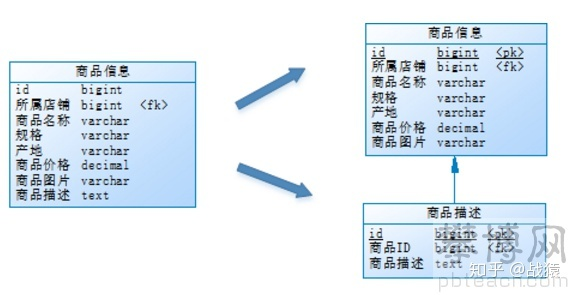
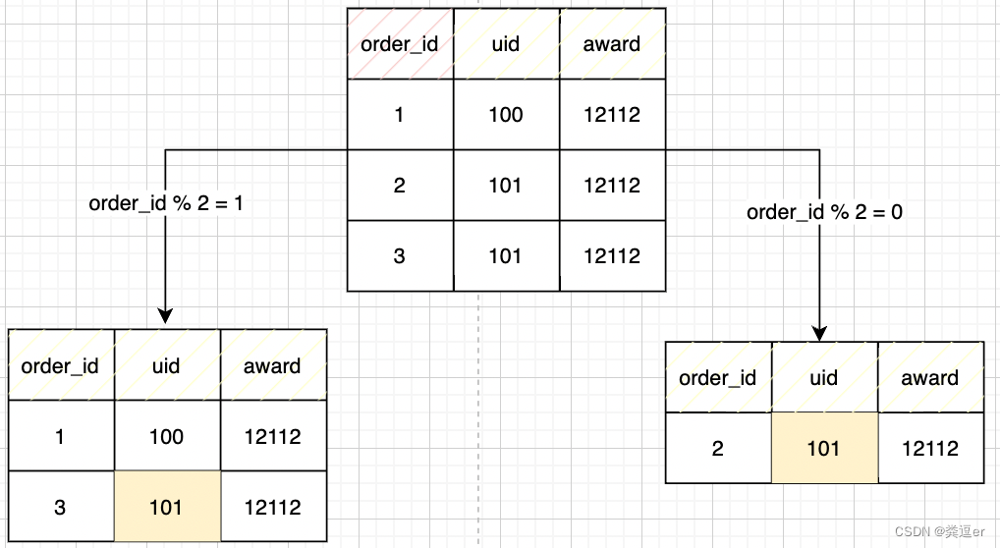
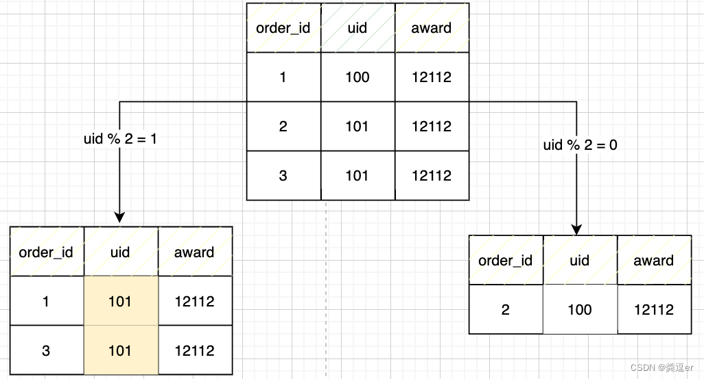
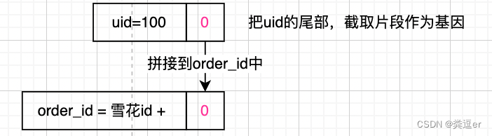

# 一. 分库分表

 **分库分表就是为了解决由于数据量过大而导致数据库性能降低的问题，将原来独立的数据库拆分成若干数据库组成 ，将数据大表拆分成若干数据表组成，使得单一数据库、单一数据表的数据量变小，从而达到提升数据库性能的目的。**

 分库分表包括分库和分表两个部分，在生产中通常包括：垂直分库、水平分库、垂直分表、水平分表四种方式。

# 二. 垂直拆分

## 1. 垂直分表

**垂直分表：将一个表内的数据按照不同的属性拆分成多个不同属性的表。将一个表按照字段分成多表，每个表存储其中一部分字段。**

**优点：**

1. 为了避免IO争抢并减少锁表的几率，查看详情的用户与商品信息浏览互不影响

2. 充分发挥热门数据的操作效率，商品信息的操作的高效率不会被商品描述的低效率所拖累。

 一般来说，某业务实体中的各个数据项的访问频次是不一样的，部分数据项可能是占用存储空间比较大的BLOB或是TEXT。例如上例中的**商品描述**。所以，当表数据量很大时，可以**将表按字段切开，将热门字段、冷门字段分开放置在不同库中**，这些库可以放在不同的存储设备上，避免IO争抢。垂直切分带来的性能提升主要集中在热门数据的操作效率上，而且磁盘争用情况减少。

通常我们按以下原则进行垂直拆分:

1. 把不常用的字段单独放在一张表;
2. 把text，blob等大字段拆分出来放在附表中;
3. 经常组合查询的列放在一张表中;

## 2. 垂直分库

 通过垂直分表性能得到了一定程度的提升，但是还没有达到要求，并且磁盘空间也快不够了，因为数据还是始终限制在一台服务器，库内垂直分表只解决了单一表数据量过大的问题，但没有将表分布到不同的服务器上，因此每个表还是竞争同一个物理机的CPU、内存、网络IO、磁盘。

**垂直分库是指按照业务将表进行分类，分布到不同的数据库上面，每个库可以放在不同的服务器上，它的核心理念是专库专用。**

例如：由于**商品信息**与**商品描述**业务耦合度较高，因此一起被存放在PRODUCT_DB(商品库)；而**店铺信息**相对独立，因此单独被存放在STORE_DB(店铺库)。

**优点**：

- 解决业务层面的耦合，业务清晰
- 能对不同业务的数据进行分级管理、维护、监控、扩展等
- 高并发场景下，垂直分库一定程度的提升IO、数据库连接数、降低单机硬件资源的瓶颈

垂直分库通过将表按业务分类，然后分布在不同数据库，并且可以将这些数据库部署在不同服务器上，从而达到多个服务器共同分摊压力的效果，但是依然没有解决单表数据量过大的问题。

## 3. 总结

1. 垂直分库：就是按照不同业务类型进行拆分到不同数据库，然后不同数据库存放在不同服务器上，达到多个服务器共同分摊压力的效果。
2. 垂直分表：按照业务的不同属性拆分（一般按照冷热程度）成多个表，降低竞争提高并发。
3. 垂直分库分表都是按照属性拆分，只是按照属性的粒度大小。分库粒度大，分表粒度小

# 三. 水平拆分

## 1. 水平分库

**水平分库**是把同一个表的数据按一定规则拆到不同的数据库中，每个库可以放在不同的服务器上。粒度大

例如：如果店铺ID为双数，将此操作映射至RRODUCT_DB1(商品库1)；如果店铺ID为单数，将操作映射至RRODUCT_DB2(商品库2)。此操作要访问数据库名称的表达式为**RRODUCT_DB[店铺ID%2 + 1]** 。

**优点**：

- 解决了单库大数据，高并发的性能瓶颈。
- 提高了系统的稳定性及可用性。

 当一个应用难以再细粒度的垂直切分，或切分后数据量行数巨大，存在单库读写、存储性能瓶颈，这时候就需要进行**水平分库**了，经过水平切分的优化，往往能解决单库存储量及性能瓶颈。但由于同一个表被分配在不同的数据库，需要额外进行数据操作的路由工作，因此大大提升了系统复杂度。

## 2. 水平分表

**水平分表**是在同一个数据库内，把同一个表的数据按一定规则拆到多个表中。粒度小

例如：商品信息及商品描述被分成了两套表。如果商品ID为双数，将此操作映射至商品信息1表；如果商品ID为单数，将操作映射至商品信息2表。此操作要访问表名称的表达式为**商品信息[商品ID%2 + 1]** 。

**优点**：

- 优化单一表数据量过大而产生的性能问题
- 避免IO争抢并减少锁表的几率

库内的水平分表，解决了单一表数据量过大的问题，分出来的小表中只包含一部分数据，从而使得单个表的数据量变小，提高检索性能。

## 3. 总结：

1. 水平分库：按照一定规则拆分（id进行hash取模），粒度大。
2. 水平分表：按照一定规则拆分（id进行hash取模），粒度小。
3. 垂直分库分表都是按照一定规则拆分，只是规则所取的粒度大小。分库粒度大（店铺id），分表粒度小（商品id）。

## 4. 基因法

假设有下面的订单表，字段为order_id, uid, award，假设订单的量很大，要进行拆表

### 4.1. 需求1：查询某个订单order_id的详情

开始的时候拆分方式，按照order_id % 2的方式，进行拆分。查询某个订单的详情：直接通过order_id%2，找到对应的表，就可以查到

### 4.2. 需求2：后面又新增了一个需求：查询某个用户uid所有的订单

分析：按照上面的order_id%2的方式分表 ==> 由于相同的用户uid=101被分到了2张表，查询造成很大的困难。

有人说，可以使用uid进行拆表，那么想查询某个uid下面的所有订单，就可以直接去某一张表查询了。

分析：该方法当然可以，但是对于需求1“查询某个订单order_id的详情”，又造成了困难，因为不知道该order_id坐落在哪张表（所以，查询某个order_id的详情，就需要遍历所有的表）

### 4.3. 满足需求1和2

1. 把uid的尾部，截取片段作为基因

2. 在生成订单号order_id的时候，传入基因，拼接成最后的订单号，即order_id = 雪花算法id + 基因 （说明，订单号order_id的生成规则要修改，即，传入uid）

3. 采用生成的订单号order_id，进行水平分表（拆分表的规则是，基因必须坐落在相同的表中）

**效果：相同uid的订单号，因为有相同的后缀，一定会落到相同的表中**

1. 查询每个订单详情：直接可以查询到
2. 查询每个用户所有订单：因为在同一个表中，也方便查询

# 四. 总结

## 1. 优点

+ 垂直分表：可以把一个宽表的字段按访问频次、是否是大字段的原则拆分为多个表，这样既能使业务清晰，还能提升部分性能。拆分后，尽量从业务角度避免联查，否则性能方面将得不偿失。
+ 垂直分库：可以把多个表按业务耦合松紧归类，分别存放在不同的库，这些库可以分布在不同服务器，从而使访问压力被多服务器负载，大大提升性能，同时能提高整体架构的业务清晰度，不同的业务库可根据自身情况定制优化方案。但是它需要解决跨库带来的所有复杂问题。
+ 水平分库：可以把一个表的数据(按数据行)分到多个不同的库，每个库只有这个表的部分数据，这些库可以分布在不同服务器，从而使访问压力被多服务器负载，大大提升性能。它不仅需要解决跨库带来的所有复杂问题，还要解决数据路由的问题(数据路由问题后边介绍)。
+ 水平分表：可以把一个表的数据(按数据行)分到多个同一个数据库的多张表中，每个表只有这个表的部分数据，这样做能小幅提升性能，它仅仅作为水平分库的一个补充优化。

一般来说，在系统设计阶段就应该根据业务耦合松紧来确定垂直分库，垂直分表方案，在数据量及访问压力不是特别大的情况，首先考虑缓存、读写分离、索引技术等方案。若数据量极大，且持续增长，再考虑水平分库水平分表方案。

## 2. 缺点

### 2.1 事务一致性问题

 由于分库分表把数据分布在不同库甚至不同服务器，不可避免会带来**分布式事务**问题。

### 2.2 跨节点关联查询

在没有分库前，我们检索商品时可以通过以下SQL对店铺信息进行关联查询：

但垂直分库后**[商品信息]**和**[店铺信息]**不在一个数据库，甚至不在一台服务器，无法进行关联查询。

可将原关联查询分为两次查询，第一次查询的结果集中找出关联数据id，然后根据id发起第二次请求得到关联数据，最后将获得到的数据进行拼装。

### 2.3 跨节点分页、排序函数

 跨节点多库进行查询时，limit分页、order by排序等问题，就变得比较复杂了。需要先在不同的分片节点中将数据进行排序并返回，然后将不同分片返回的结果集进行汇总和再次排序。

### 2.4 主键避重

 在分库分表环境中，由于表中数据同时存在不同数据库中，主键值平时使用的自增长将无用武之地，某个分区数据库生成的ID无法保证全局唯一。**因此需要单独设计全局主键，以避免跨库主键重复问题。**

### 2.5 公共表

 实际的应用场景中，参数表、数据字典表等都是数据量较小，变动少，而且属于高频联合查询的依赖表。例子中**地理区域表**也属于此类型。

 可以将这类表在每个数据库都保存一份，所有对公共表的更新操作都同时发送到所有分库执行。

# 五. 参考：

https://blog.csdn.net/weixin_36750623/article/details/127014428

https://zhuanlan.zhihu.com/p/98392844