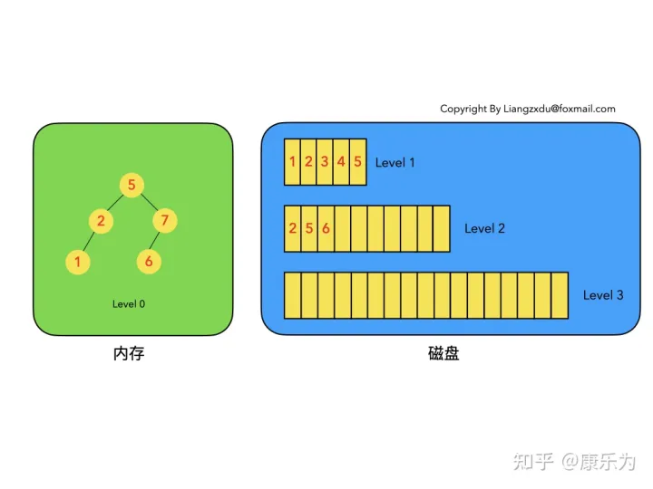

# 一. LSM树数据结构定义

LSM树的名字就叫: 日志结构合并树

查阅了一些资料，LSM树并没有一种固定死的实现方式，更多的是一种将：

“磁盘顺序写” + “多个树(状数据结构)” + “冷热（新老）数据分级” + “定期归并” + “非原地更新”这几种特性统一在一起的思想。

为了方便后续的讲解分析，我们尝试先对LSM树做一个定义。

**LSM树的定义：**

1. LSM树是一个横跨内存和磁盘的，包含多颗"子树"的一个森林。
2. LSM树分为Level 0，Level 1，Level 2 ... Level n 多颗子树，其中只有Level 0在内存中，其余Level 1-n在磁盘中。
3. 内存中的Level 0子树一般采用排序树（红黑树/AVL树）、跳表或者TreeMap等这类有序的数据结构，方便后续顺序写磁盘。
4. 磁盘中的Level 1-n子树，本质是数据排好序后顺序写到磁盘上的文件，只是叫做树而已。
5. 每一层的子树都有一个阈值大小，达到阈值后会进行合并，合并结果写入下一层。
6. 只有内存中数据允许原地更新，磁盘上数据的变更只允许追加写，不做原地更新。

## 图解

- 图1中分成了左侧绿色的内存部分和右侧蓝色的磁盘部分（定义1）。
- 图1左侧绿色的内存部分只包含Level 0树，右侧蓝色的磁盘部分则包含Level 1-n等多棵"树"（定义2）
- 图1左侧绿色的内存部分中Level 0是一颗二叉排序树（定义3）。注意这里的有序性，该性质决定了LSM树优异的读写性能。
- 图1右侧蓝色的磁盘部分所包含的Level 1到Level n多颗树，虽然叫做“树”，但本质是按数据key排好序后，顺序写在磁盘上的一个个文件（定义4） ，注意这里再次出现了有序性。
- 内存中的Level 0树在达到阈值后，会在内存中遍历排好序的Level 0树并顺序写入磁盘的Level 1。同样的，在磁盘中的Level n（n>0）达到阈值时，则会将Level n层的多个文件进行归并，写入Level n+1层。（定义5）
- 除了内存中的Level 0层做原地更新外，对已写入磁盘上的数据，都采用Append形式的磁盘顺序写，即更新和删除操作并不去修改老数据，只是简单的追加新数据。图1中右侧蓝色的磁盘部分，Level 1和Level 2均包含key为2的数据，同时图1左侧绿色内存中的Level 0树也包含key为2的数据节点。（定义6）

# 二. 插入操作

LSM树的插入较简单，数据无脑往内存中的Level 0排序树丢即可，并不关心该数据是否已经在内存或磁盘中存在。代价很低，能实现极高的写吞吐量。

# 三. 删除操作

LSM树的删除操作并不是直接删除数据，而是通过一种叫“墓碑标记”的特殊数据来标识数据的删除。

**删除操作分为：待删除数据在内存中、待删除数据在磁盘中 和 该数据根本不存在 三种情况。**

综合看待上述三种情况，发现不论数据有没有、在哪里，删除操作都是等价于向Level 0树中写入墓碑标记。该操作复杂度为树高log(n)，代价很低。

实际上就是对level 0树上的操作，如果存在则标记为删除，如果不存在则插入删除节点

## 1 待删除数据在内存中：

将要删除的key所在的Level 0树的key标记为墓碑

## 2 待删除数据在磁盘中：

待删除数据在磁盘上时的删除过程。我们并不去修改磁盘上的数据（理都不理它），而是直接向内存中的Level 0树中插入墓碑标记即可。

## 3 待删除数据根本不存在：

这种情况等价于在内存的Level 0树中新增一条墓碑标记，场景转换为情况2的内存中插入墓碑标记操作。

# 四. 修改操作

**LSM树的修改操作和删除操作很像，也是分为三种情况：待修改数据在内存中、在磁盘中和 该数据根本不存在。**

修改操作都是对内存中Level 0进行覆盖/新增操作。该操作复杂度为树高log(n)，代价很低。

## 1 待修改数据在内存中：

待修改数据在内存中的操作过程。新的蓝色的key=7的数据，直接定位到内存中Level 0树上黄色的老的key=7的位置，将其覆盖即可。

## 2 待修改数据在磁盘中：

待修改数据在磁盘中的操作过程。LSM树并不会去磁盘中的Level 1树上原地更新老的key=7的数据，而是直接将新的蓝色的节点7插入内存中的Level 0树中。

## 3 该数据根本不存在：

此场景等价于情况2，直接向内存中的Level 0树插入新的数据即可。

# 五. 查询操作

LSM树的查询操作会按顺序查找Level 0、Level 1、Level 2 ... Level n 每一颗树，一旦匹配便返回目标数据，不再继续查询。该策略保证了查到的一定是目标key最新版本的数据（有点MVCC的感觉）。

分场景分析：依然分为 **待查询数据在内存中** 和 **待查询数据在磁盘中** 两种情况。

综合上述两种情况，我们发现，LSM树的查询操作相对来说代价比较高，需要从Level 0到Level n一直顺序查下去。极端情况是LSM树中不存在该数据，则需要把整个库从Level 0到Level n给扫了一遍，然后返回查无此人（可以通过 布隆过滤器 + 建立稀疏索引 来优化查询操作）。**代价大于以B/B+树为基本数据结构的传统RDB存储引擎。**

## 1 待查询数据在内存中：

沿着内存中已排好序的Level 0树递归向下比较查询，返回目标节点即可。我们注意到磁盘上的Level 1树中同样包括一个key=6的较老的数据。但LSM树查询的时候会按照Level 0、1、2 ... n的顺序查询，一旦查到第一个就返回，因此磁盘上老的key=6的数据没人理它，更不会作为结果被返回。

## 2 待查询数据在磁盘中：

先查询内存中的Level 0树，没查到便查询磁盘中的Level 1树，还是没查到，于是查询磁盘中的Level 2树，匹配后返回key=6的数据。

# 六. 合并操作

合并操作是LSM树的核心（毕竟LSM树的名字就叫: 日志结构合并树，直接点名了合并这一操作）

由于原始数据都是有序的，因此归并的过程只需要对数据集进行一次扫描即可，复杂度为O(n)。

之所以在增、删、改、查这四个基本操作之外还需要合并操作：

1. 因为内存不是无限大，Level 0树达到阈值时，需要将数据从内存刷到磁盘中，这是合并操作的第一个场景**（Level 0 内存达到阈值）**
2. 需要对磁盘上达到阈值的顺序文件进行归并，并将归并结果写入下一层，归并过程中会清理重复的数据和被删除的数据(墓碑标记)。**（Level n磁盘达到阈值）**

## 1 内存数据写入磁盘的场景：

**当level 0达到阈值时，开启合并操作，将level 0上的数据合并成一个块到level 1上。**

对内存中的Level 0树进行中序遍历，将数据顺序写入磁盘的Level 1层即可，我们可以看到因为Level 0树是已经排好序的，所以写入的Level 1中的新块也是有序的（有序性保证了查询和归并操作的高效）。此时磁盘的Level 1层有两个Block块。

**被标记为墓碑的节点，不会合并到Level 1中**

## 2 磁盘中多个块的归并：

**当Level n上的块达到阈值时，则会开启合并，将level n上的多个数据块合并到level n+1中**

注意到key=5和key=7的数据同时存在于较老的Block 1和较新的Block 2中。而归并的过程是保留较新的数据，于是我们看到结果中，key=5和7的数据都是红色的（来自于较新的Block2）。

**被标记为墓碑的节点，不会合并到Level n+1中**

**如果节点出现在两个数据块，则使用最新的数据块**

# 七. 优缺点分析

可以看到LSM树将增、删、改这三种操作都转化为内存insert + 磁盘顺序写(当Level 0满的时候)，通过这种方式得到了无与伦比的写吞吐量。

LSM树的查询能力则相对被弱化，相比于B+树的最多3~4次磁盘IO，LSM树则要从Level 0一路查询Level n，极端情况下等于做了全表扫描。（即便做了稀疏索引，也是lg(N0)+lg(N1)+...+lg(Nn)的复杂度，大于B+树的lg(N0+N1+...+Nn)的时间复杂度）。

同时，LSM树只append追加不原地修改的特性引入了归并操作，归并操作涉及到大量的磁盘IO，比较消耗性能，需要合理设置触发该操作的参数。

**优：增、删、改操作飞快，写吞吐量极大。**

**缺：读操作性能相对被弱化；不擅长区间范围的读操作； 归并操作较耗费资源。**

| 操作 | 平均代价 | 最坏情况代价 |
| ---- | -------- | ------------ |
| 插入 | 1        | 1            |
| 删除 | 1        | 1            |
| 修改 | 1        | 1            |
| 查找 | lgN      | lgN          |

# 八. 总结

以上是对LSM树基本操作以及优缺点的分析，我们可以据此得出LSM树的设计原则：

1. 先内存再磁盘
2. 内存原地更新
3. 磁盘追加更新
4. 归并保留新值

如果说B/B+树的读写性能基本平衡的话，LSM树的设计原则通过舍弃部分读性能，换取了无与伦比的写性能。该数据结构适合用于写吞吐量远远大于读吞吐量的场景，得到了NoSQL届的喜爱和好评。

# 参考：

https://zhuanlan.zhihu.com/p/415799237