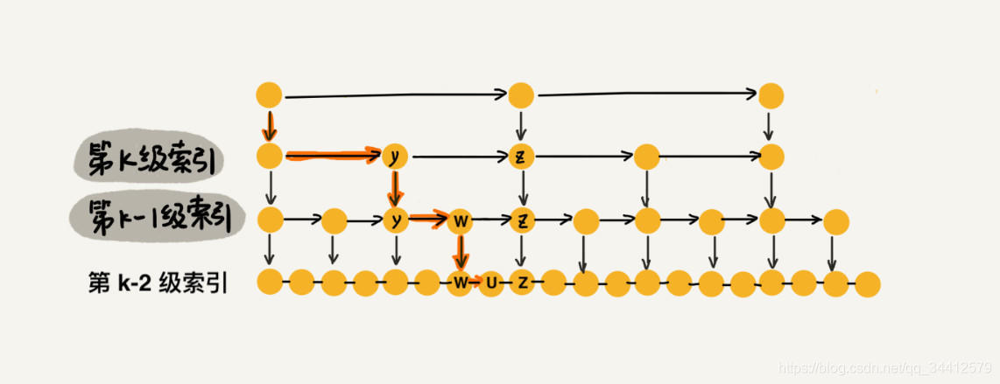

# 一. 跳跃表skipList

https://blog.csdn.net/qq_34412579/article/details/101731935

## 结构

是一个**多层次**的链表，每个节点都有一个next指针（指向下个元素）和一个down指针（指向下一层）

每层节点的**next跨度**大小都不同，从上到下依次减小

最底层为原始链表，是有序的链表

## 时间复杂度

- 性能可以和AVL树媲美，且实现简单
- 最好O（lgN）
- 最差O（N） 

## 空间复杂度

跳表通过建立索引，来提高查找元素的效率，就是典型的“空间换时间”的思想，所以在空间上做了一些牺牲，假如原始链表包含 n 个元素，则一级索引元素个数为 n/2、二级索引元素个数为 n/4、三级索引元素个数为 n/8 以此类推。所以，索引节点的总和是：n/2 n/4 n/8 … 8 4 2 = n-2，**空间复杂度是 O(n)**。

# 二. 查询元素

1. 先从最顶层元素开始查找
2. 如果该节点和该元素相同则返回
3. 如果next节点比该元素大，则向下沉，到第二层索引查找。
4. 如果next节点比该元素小，则进行到next节点。
5. 循环步骤2，3，4直到查到元素

时间复杂度为O(logN)，因为用了二分查找方法

# 三. 插入元素

插入元素分为两步：查找到要插入的位置，要插入的层高

插入的时间复杂度是 O(logn)。

## 查找要插入的位置

就用章节二中的方式查找到位置

## 插入的层高

在每次新插入元素的时候，尽量让该元素有 1/2 的几率建立一级索引、1/4 的几率建立二级索引、1/8 的几率建立三级索引，以此类推，就能满足我们上面的条件。现在我们就需要一个概率算法帮我们把控这个 1/2、1/4、1/8 … ，当每次有数据要插入时，先通过概率算法告诉我们这个元素需要插入到几级索引中，然后开始维护索引并把数据插入到原始链表中。
每次计算层高使用了**掷硬币法**：每次是否上升高一层，则有50%的成功和50%的失败。这样就能满足概率

# 四. 删除元素

直接查找到要删除的位置，直接删除对应的节点和层高

# 五. 总结

跳表是可以实现二分查找的有序链表；

每个元素插入时随机生成它的level；

最底层包含所有的元素；

如果一个元素出现在level(x)，那么它肯定出现在x以下的level中；

每个索引节点包含两个指针，一个向下，一个向右；（笔记目前看过的各种跳表源码实现包括Redis 的zset 都没有向下的指针，那怎么从二级索引跳到一级索引呢？留个悬念，看源码吧，文末有跳表实现源码）

跳表查询、插入、删除的时间复杂度为O(log n)，与平衡二叉树接近；