# 一. GC技术

常见的GC算法：**引用计数法**、**标记-清除法**

## 1. GC算法的评判标准

1. **吞吐量**：即单位时间内的处理能力。
2. **最大暂停时间**：因执行GC而暂停执行程序所需的时间。
3. **堆的使用效率**：鱼与熊掌不可兼得，堆使用效率和吞吐量、最大暂停时间是不可能同时满足的。即可用的堆越大，GC运行越快；相反，想要利用有限的堆，GC花费的时间就越长。
4. **访问的局部性**：在存储器的层级构造中，我们知道越是高速存取的存储器容量会越小。由于程序的局部性原理，将经常用到的数据放在堆中较近的位置，可以提高程序的运行效率。

## 2. 可达性

 所谓的可达性就是通过一系列称为“GC Roots”的对象为起点，从这些节点开始向下搜索，搜索走过的路径称为引用链，当一个对象到GC Roots没有任何引用链相连（用图论的话来说，就是GC Roots到这个对象不可达）时，则说明此对象是不可用的。

## 3. 引用计数法

所谓的引用计数法就是给每个对象一个引用计数器，每当有一个地方引用它时，计数器就会加1；当引用失效时，计数器的值就会减1；任何时刻计数器的值为0的对象就是不可能再被使用的。

### 3.1 优点

1. 可即时回收垃圾：在该方法中，每个对象始终知道自己是否有被引用，当被引用的数值为0时，对象马上可以把自己当作空闲空间链接到空闲链表。
2. 最大暂停时间短。
3. 没有必要沿着指针查找

### 3.2 缺点

1. 计数器值的增减处理非常繁重
2. 计算器需要占用很多位。
3. 实现繁琐。
4. 循环引用无法回收。

## 4. 标记-清除算法

 该算法分为标记和清除两个阶段。标记就是把所有活动对象都做上标记的阶段；清除就是将没有做上标记的对象进行回收的阶段。白色为清除对象，黑色为使用对象，灰色为待扫描对象。

### 4.1 优点

1. 解决了循环引用无法释放问题

### 4.2 缺点

1. 效率较低，标记和清除两个动作都需要遍历所有对象，并且在GC时，都需要暂停应用程序，对于交互性比较要求比较高的应用而言这种体验非常差
2. 通过标记清除法清理出来的内存碎片化较为严重，因为被清理的对象存在于内存的各个角落，所以清理出来的内存不是连贯的。

# 二. GO的GC

垃圾回收(Garbage Collection，简称GC)是编程语言中提供的自动的内存管理机制，自动释放不需要的内存对象，让出存储器资源。GC过程中无需程序员手动执行。GC机制在现代很多编程语言都支持，GC能力的性能与优劣也是不同语言之间对比度指标之一。

+ Go V1.3：标记-清除(mark and sweep)算法，整体过程需要启动STW，效率极低。
+ Go V1.5：三色标记法+屏障机制（插入屏障和删除屏障）， 堆空间启动写屏障，栈空间不启动，全部扫描之后，需要重新扫描一次栈(需要STW)，效率普通
+ Go V1.8：三色标记法+混合写屏障机制，栈空间不启动，堆空间启动。整个过程几乎不需要STW，效率较高。
+ 都需要扫描栈上数据，因为栈上对象会引用堆上对象。栈上对象内存会自动回收，而堆上对象则由GC处理

## 1. Go V1.3 标记-清除(mark and sweep)算法

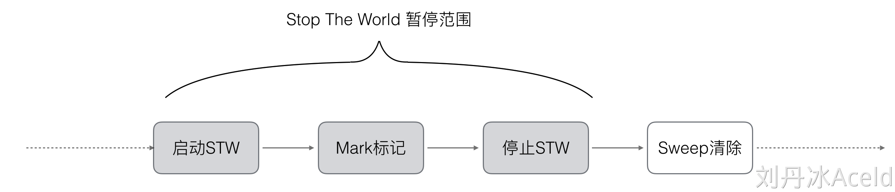

Golang1.3之前的时候主要用的普通的标记-清除算法，此算法主要有两个主要的步骤：

- 标记(Mark phase)
- 清除(Sweep phase)

操作非常简单，但是有一点需要额外注意：mark and sweep算法在执行的时候，需要程序暂停！即 `STW(stop the world)`，STW的过程中，CPU不执行用户代码，全部用于垃圾回收，这个过程的影响很大，所以STW也是一些回收机制最大的难题和希望优化的点。所以在执行第三步的这段时间，程序会暂定停止任何工作，卡在那等待回收执行完毕。

### 1.1 步骤

1. 暂停程序业务逻辑, 从根节点出发，分类出**可达**和**不可达**的对象，然后做上标记。
2. 开始标记，程序找出它所有**可达**的对象，并做上标记
3. 标记完了之后，开启程序业务，然后开始清除**未标记**的对象

### 1.2 缺点

- STW，stop the world；让程序暂停，程序出现卡顿 **(重要问题)**；
- 标记需要扫描整个heap；
- 清除数据会产生heap碎片。

## 2. Go V1.5的三色发标记法+屏障技术

### 2.1 三色标记

Golang中的垃圾回收主要应用三色标记法，GC过程和其他用户goroutine可并发运行，但需要一定时间的**STW(stop the world)**，所谓**三色标记法**实际上就是通过三个阶段的标记来确定清楚的对象都有哪些？我们来看一下具体的过程。

+ **白色**：未搜索的对象，在回收周期开始时所有对象都是白色，在回收周期结束时所有的白色都是垃圾对象
+ **灰色**：正在搜索的对象，该类对象可能还存在外部引用对象
+ **黑色**：已搜索完的对象，这类对象不再有外部引用对象

#### 2.1.1 步骤1，初始化对象

**第一步** , 每次新创建的对象，默认的颜色都是标记为“白色”。

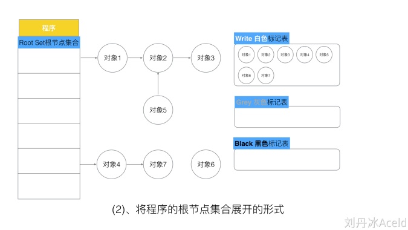

#### 2.1.2 步骤2，扫描根节点白色对象

**第二步**, 每次GC回收开始, 会从**根**节点开始遍历所有对象，把遍历到的对象从白色集合放入“灰色”。这里 要注意的是，本次遍历是一次遍历，非递归形式，是从程序扫描**可抵达的对象遍历一层**，如图所示，当前可抵达的对象是对象1和对象4，那么自然本轮遍历结束，对象1和对象4就会被标记为灰色，灰色标记表就会多出这两个对象。

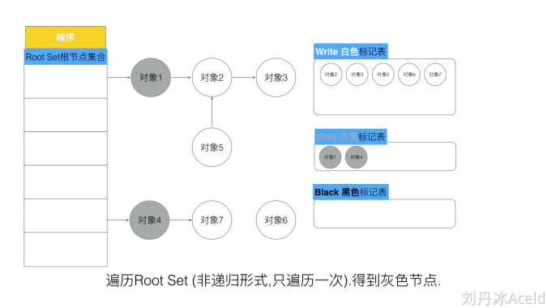

#### 2.1.3 步骤3，扫描灰色对象

**第三步**, 遍历灰色集合，将灰色对象引用的对象从白色集合放入灰色集合，之后将此灰色对象放入黑色集合，如图所示。这一次遍历是只扫描灰色对象，将灰色对象的第一层遍历可抵达的对象由白色变为灰色，如：对象2、对象7. 而之前的灰色对象1和对象4则会被标记为黑色，同时由灰色标记表移动到黑色标记表中。

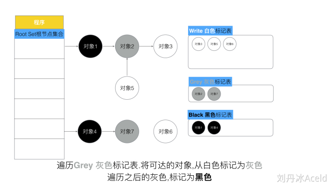

#### 2.1.4 步骤4，直到无灰色对象

**第四步**, 重复**第三步**, 直到灰色中无任何对象，如图所示。当我们全部的可达对象都遍历完后，灰色标记表将不再存在灰色对象，目前全部内存的数据只有两种颜色，黑色和白色。那么黑色对象就是我们程序逻辑可达（需要的）对象，这些数据是目前支撑程序正常业务运行的，是合法的有用数据，不可删除，白色的对象是全部不可达对象，目前程序逻辑并不依赖他们，那么白色对象就是内存中目前的垃圾数据，需要被清除。

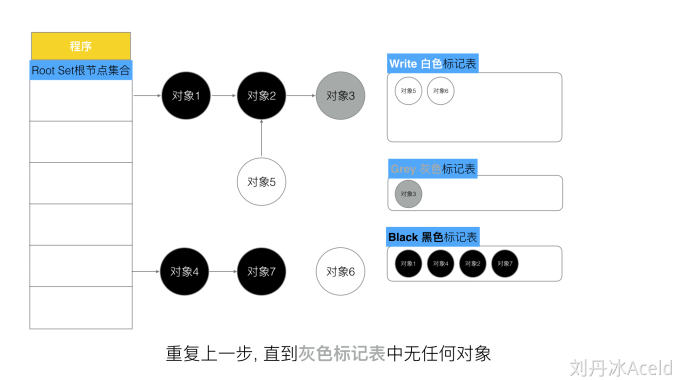

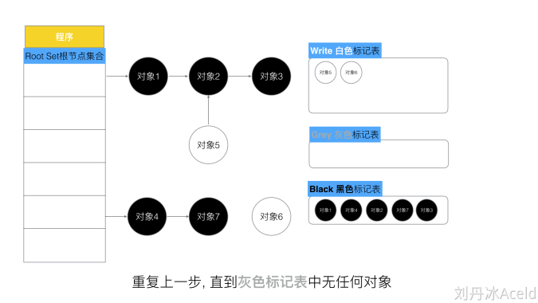

#### 2.1.2 步骤4，清理白色对象

**第五步**: 回收所有的白色标记表的对象. 也就是回收垃圾，如图所示。以上我们将全部的白色对象进行删除回收，剩下的就是全部依赖的黑色对象。

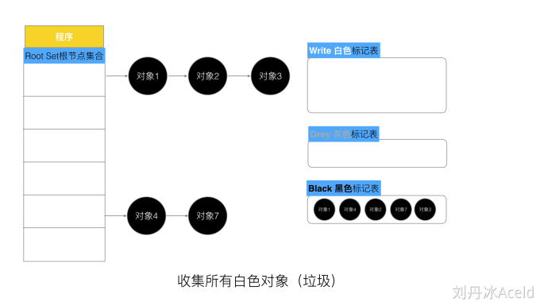

### 2.2 没有STW的三色标记

在三色标记法执行期间可能会有很多并发流程均会被扫描，执行并发流程的内存可能相互依赖，为了在GC过程中保证数据的安全，我们在开始三色标记之前就会加上STW，在扫描确定黑白对象之后再放开STW。但是很明显这样的GC扫描的性能实在是太低了。

假设不使用STW的话，会出现什么问题。会出现丢失使用对象问题

#### 2.2.1  假设状态

我们把初始状态设置为已经经历了第一轮扫描，目前黑色的有对象1和对象4， 灰色的有对象2和对象7，其他的为白色对象，且对象2是通过指针p指向对象3的，如图所示。

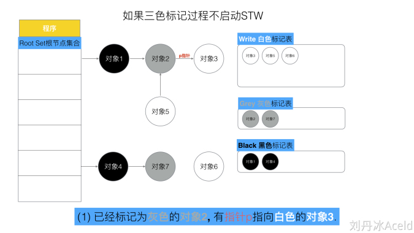

#### 2.2.2 并发读写对象

现在如何三色标记过程不启动STW，那么在GC扫描过程中，任意的对象均可能发生读写操作，如图所示，在还没有扫描到对象2的时候，已经标记为黑色的对象4，此时创建指针q，并且指向白色的对象3。

与此同时灰色的对象2将指针p移除，那么白色的对象3实则就是被挂在了已经扫描完成的黑色的对象4下，如图所示。

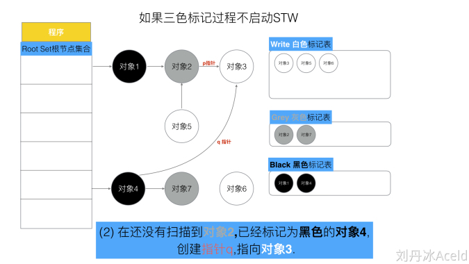

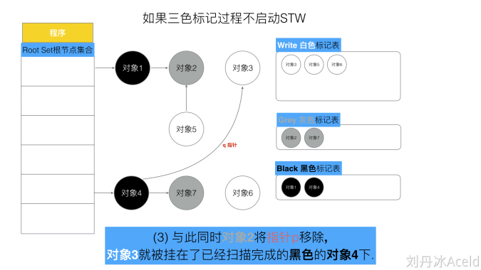

#### 2.2.3 问题状态

然后我们正常指向三色标记的算法逻辑，将所有灰色的对象标记为黑色，那么对象2和对象7就被标记成了黑色

那么就执行了三色标记的最后一步，将所有白色对象当做垃圾进行回收，如图所示。

但是最后我们才发现，本来是对象4合法引用的对象3，却被GC给“误杀”回收掉了。并且，如果示例中的白色对象3还有很多下游对象的话, 也会一并都清理掉。

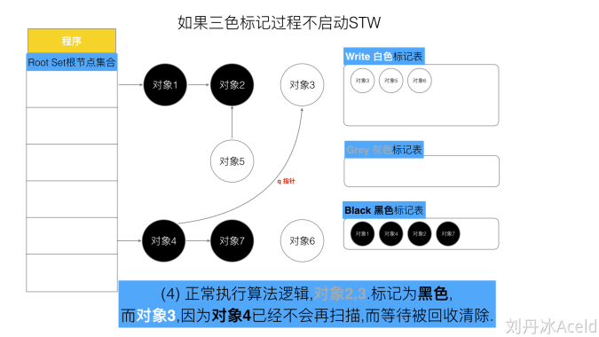

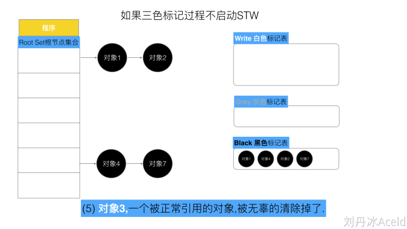

#### 2.2.3 问题根因

在三色标记法中，是不希望被发生的。

- 条件1: 一个白色对象被黑色对象引用**(白色被挂在黑色下)**
- 条件2: 灰色对象与它之间的可达关系的白色对象遭到破坏**(灰色同时丢了该白色)**
  如果当以上两个条件同时满足时，就会出现对象丢失现象!

为了防止这种现象的发生，最简单的方式就是STW，直接禁止掉其他用户程序对对象引用关系的干扰，但是**STW的过程有明显的资源浪费，对所有的用户程序都有很大影响**。那么是否可以在保证对象不丢失的情况下合理的尽可能的提高GC效率，减少STW时间呢？答案是可以的，我们只要使用一种机制，尝试去破坏上面的两个必要条件就可以了。

### 2.3 屏障机制

我们让GC回收器，满足下面两种情况之一时，即可保对象不丢失。  这两种方式就是“强三色不变式”和“弱三色不变式”。为了遵循上述的两个方式，GC算法演进到两种屏障方式，他们“插入屏障”, “删除屏障”。

+ 插入写屏障：只对堆区对象生效，栈区对象不生效。结束时需要STW来重新扫描栈，标记栈上引用的白色对象的存活； 
+  删除写屏障：回收精度低，GC开始时STW扫描堆栈来记录初始快照，这个过程会保护开始时刻的所有存活对象。 

#### 2.3.1 强三色不变式

不存在黑色对象引用到白色对象的指针。强三色不变色实际上是强制性的不允许黑色对象引用白色对象，这样就不会出现有白色对象被误删的情况。

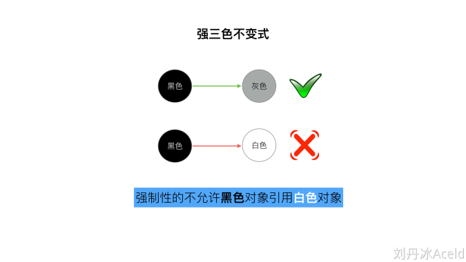

#### 2.3.2 弱三色不变式

所有被黑色对象引用的白色对象都处于灰色保护状态。

弱三色不变式强调，黑色对象可以引用白色对象，但是这个白色对象必须存在其他灰色对象对它的引用，或者可达它的链路上游存在灰色对象。 这样实则是黑色对象引用白色对象，白色对象处于一个危险被删除的状态，但是上游灰色对象的引用，可以保护该白色对象，使其安全。

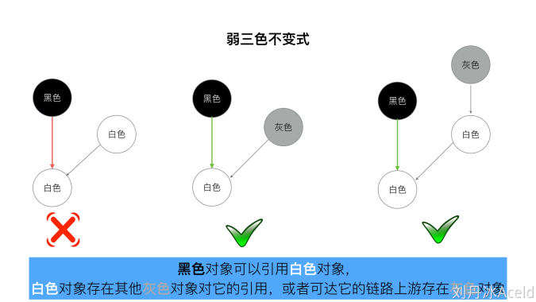

#### 2.3.3 插入屏障

+ `具体操作`: 在A对象引用B对象的时候，B对象被标记为灰色。(将B挂在A下游，B必须被标记为灰色)
+ `满足`: **强三色不变式**. (不存在黑色对象引用白色对象的情况了， 因为白色会强制变成灰色)
+ 我们知道,黑色对象的内存槽有两种位置, `栈`和`堆`. 栈空间的特点是容量小,但是要求相应速度快,因为函数调用弹出频繁使用, 所以“插入屏障”机制,在**栈空间的对象操作中不使用**. 而仅仅使用在堆空间对象的操作中.
+ 步骤：先全局进行三色标记+写入屏障处理，再对栈区进行STW和三色标记，最后再解除STW和清除对象

具体步骤：

1. 程序初始化全部标记为白色，将所有对象加入到白色集合

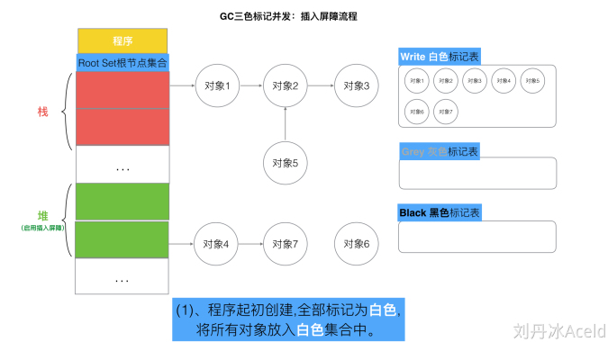

2. 遍历root（非递归形式，只遍历一次）得到第一层灰色接地单

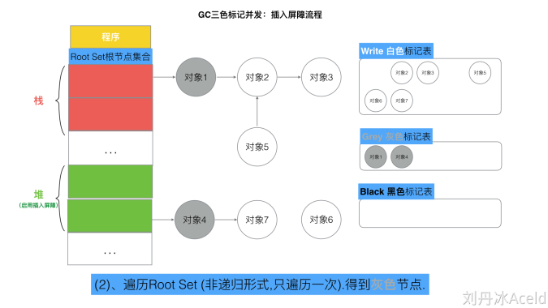

3. 遍历灰色标记表，将可达的对象，从白色标记为灰色，遍历结束后灰色标记为黑色

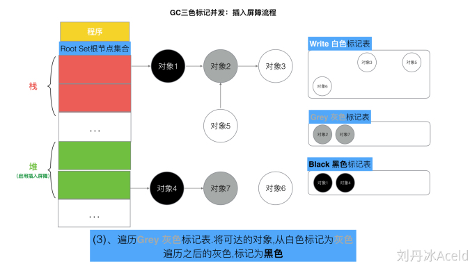

4. 由于并发特性，此刻外界向对象4添加对象8，对象1添加对象9，对象4在堆区，即可触发插入写屏障机制，对象1不触发

5. 由于插入写屏障（黑色对象添加白色，将白色改为灰色），对象8为灰色，对象9依旧为白色（栈区）

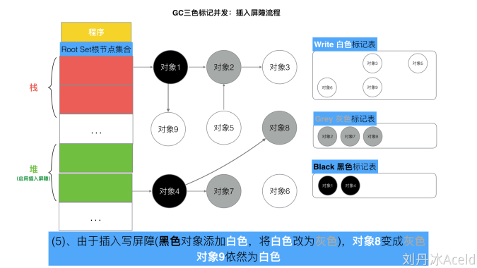

6. 继续循环三色标记过程，知道没有灰色节点

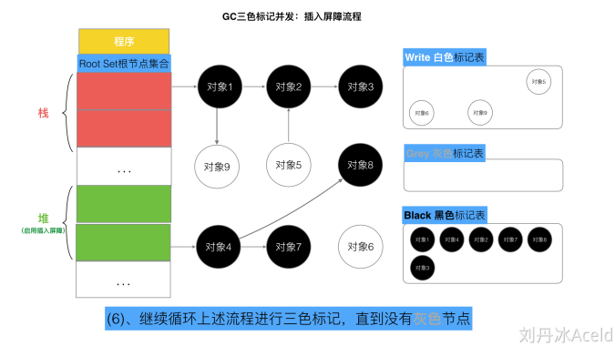

7. 如果栈不添加,当全部三色标记扫描之后,栈上有可能依然存在白色对象被引用的情况(如上图的对象9).  所以要对栈重新进行三色标记扫描, 但这次为了对象不丢失, 要对本次标记扫描启动**STW**暂停. 直到栈空间的三色标记结束.

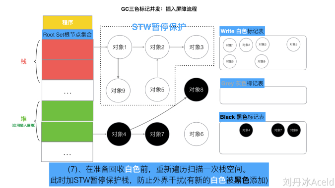

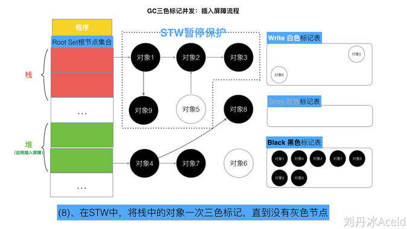

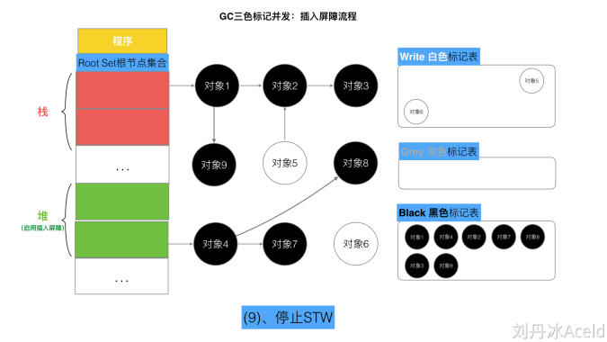

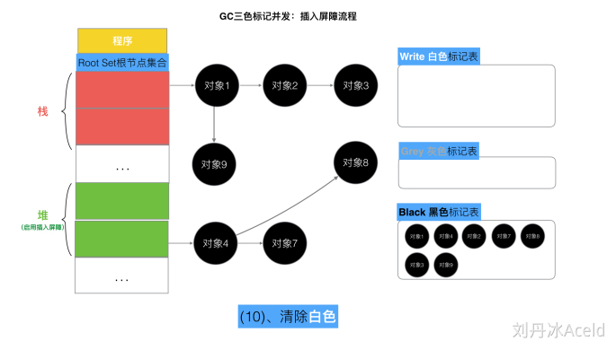

#### 2.3.4 删除屏障

+ `具体操作`: 被删除的对象，如果自身为灰色或者白色，那么被标记为灰色。

+ `满足`: **弱三色不变式**. (保护灰色对象到白色对象的路径不会断)
+ 这种方式的回收精度低，一个对象即使被删除了最后一个指向它的指针也依旧可以活过这一轮，在下一轮GC中被清理掉。

具体步骤：

1. 程序初始化白色对象，将所有对象加入到白色集合

2. 遍历root得到灰色节点集合

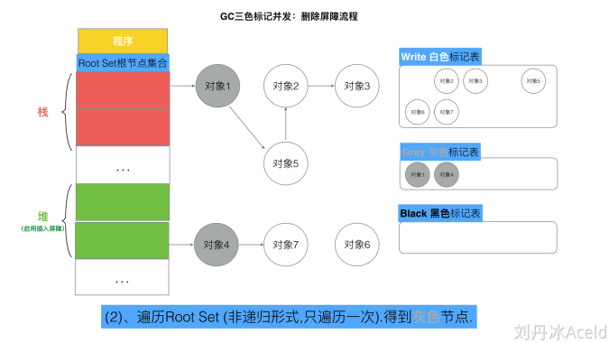

3. 灰色对象1删除对象5，如果不触发删除屏障，5-2-3路径与主链路断开，最后都会被清除

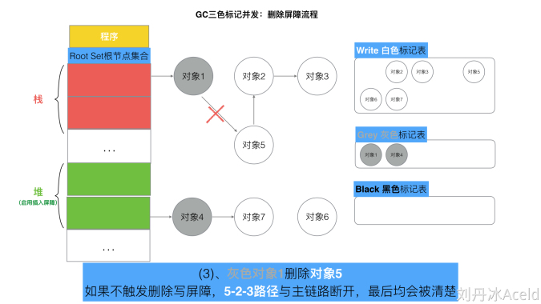

4. 触发删除屏障，被删除的对象5被标记为灰色

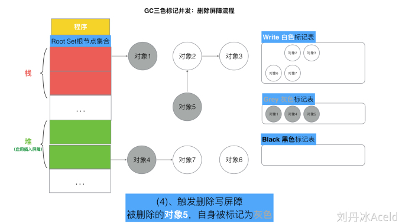

5. 遍历所有灰色节点，将可达对象从白色标记为灰色，遍历过的灰色标记对黑色

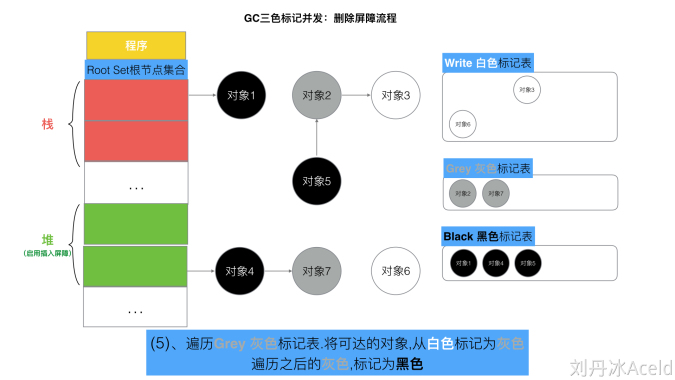

6. 继续循环三色标记，直到没有灰色节点

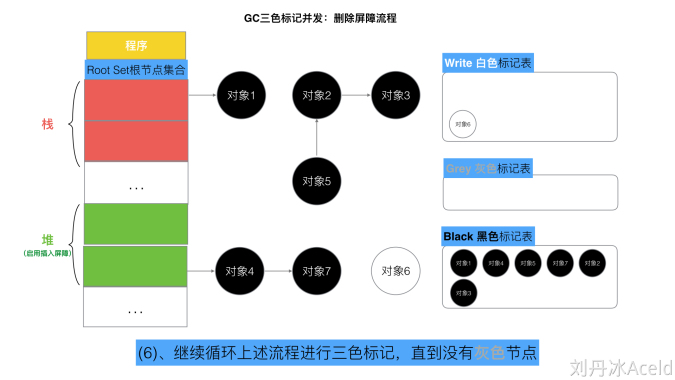

7. 清理白色

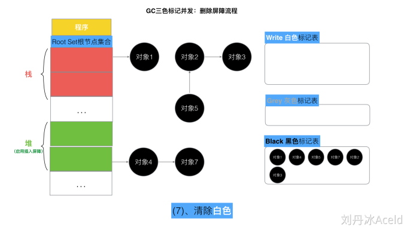

## 3. Go V1.8的混合写屏障(hybrid write barrier)机制

插入写屏障和删除写屏障的短板：

-  插入写屏障：结束时需要STW来重新扫描栈，标记栈上引用的白色对象的存活； 
-  删除写屏障：回收精度低，GC开始时STW扫描堆栈来记录初始快照，这个过程会保护开始时刻的所有存活对象。 

Go V1.8版本引入了混合写屏障机制（hybrid write barrier），避免了对栈re-scan的过程，极大的减少了STW的时间。结合了两者的优点。

### 3.1 混合写屏障规则

+ Golang中的混合写屏障满足`弱三色不变式`，结合了删除写屏障和插入写屏障的优点，只需要在开始时并发扫描各个goroutine的栈，使其变黑并一直保持，这个过程不需要STW，而标记结束后，因为栈在扫描后始终是黑色的，也无需再进行re-scan操作了，减少了STW的时间。
+ `具体操作`:
  1. GC开始将**栈上**的对象全部扫描并标记为黑色(之后不再进行第二次重复扫描，无需STW)，
  2. GC期间，任何在栈上创建的新对象，均为黑色。
  3. 被删除的对象标记为灰色。
  4. 被添加的对象标记为灰色。

+ `满足`: 变形的**弱三色不变式**.
+ 注意:
  +  **屏障技术是不在栈上应用的，因为要保证栈的运行效率。**
  + 混合写屏障是Gc的一种屏障机制，所以只是当程序执行GC的时候，才会触发这种机制。

### 3.2 开始GC

1. GC开始全部默认为白色
2. 三色标记法，优先扫描全部栈对象将可达对象标记为黑色

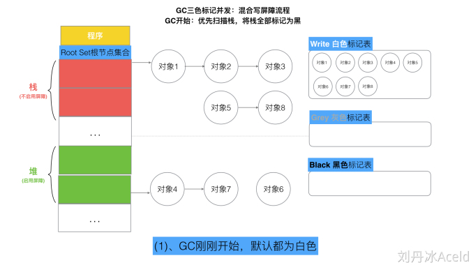

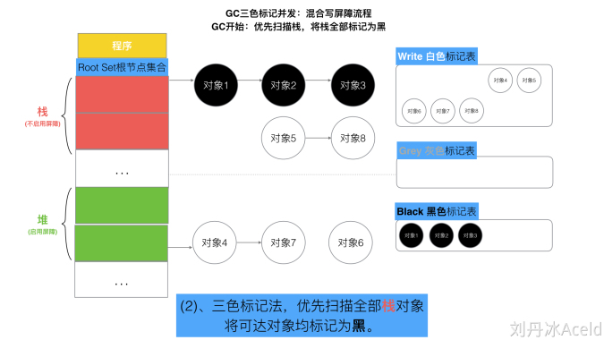

### 3.3 场景一： 对象被一个堆对象删除引用，成为栈对象的下游

1. 将堆对象7添加到栈对象1下游，因为栈不启动写屏障，所以直接挂在下游
2. 堆对象4删除堆对象7的引用关系，因为堆对象4在堆区，所以触发写屏障，标记为灰色

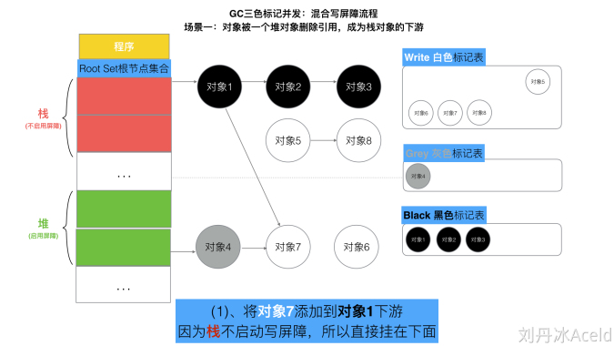

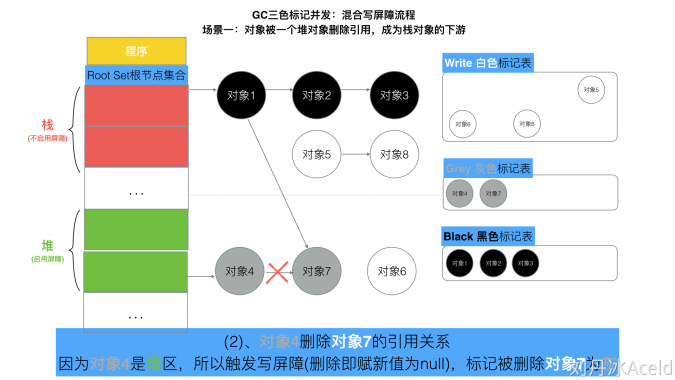

### 3.4 场景二： 对象被一个栈对象删除引用，成为另一个栈对象的下游

1. 在栈上新建一个对象9（混合写屏障模式中，GC过程中任何新建对象均为黑色）
2. 对象9添加下游引用栈对象3（直接添加，栈不启用屏障）
3. 栈对象2删除栈对象3的引用（直接删除，栈不启用屏障）

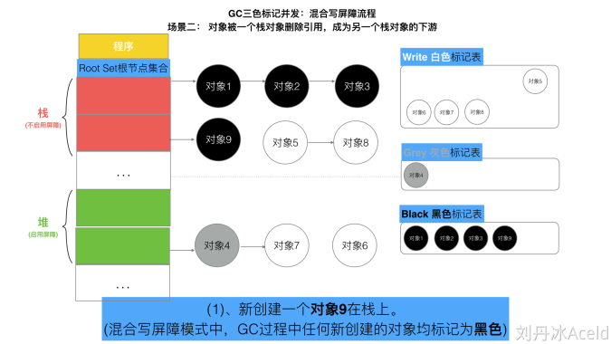

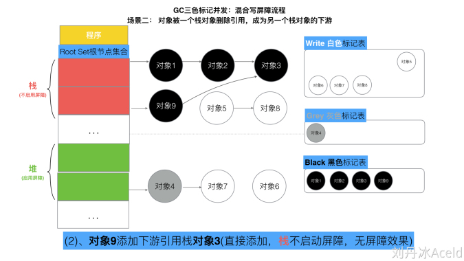

### 3.5 场景三：对象被一个堆对象删除引用，成为另一个堆对象的下游

1. 堆对象10已经扫描标记为黑色
2. 堆对象10添加下游引用堆对象7，触发屏障机制，被添加对象7标记为灰色
3. 堆对象4删除堆对象7的引用，触发屏障机制，被删除对象7标记为灰色

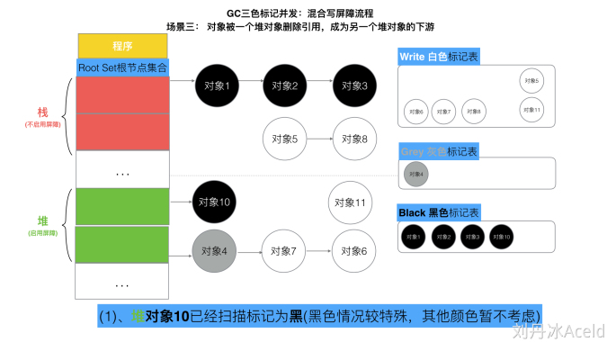

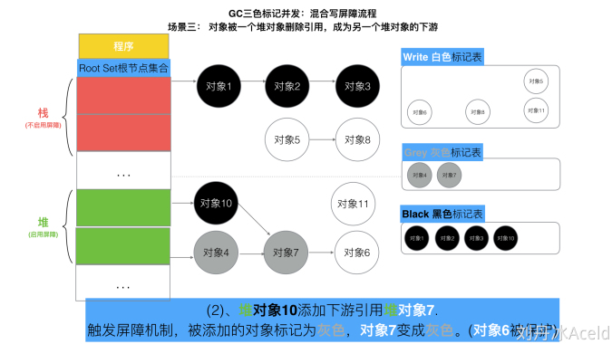

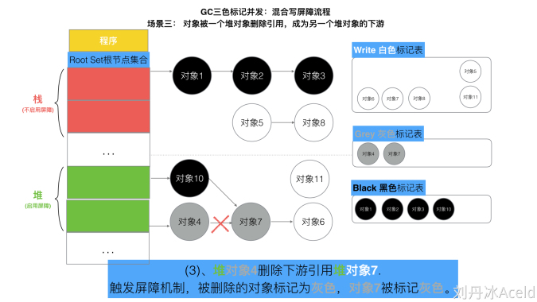

### 3.6 场景四：对象从一个栈对象删除引用，成为另一个堆对象的下游

1. 栈对象1删除栈对象2的引用（栈空间不触发屏障）
2. 堆对象4将之前引用堆对象7的关系，转移至对象2（对象4删除对象7引用关系）
3. 堆对象4删除堆对象7的引用，触发屏障机制，被删除对象7标记为灰色

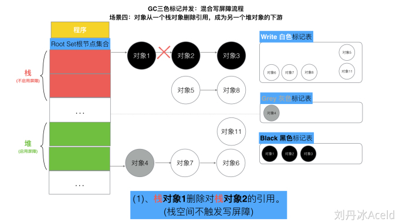

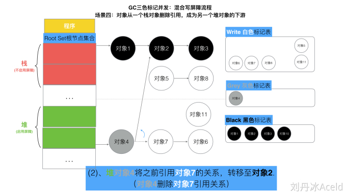

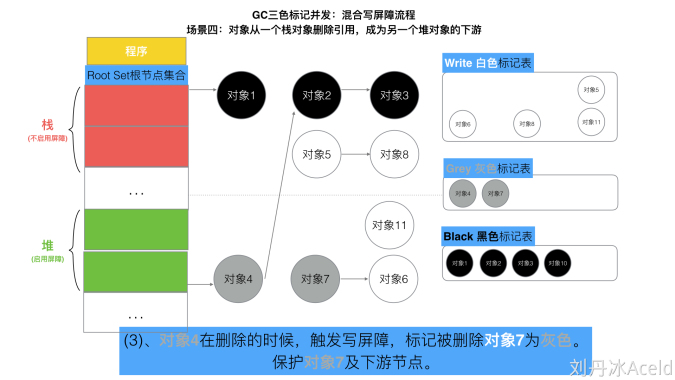

## 4. STW分析

Golang使用的是三色标记法方案，并且支持并行GC，即用户代码何以和GC代码同时运行。具体来讲，Golang GC分为几个阶段:

- Mark阶段该阶段又分为两个部分：

- - Mark Prepare：初始化GC任务，包括开启写屏障(write barrier)和辅助GC(mutator assist)，统计root对象的任务数量等，这个过程需要STW。
  - GC Drains: 扫描所有root对象，包括全局指针和goroutine(G)栈上的指针（扫描对应G栈时需停止该G)，将其加入标记队列(灰色队列)，并循环处理灰色队列的对象，直到灰色队列为空。该过程后台并行执行。

- Mark Termination阶段：该阶段主要是完成标记工作，重新扫描(re-scan)全局指针和栈。因为Mark和用户程序是并行的，所以在Mark过程中可能会有新的对象分配和指针赋值，这个时候就需要通过写屏障（write barrier）记录下来，re-scan 再检查一下，这个过程也是会STW的。

- Sweep: 按照标记结果回收所有的白色对象，该过程后台并行执行。

- Sweep Termination: 对未清扫的span进行清扫, 只有上一轮的GC的清扫工作完成才可以开始新一轮的GC。

总结一下，Golang的GC过程有两次STW:第一次STW会准备根对象的扫描, 启动写屏障(Write Barrier)和辅助GC(mutator assist).第二次STW会重新扫描部分根对象, 禁用写屏障(Write Barrier)和辅助GC(mutator assist).

# 参考

------

https://www.yuque.com/aceld/golang/zhzanb

https://www.zhihu.com/question/326191221/answer/777405566