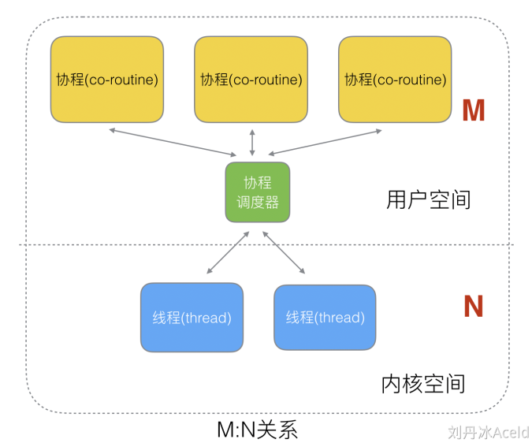

# 进程和协程的关系

## N:1关闭

N个协程绑定1个线程，优点就是**协程在用户态线程即完成切换，不会陷入到内核态，这种切换非常的轻量快速**。但也有很大的缺点，1个进程的所有协程都绑定在1个线程上

缺点：

- 某个程序用不了硬件的多核加速能力
- 一旦某协程阻塞，造成线程阻塞，本进程的其他协程都无法执行了，根本就没有并发的能力了。

## 1:1 关系

1个协程绑定1个线程，这种最容易实现。协程的调度都由CPU完成了，不存在N:1缺点，

缺点：协程的创建、删除和切换的代价都由CPU完成，有点略显昂贵了。

## M:N关系

M个协程绑定N个线程，是N:1和1:1类型的结合，克服了以上2种模型的缺点，但实现起来最为复杂。需要有很好的协程调度器，协程调度器决定了性能的高低

协程跟线程是有区别的，线程由CPU调度是抢占式的，**协程由用户态调度是协作式的**，一个协程让出CPU后，才执行下一个协程。

# 废弃的调度器

M想要执行、放回G都必须访问全局G队列，并且M有多个，即多线程访问同一资源需要加锁进行保证互斥/同步，所以全局G队列是有互斥锁进行保护的。

老调度器有几个缺点：

1. 创建、销毁、调度G都需要每个M获取锁，这就形成了**激烈的锁竞争**。
2. M转移G会造成**延迟和额外的系统负载**。比如当G中包含创建新协程的时候，M创建了G’，为了继续执行G，需要把G’交给M’执行，也造成了**很差的局部性**，因为G’和G是相关的，最好放在M上执行，而不是其他M'。
3. 系统调用(CPU在M之间的切换)导致频繁的线程阻塞和取消阻塞操作增加了系统开销。

# GMP

G表示协程，M表示执行的线程，P表示调度器。P和M是11关系，但是会存在M>=P的情况。G的创建会优先保存到P的本地队列上，如果P的本地队列已满则扔到全局队列。当一个G要执行时，则M上运行的goroutine切换为G0，G0负责调度时协程的切换，会优先从P的本地队列取到G，如果本地队列为空，则从全局队列或者其他P的队列偷取G，并开始运行G。

## 概念

G：goroutine（协程）

M：thread（内核线程）

P：processor（处理器/调度器）

全局队列：当P的本地队列满时，G会放到全局队列

P的本地队列：G的创建优先放到该P的本地队列

M的休眠队列：当M没有执行G时，则会将M扔到休眠队列。休眠时间过久时则销毁

M的状态分为两种：正常状态和自旋状态。自旋状态是：当有PM被唤醒时，P中的队列没有G，则会自旋不断寻找G

**Processor，它包含了运行goroutine的资源**，如果线程想运行goroutine，必须先获取P，P中还包含了可运行的G队列。

## 模型

1. **全局队列**（Global Queue）：存放等待运行的G。
2. **P的本地队列**：同全局队列类似，存放的也是等待运行的G，存的数量有限，不超过256个。新建G'时，G'优先加入到P的本地队列，如果队列满了，则会把本地队列中一半的G移动到全局队列。
3. **P列表**：所有的P都在程序启动时创建，并保存在数组中，最多有`GOMAXPROCS`(可配置)个。
4. **M**：线程想运行任务就得获取P，从P的本地队列获取G，P队列为空时，M也会尝试从全局队列**拿**一批G放到P的本地队列，或从其他P的本地队列**偷**一半放到自己P的本地队列。M运行G，G执行之后，M会从P获取下一个G，不断重复下去。

**Goroutine调度器和OS调度器是通过M结合起来的，每个M都代表了1个内核线程，OS调度器负责把内核线程分配到CPU的核上执行**。

## P和M的关系

M与P的数量没有绝对关系，一个M阻塞，P就会去创建或者切换另一个M，所以，即使P的默认数量是1，也有可能会创建很多个M出来。

### P的数量

由启动时环境变量`$GOMAXPROCS`或者是由`runtime`的方法`GOMAXPROCS()`决定。这意味着在程序执行的任意时刻都只有`$GOMAXPROCS`个goroutine在同时运行。

### M的数量

- go语言本身的限制：go程序启动时，会设置M的最大数量，默认10000.但是内核很难支持这么多的线程数，所以这个限制可以忽略。
- runtime/debug中的SetMaxThreads函数，设置M的最大数量
- 一个M阻塞了，会创建新的M。

### P和M何时会被创建

+ P何时创建：在确定了P的最大数量n后，运行时系统会根据这个数量创建n个P。
+ M何时创建：没有足够的M来关联P并运行其中的可运行的G。比如所有的M此时都阻塞住了，而P中还有很多就绪任务，就会去寻找空闲的M，而没有空闲的，就会去创建新的M

## 调度器的设计策略

### 复用线程

避免频繁的创建、销毁线程，而是对线程的复用。

1. work stealing机制：当本线程无可运行的G时，尝试从其他线程绑定的P偷取G，而不是销毁线程。
2. hand off机制：当本线程因为G进行系统调用阻塞时，线程释放绑定的P，把P转移给其他空闲的线程执行。
3. 当线程长时间空闲时才会被销毁

### 利用并行

`GOMAXPROCS`设置P的数量，最多有`GOMAXPROCS`个线程分布在多个CPU上同时运行。`GOMAXPROCS`也限制了并发的程度，比如`GOMAXPROCS = 核数/2`，则最多利用了一半的CPU核进行并行。

### 抢占

在coroutine中要等待一个协程主动让出CPU才执行下一个协程，在Go中，一个goroutine最多占用CPU **10ms**，防止其他goroutine被饿死，这就是goroutine不同于coroutine的一个地方。

### 全局G队列

在新的调度器中依然有全局G队列，但功能已经被弱化了，当M执行work stealing从其他P偷不到G时，它可以从全局G队列获取G。

## go func()  调度流程

1. 我们通过 go func()来创建一个goroutine
2. 有两个存储G的队列，一个是局部调度器P的本地队列、一个是全局G队列。新创建的G会先保存在P的本地队列中，如果P的本地队列已经满了就会保存在全局的队列中
3. G只能运行在M中，一个M必须持有一个P，M与P是1：1的关系。M会从P的本地队列弹出一个可执行状态的G来执行，如果P的本地队列为空，就会想其他的MP组合偷取一个可执行的G来执行；
4. 一个M调度G执行的过程是一个循环机制；
5. 当M执行某一个G时候如果发生了syscall或则其余阻塞操作，M会阻塞，如果当前有一些G在执行，runtime会把这个线程M从P中摘除(detach)，然后再创建一个新的操作系统的线程(如果有空闲的线程可用就复用空闲线程)来服务于这个P
6. 当M系统调用结束时候，这个G会尝试获取一个空闲的P执行，并放入到这个P的本地队列。如果获取不到P，那么这个线程M变成休眠状态， 加入到空闲线程中，然后这个G会被放入全局队列中。

## 调度器的生命周期

### M0

`M0`是启动程序后的编号为0的**主线程**，这个M对应的实例会在全局变量runtime.m0中，不需要在heap上分配，M0负责执行初始化操作和启动第一个G， 在之后M0就和其他的M一样了。

### G0

`G0`是每次启动一个M都会第一个创建的gourtine，G0仅用于负责调度的G，G0不指向任何可执行的函数, 每个M都会有一个自己的G0。在调度或系统调用时会使用G0的栈空间, 全局变量的G0是M0的G0。

### 总结

M0是全局唯一的，G0会存在多个。M0负责启动和初始化第一个G（G0），然后跟其他M一样。而G0则是每个M所属，只会负责调度其他G执行，不会执行任何可执行函数。

## Go调度器调度场景过程全解析

### 场景1：G1创建G2

P拥有G1，M1获取P后开始运行G1，G1使用`go func()`创建了G2，为了局部性G2优先加入到P1的本地队列。

### 场景2：G1执行完毕

G1运行完成后(函数：`goexit`)，M上运行的goroutine切换为G0，G0负责调度时协程的切换（函数：`schedule`）。从P的本地队列取G2，从G0切换到G2，并开始运行G2(函数：`execute`)。实现了线程M1的复用。

### 场景3：G2开辟过多的G

假设每个P的本地队列只能存3个G。G2要创建了6个G，前3个G（G3, G4, G5）已经加入p1的本地队列，p1本地队列满了。

### 场景4：G2本地已满再创建G

G2在创建G7的时候，发现P1的本地队列已满，需要执行**负载均衡**(把P1中本地队列中前一半的G，还有新创建G**转移**到全局队列)

这些G被转移到全局队列时，会被打乱顺序。所以G3,G4,G7被转移到全局队列。

### 场景5：G2本地未满创建G

G8加入到P1点本地队列的原因还是因为P1此时在与M1绑定，而G2此时是M1在执行。所以G2创建的新的G会优先放置到自己的M绑定的P上。

### 场景6：唤醒正在休眠的M

规定：**在创建G时，运行的G会尝试唤醒其他空闲的P和M组合去执行**。

假定G2唤醒了M2，M2绑定了P2，并运行G0，但P2本地队列没有G，M2此时为自旋线程**（没有G但为运行状态的线程，不断寻找G）**。

### 场景7：被唤醒的M2从全局队列批量获取G

M2尝试从全局队列(简称“GQ”)取一批G放到P2的本地队列（函数：`findrunnable()`）。M2从全局队列取的G数量符合下面的公式：n =  min(len(GQ) / GOMAXPROCS +  1,  cap(LQ) / 2 )

至少从全局队列取1个g，但每次不要从全局队列移动太多的g到p本地队列，给其他p留点。这是**从全局队列到P本地队列的负载均衡**。

假定我们场景中一共有4个P（GOMAXPROCS设置为4，那么我们允许最多就能用4个P来供M使用）。所以M2只从能从全局队列取1个G（即G3）移动P2本地队列，然后完成从G0到G3的切换，运行G3。

### 场景8：M2从M1中偷取G

**全局队列已经没有G，那m就要执行work stealing(偷取)：从其他有G的P那里偷取一半G过来，放到自己的P本地队列**。P2从P1的本地队列尾部取一半的G，本例中一半则只有1个G8，放到P2的本地队列并执行。

### 场景9：自旋线程的最大限制

为什么要让m3和m4自旋，自旋本质是在运行，线程在运行却没有执行G，就变成了浪费CPU.  为什么不销毁现场，来节约CPU资源。因为创建和销毁CPU也会浪费时间，我们**希望当有新goroutine创建时，立刻能有M运行它**，如果销毁再新建就增加了时延，降低了效率。当然也考虑了过多的自旋线程是浪费CPU，所以系统中最多有`GOMAXPROCS`个自旋的线程(当前例子中的`GOMAXPROCS`=4，所以一共4个P)，多余的没事做线程会让他们休眠。

### 场景10：G发生系统调用/阻塞

假定当前除了M3和M4为自旋线程，还有M5和M6为空闲的线程(没有得到P的绑定，注意我们这里最多就只能够存在4个P，所以P的数量应该永远是M>=P, 大部分都是M在抢占需要运行的P)，G8创建了G9，G8进行了**阻塞的系统调用**，M2和P2立即解绑，P2会执行以下判断：如果P2本地队列有G、全局队列有G或有空闲的M，P2都会立马唤醒1个M和它绑定，否则P2则会加入到空闲P列表，等待M来获取可用的p。本场景中，P2本地队列有G9，可以和其他空闲的线程M5绑定。

### 场景11：G发生系统调用/非阻塞

M2和P2会解绑，但M2会记住P2，然后G8和M2进入系统调用状态。当G8和M2退出系统调用时，会尝试获取P2，如果无法获取，则获取空闲的P，如果依然没有，G8会被记为可运行状态，并加入到全局队列,M2因为没有P的绑定而变成休眠状态(长时间休眠等待GC回收销毁)。

## 参考：

https://www.yuque.com/aceld/golang/srxd6d