# 一. 内存逃逸

go语言编译器会自动决定把一个变量放在栈还是放在堆，编译器会做**逃逸分析(escape analysis)**，**当发现变量的作用域没有跑出函数范围，就可以在栈上，反之则必须分配在堆**。内存逃逸的变量需要进行gc回收，这一会带来额外的性能开销。
Golang中一个函数内局部变量，不管是不是动态new出来的，它会被分配在堆还是栈，是由编译器做逃逸分析之后做出的决定。

## 1. 逃逸规则

我们其实都知道一个普遍的规则，就是如果变量需要使用堆空间，那么他就应该进行逃逸。

Go语言中的引用类型有func（函数类型），interface（接口类型），slice（切片类型），map（字典类型），channel（管道类型），*（指针类型）等。

 **如果函数外部没有引用，则优先放到栈中；**

**如果函数外部存在引用，则必定放到堆中。**

**注意：仅在函数内部使用的变量，也有可能放到堆中，比如内存过大超过栈的存储能力。**

## 2. 逃逸场景

1. 指针逃逸
2. 栈空间不足逃逸
3. 动态类型逃逸
4. 包引用对象逃逸

### 2.1 []interface{}

`[]interface{}`数据类型，通过`[]`赋值必定会出现逃逸

```go
package main

func main() {
    data := []interface{}{100, 200}
    data[0] = 100 // data[0] = 100 发生了逃逸现象。
}
```

### 2.2 map[string]interface{}

`map[string]interface{}`类型尝试通过赋值，必定会出现逃逸。

```go
package main

func main() {
    data := make(map[string]interface{})
    data["key"] = 200 // data["key"] = 200 发生了逃逸。
}
```

### 2.3 map[interface{}]interface{}

`map[interface{}]interface{}`类型尝试通过赋值，会导致key和value的赋值，出现逃逸。

```go
package main

func main() {
    data := make(map[interface{}]interface{})
    data[100] = 200 // data[100] = 200 中，100和200均发生了逃逸
}
```

### 2.4 map\[string][]string

map\[string][]string数据类型，赋值会发生[]string发生逃逸。

```go
package main

func main() {
    data := make(map[string][]string)
    data["key"] = []string{"value"} // []string{...}切片发生了逃逸。
}
```

### 2.5 []*int

`[]*int`数据类型，赋值的右值会发生逃逸现象。

```go
package main

func main() {
    a := 10
    data := []*int{nil}
    data[0] = &a // moved to heap: a，最终将变量a 移动到了堆上。
}
```

### 2.6 func(*int)

`func(*int)`函数类型，进行函数赋值，会使传递的形参出现逃逸现象。

```go
package main

import "fmt"

func foo(a *int) {
    return
}

func main() {
    data := 10
    f := foo
    f(&data) // data已经被逃逸到堆上。
    fmt.Println(data)
}
```

### 2.7 func([]string)

`func([]string)`: 函数类型，进行`[]string{"value"}`赋值，会使传递的参数出现逃逸现象。

```go
package main

import "fmt"

func foo(a []string) {
    return
}

func main() {
    s := []string{"aceld"}
    foo(s) // s escapes to heap，s被逃逸到堆上。
    fmt.Println(s)
}
```

### 2.8 chan []string

`chan []string`数据类型，想当前channel中传输`[]string{"value"}`会发生逃逸现象。

```go
package main

func main() {
    ch := make(chan []string)

    s := []string{"aceld"}

    go func() {
        ch <- s // []string{...} escapes to heap, s被逃逸到堆上。
    }()
}
```

### 2.9  两数传递指针真的比传值的效率高吗？

我们知道传递指针可以减少底层值的复制，可以提高效率，但是如果复制的数据量小，由于指针传递会产生逃逸，则可能会使用堆，也可能增加 GC 的负担，所以传递指针不一定是高效的

### 2.10 总结

+ **函数返回局部变量的指针**：局部变量原本应该在栈中分配，在栈中回收。但是由于返回时被外部引用，因此其生命周期大于栈，则溢出。
+ 发送指针或带有指针的值到 channel 中：在编译时，是没有办法知道哪个 goroutine 会在 channel 上接收数据。所以编译器没法知道变量什么时候才会被释放。
+ **在一个切片上存储指针或带指针的值**：一个典型的例子就是 []*string 。这会导致切片的内容逃逸。尽管其后面的数组可能是在栈上分配的，但其引用的值一定是在堆上。
+ **slice 的背后数组被重新分配了**：因为 append 时可能会超出其容量( cap )。 slice 初始化的地方在编译时是可以知道的，它最开始会在栈上分配。如果切片背后的存储要基于运行时的数据进行扩充，就会在堆上分配。
+ **在 interface 类型上调用方法**：在 interface 类型上调用方法都是动态调度的 —— 方法的真正实现只能在运行时知道。想像一个 io.Reader 类型的变量 r , 调用 r.Read(b) 会使得 r 的值和切片b 的背后存储都逃逸掉，所以会在堆上分配。
+ **栈空间不足逃逸**：当对象大小超过的栈帧大小时（详见go内存分配），变量对象发生逃逸被分配到堆上。
+ 当对象不确定大小或者被作为不确定大小的参数时发生逃逸。
+ 在给切片或者map赋值对象指针（与对象共享内存地址时）：对象会逃逸到堆上。但赋值对象值或者返回对象值切片是不会发生逃逸的。
  

# 二. make和new的区别

`new`和`make`是内建的两个函数，主要用来创建分配类型内存。

make和new都是内存的分配（堆上），但是make只用于slice、map以及channel的初始化（非零值）；而new用于类型的内存分配，并且内存置为**零**。make返回的是引用类型本身；而new返回的是指向类型的指针。

## 1. new

它只接受一个参数，这个参数是一个类型，分配好内存后，返回一个指向该类型内存地址的指针。同时请注意它同时把分配的内存置为零，也就是类型的零值。

这就是new，它返回的永远是类型的**指针**，指向分配类型的内存地址。

## 2. make

make也是用于内存分配的，但是和new不同。它只用于：`chan`，`map`，`slice` 的内存创建，而且它返回的类型就是这三个**类型本身**，而不是他们的指针类型，因为这三种类型就是引用类型，所以就没有必要返回他们的指针了。

注意，因为这三种类型是引用类型，所以必须得初始化，但是不是置为零值，这个和new是不一样的。

## 3. 总结

- make和new都是golang用来分配内存的內建函数，且在堆上分配内存
- make返回的还是引用类型本身；而new返回的是指向类型的指针。
- make只能用来分配及初始化类型为slice，map，channel的数据；new可以分配任意类型的数据。
- 如果对slice，map，channel用new分配出来，需要用*解引用使用

# 三. Golang内存管理之魂TCMalloc  

先了解基本的内存申请模式，即TCMalloc。Golang的内存管理就是基于**TCMalloc**的核心思想来构建的。

## 1. 架构

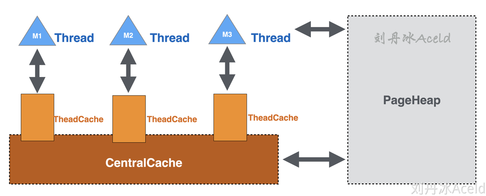

TCMalloc最大优势就是每个线程都会独立维护自己的内存池。TCMalloc则是为每个Thread预分配一块缓存，每个Thread在申请内存时首先会先从这个缓存区ThreadCache申请，且所有ThreadCache缓存区还共享一个叫CentralCache的中心缓存。这样做的好处其一是ThreadCache做为每个线程独立的缓存，能够明显的提高Thread获取高命中的数据，其二是ThreadCache也是从堆空间一次性申请，即只触发一次系统调用即可。

每个ThreadCache还会共同访问CentralCache。CentralCache是所有线程共享的缓存，当ThreadCache的缓存不足时，就会从CentralCache获取，当ThreadCache的缓存充足或者过多时，则会将内存退还给CentralCache。但是CentralCache由于共享，那么访问一定是需要加锁的。ThreadCache作为线程独立的第一交互内存，访问无需加锁，CentralCache则作为ThreadCache临时补充缓存。

TCMalloc的构造不仅于此，提供了ThreadCache和CentralCache可以解决小对象内存块的申请，但是对于大块内存Cache显然是不适合的。 所以为了解决中对象和大对象的内存申请，TCMalloc依然有一个全局共享内存堆PageHeap。PageHeap也是一次系统调用从虚拟内存中申请的，PageHeap很明显是全局的，所以访问一定是要加锁。其作用是当CentralCache没有足够内存时会从PageHeap取，当CentralCache内存过多或者充足，则将低命中内存块退还PageHeap。如果Thread需要大对象申请超过的Cache容纳的内存块单元大小，也会直接从PageHeap获取。

+ **ThreadCache**：每个线程独享该内存池，不需加锁。缓存不足则从CentralCache获取，缓存充足或者过多时归还给CentralCache。
+ **CentralCache**：所有线程共享该内存池，需要加锁。作为临时补充缓存区。当缓存不足时，则会向PageHeap申请缓存。缓存充足或者过多时归还给PageHeap。
+ **PageHeap**：ThreadCache和CentralCache只适用于小对象申请，对于中对象和大对象则直接到PageHeap申请

| **对象** | **容量**     |
| -------- | ------------ |
| 小对象   | (0,256KB]    |
| 中对象   | (256KB, 1MB] |
| 大对象   | (1MB, +∞)    |

## 2. TCMalloc模型相关基础结构

### 2.1.Page

TCMalloc中的Page与之前章节介绍操作系统对虚拟内存管理的MMU定义的物理页有相似的定义，TCMalloc将虚拟内存空间划分为多份同等大小的Page，每个**Page默认是8KB**。

对于TCMalloc来说，虚拟内存空间的全部内存都按照Page的容量分成均等份，并且给每份Page标记了ID编号，

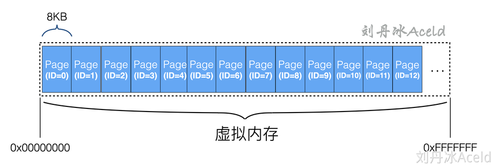

### 2.2.Span

多个连续的Page称之为是一个Span，其定义含义有操作系统的管理的页表相似。TCMalloc是以Span为单位向操作系统申请内存的。每个Span记录了第一个起始Page的编号Start，和一共有多少个连续Page的数量Length。为了方便Span和Span之间的管理，Span集合是以双向链表的形式构建。

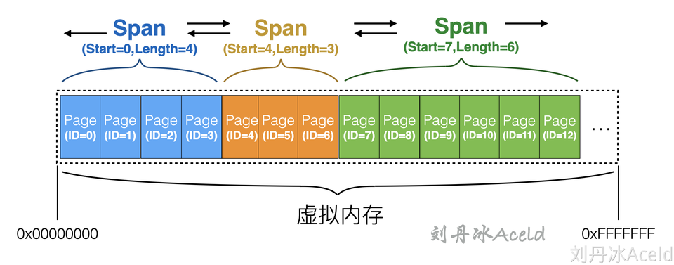

### 2.3.Size Class

在256KB以内的小对象，TCMalloc会将这些小对象集合划分成多个内存刻度，同属于一个刻度类别下的内存集合称之为属于一个Size Class。

每个Size Class都对应一个大小比如8字节、16字节、32字节等。在申请小对象内存的时候，**TCMalloc会根据使用方申请的空间大小就近向上取最接近的一个Size Class的Span（由多个等空间的Page组成）内存块返回给使用方。**

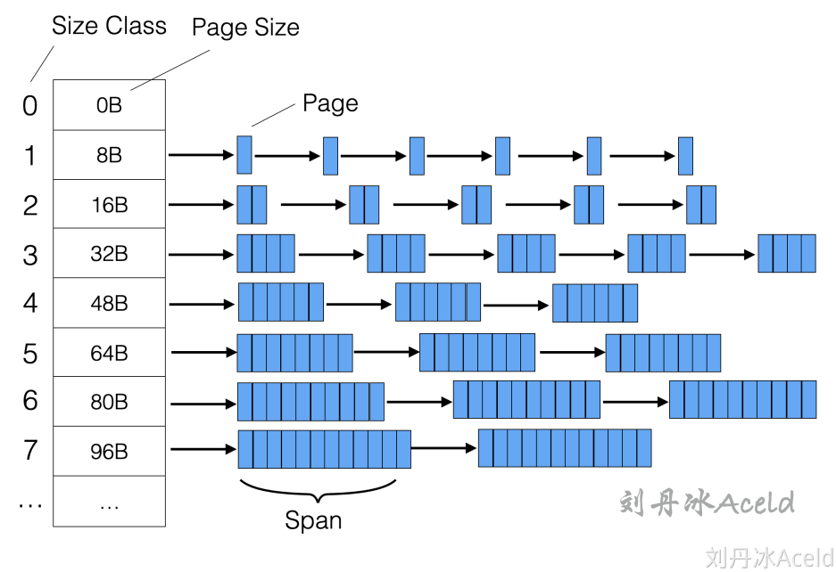

## 3. ThreadCache

**在TCMalloc中每个线程都会有一份单独的缓存**，就是ThreadCache。ThreadCache中对于**每个Size Class都会有一个对应的FreeList**，FreeList表示当前缓存中还有多少个空闲的内存可用

使用方对于从TCMalloc申请的小对象，会直接从TreadCache获取，实则是从FreeList中返回一个空闲的对象，如果对应的Size Class刻度下已经没有空闲的Span可以被获取了，则ThreadCache会从CentralCache中获取。当使用方使用完内存之后，归还也是直接归还给当前的ThreadCache中对应刻度下的的FreeList中。

整条申请和归还的流程是不需要加锁的，因为ThreadCache为当前线程独享，但如果ThreadCache不够用，需要从CentralCache申请内存时，这个动作是需要加锁的。不同Thread之间的ThreadCache是以双向链表的结构进行关联，是为了方便TCMalloc统计和管理。

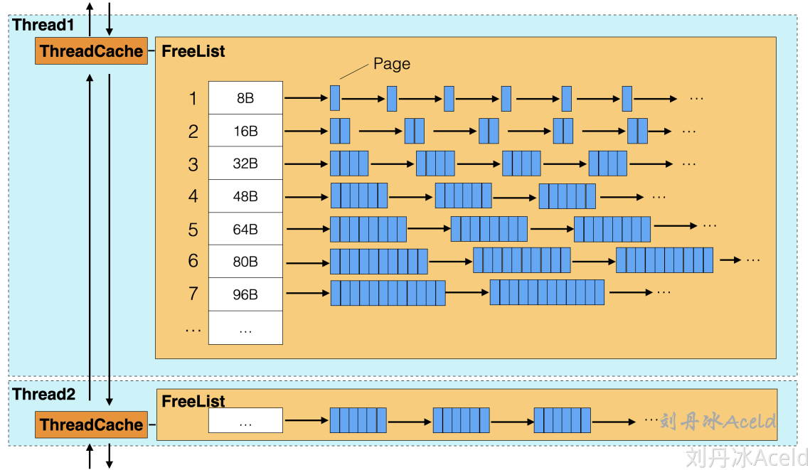

## 4. CentralCache

**CentralCache是各个线程共用的，所以与CentralCache获取内存交互是需要加锁的。**CentralCache缓存的Size Class和ThreadCache的一样，这些缓存都被放在CentralFreeList中，当ThreadCache中的某个Size Class刻度下的缓存小对象不够用，就会向CentralCache对应的Size Class刻度的CentralFreeList获取，同样的如果ThreadCache有多余的缓存对象也会退还给响应的CentralFreeList。

CentralCache与PageHeap的角色关系与ThreadCache与CentralCache的角色关系相似，当CentralCache出现Span不足时，会从PageHeap申请Span，以及将不再使用的Span退还给PageHeap。

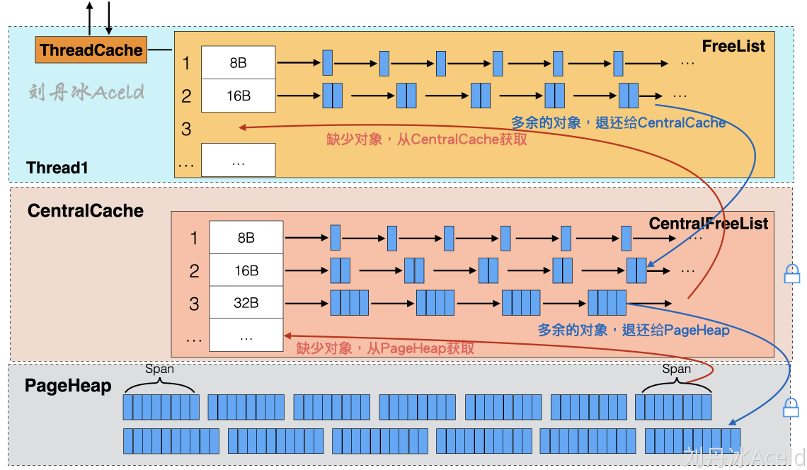

## 5. PageHeap

PageHeap是提供CentralCache的内存来源。PageHead与CentralCache不同的是CentralCache是与ThreadCache布局一模一样的缓存，主要是起到针对ThreadCache的一层二级缓存作用，且只支持小对象内存分配。而PageHeap则是针对CentralCache的三级缓存。**弥补对于中对象内存和大对象内存的分配**，PageHeap也是直接和操作系统虚拟内存衔接的一层缓存，当ThreadCache、CentralCache、PageHeap都找不到合适的Span，PageHeap则会调用操作系统内存申请系统调用函数来从虚拟内存的堆区中取出内存填充到PageHeap当中。**PageHeap内部的Span管理，采用两种不同的方式，对于128个Page以内的Span申请，每个Page刻度都会用一个链表形式的缓存来存储。对于128个Page以上内存申请，PageHeap是以有序集合来存放**。

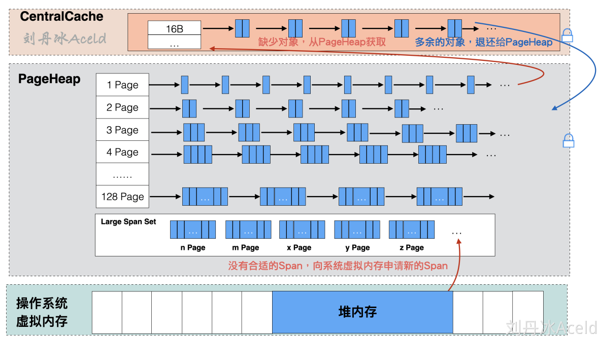

## 6. TCMalloc的小对象分配

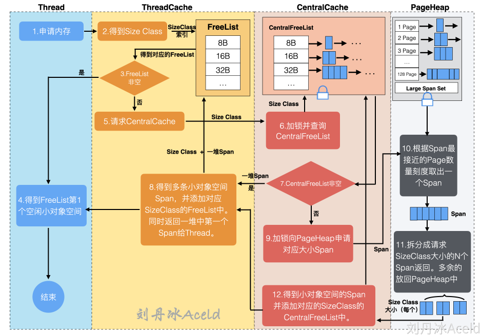

小对象为占用内存**小于等于256KB**的内存，参考图中的流程，下面将介绍详细流程步骤：

（1）Thread用户线程应用逻辑申请内存，当前Thread访问对应的ThreadCache获取内存，此过程不需要加锁。

（2）ThreadCache的得到申请内存的SizeClass（一般向上取整，大于等于申请的内存大小），通过SizeClass索引去请求自身对应的FreeList。

（3）判断得到的FreeList是否为非空。

（4）如果FreeList非空，则表示目前有对应内存空间供Thread使用，得到FreeList第一个空闲Span返回给Thread用户逻辑，流程结束。

（5）如果FreeList为空，则表示目前没有对应SizeClass的空闲Span可使用，请求CentralCache并告知CentralCache具体的SizeClass。

（6）CentralCache收到请求后，加锁访问CentralFreeList，根据SizeClass进行索引找到对应的CentralFreeList。

（7）判断得到的CentralFreeList是否为非空。

（8）如果CentralFreeList非空，则表示目前有空闲的Span可使用。返回多个Span，将这些Span（除了第一个Span）放置ThreadCache的FreeList中，并且将第一个Span返回给Thread用户逻辑，流程结束。

（9）如果CentralFreeList为空，则表示目前没有可用是Span可使用，向PageHeap申请对应大小的Span。

（10）PageHeap得到CentralCache的申请，加锁请求对应的Page刻度的Span链表。

（11）PageHeap将得到的Span根据本次流程请求的SizeClass大小为刻度进行拆分，分成N份SizeClass大小的Span返回给CentralCache，如果有多余的Span则放回PageHeap对应Page的Span链表中。

（12）CentralCache得到对应的N个Span，添加至CentralFreeList中，跳转至第（8）步。

## 7. TCMalloc的中对象分配

中对象为**大于256KB且小于等于1MB**的内存。对于中对象分配，Thread不再按照小对象的流程路径向ThreadCache获取，而是直接从PageHeap获取

**PageHeap将128个Page以内大小的Span定义为小Span，将128个Page以上大小的Span定义为大Span**。由于一个Page为8KB，那么128个Page即为1MB，所以对于中对象的申请，PageHeap均是按照小Span的申请流程

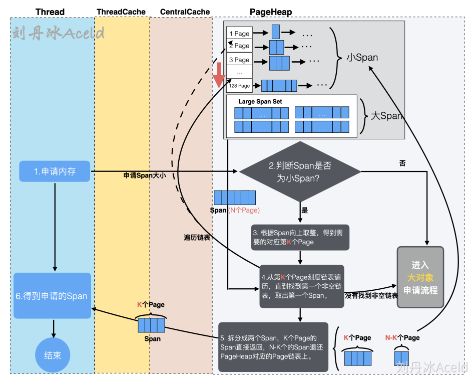

（1）Thread用户逻辑层提交内存申请处理，如果本次申请内存超过256KB但不超过1MB则属于中对象申请。TCMalloc将直接向PageHeap发起申请Span请求。

（2）PageHeap接收到申请后需要判断本次申请是否属于小Span（128个Page以内），如果是，则走小Span，即中对象申请流程，如果不是，则进入大对象申请流程，下一节介绍。

（3）PageHeap根据申请的Span在小Span的链表中向上取整，得到最适应的第K个Page刻度的Span链表。

（4）得到第K个Page链表刻度后，将K作为起始点，向下遍历找到第一个非空链表，直至128个Page刻度位置，找到则停止，将停止处的非空Span链表作为提供此次返回的内存Span，将链表中的第一个Span取出。如果找不到非空链表，则当错本次申请为大Span申请，则进入大对象申请流程。

（5）假设本次获取到的Span由N个Page组成。PageHeap将N个Page的Span拆分成两个Span，其中一个为K个Page组成的Span，作为本次内存申请的返回，给到Thread，另一个为N-K个Page组成的Span，重新插入到N-K个Page对应的Span链表中。

## 8. TCMalloc的大对象分配

对于超过128个Page（即1MB）的内存分配则为大对象分配流程。Thread绕过ThreadCache和CentralCache，直接向PageHeap获取

进入大对象分配流程除了申请的Span大于128个Page之外，对于中对象分配如果找不到非空链表也会进入大对象分配流程，大对象分配的具体流程如下：

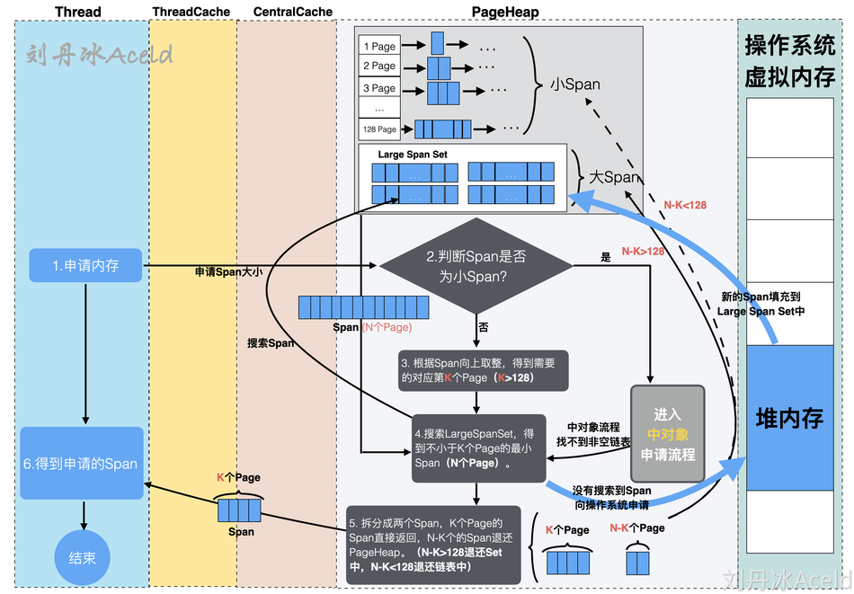

（1）Thread用户逻辑层提交内存申请处理，如果本次申请内存超过1MB则属于大对象申请。TCMalloc将直接向PageHeap发起申请Span      。

（2）PageHeap接收到申请后需要判断本次申请是否属于小Span（128个Page以内），如果是，则走小Span中对象申请流程（上一节已介绍），如果不是，则进入大对象申请流程。

（3）PageHeap根据Span的大小按照Page单元进行除法运算，向上取整，得到最接近Span的且大于Span的Page倍数K，此时的K应该是大于128。如果是从中对象流程分过来的（中对象申请流程可能没有非空链表提供Span），则K值应该小于128。

（4）搜索Large Span Set集合，找到不小于K个Page的最小Span（N个Page）。如果没有找到合适的Span，则说明PageHeap已经无法满足需求，则向操作系统虚拟内存的堆空间申请一堆内存，将申请到的内存安置在PageHeap的内存结构中，重新执行（3）步骤。

（5）将从Large Span Set集合得到的N个Page组成的Span拆分成两个Span，K个Page的Span直接返回给Thread用户逻辑，N-K个Span退还给PageHeap。其中如果N-K大于128则退还到Large Span Set集合中，如果N-K小于128，则退还到Page链表中。

## 6 Golang堆内存管理

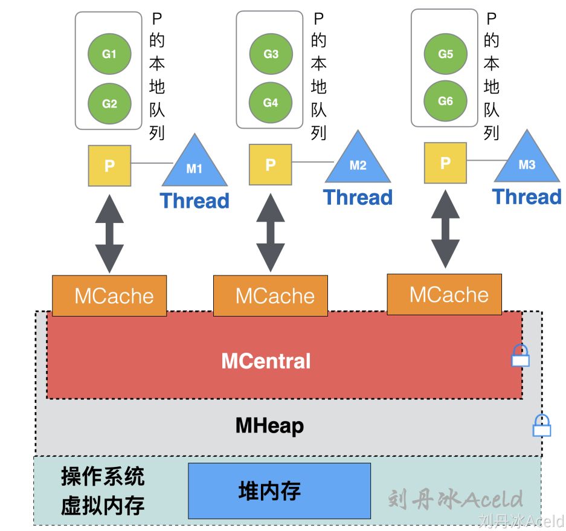

Golang内存管理模型与TCMalloc的设计极其相似。MCache就是ThreadCache，MCentral就是CentralCache，PageHeap就是MHeap。

MCache是与Golang协程调度模型GPM中的P所绑定，而不是和线程绑定。因为Golang调度的GPM模型，真正可运行的线程M的数量与P的数量一致，即GOMAXPROCS个，所以MCache与P进行绑定更能节省内存空间使用，可以保证每个G使用MCache时不需要加锁就可以获取到内存。而TCMalloc中的ThreadCache随着Thread的增多，ThreadCache的数量也就相对成正比增多

| **TCMalloc** | **Golang**         |
| ------------ | ------------------ |
| 小对象       | Tiny对象（<16B）   |
| 中对象       | 小对象（16B~32KB） |
| 大对象       | 大对象（>32KB）    |

具体查看：https://www.yuque.com/aceld/golang/qzyivn#VyQ8I

