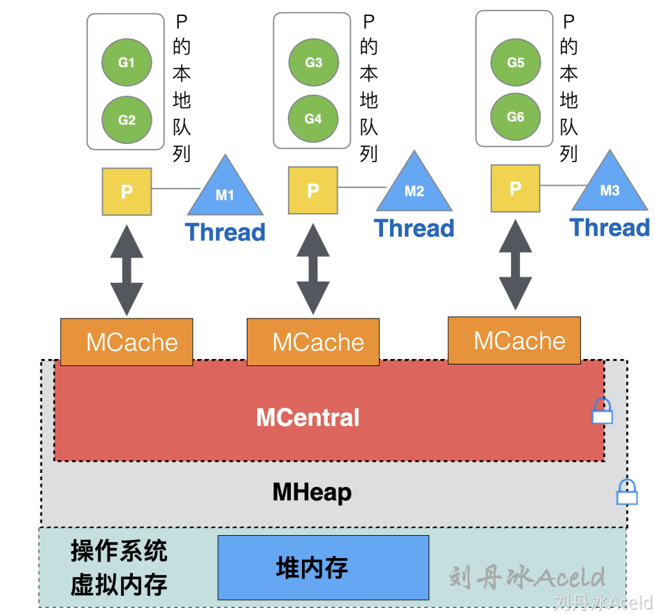

# 一. 基础知识

## 1. new和make的区别

new 的参数要求传入一个类型，而不是一个值，它会申请该类型的内存大小空间，并初始化为对应的零值，返回该指向类型空间的一个指针

make 也用于内存分配，但它只用于引用对象 slice、map、channel的内存创建，返回的类型是类型本身

new 分配的空间被清零。make 分配空间后，会进行初始化；

## 2. 数组和切片的区别

**相同点：**

1. 只能存储一组相同类型的数据结构

2. 都是通过下标来访问，并且有容量长度，长度通过 len 获取，容量通过 cap 获取

**区别：**

1. 数组是定长，访问和复制不能超过数组定义的长度，否则就会下标越界，切片长度和容量可以自动扩容

2. 数组是值类型，切片是引用类型，每个切片都引用了一个底层数组，切片本身不能存储任何数据，都是这底层数组存储数据，所以修改切片的时候修改的是底层数组中的数据。切片一旦扩容，指向一个新的底层数组，内存地址也就随之改变

## 3. for range 的时候它的地址会发生变化么？

在 for a,b := range c 遍历中， a 和 b 在内存中只会存在一份，即之后每次循环时遍历到的数据都是以值覆盖的方式赋给 a 和 b，a，b 的内存地址始终不变。由于有这个特性，for 循环里面如果开协程，不要直接把 a 或者 b 的地址传给协程。解决办法：在每次循环时，创建一个临时变量。

## 4. go defer，多个 defer 的顺序，defer 在什么时机会修改返回值？

作用：defer延迟函数，释放资源，收尾工作；如释放锁，关闭文件，关闭链接；捕获panic;

避坑指南：defer函数紧跟在资源打开后面，否则defer可能得不到执行，导致内存泄露。

多个 defer 调用顺序是 LIFO（后入先出），defer后的操作可以理解为压入栈中

defer，return，return value（函数返回值） 执行顺序：首先return，其次return value，最后defer。defer可以修改函数最终返回值，修改时机：**有名返回值或者函数返回指针** 

## 5. rune类型

golang中string底层是通过byte数组实现的。中文字符在unicode下占2个字节，在utf-8编码下占3个字节，而golang默认编码正好是utf-8。

`byte` 等同于`int8`，常用来处理ascii字符

`rune`是类型`int32`的别名，主要用于处理unicode以及utf-8字符。

## 3. 值传递和指针传递有什么区别

值传递：会创建一个新的副本并将其传递给所调用函数或方法 指针传递：将创建相同内存地址的新副本

需要改变传入参数本身的时候用指针传递，否则值传递

另外，如果函数内部返回指针，会发生内存逃逸。函数参数传指针也可能会发生逃逸

## 4. slice 底层数据结构和一些特性

Go 的 slice 底层数据结构是由一个 array 指针指向底层数组，len 表示切片长度，cap 表示切片容量。slice 的主要实现是扩容。对于 append 向 slice 添加元素时，假如 slice 容量够用，则追加新元素进去，slice.len++，返回原来的 slice。当原容量不够，则 slice 先扩容，扩容之后 slice 得到新的 slice，将元素追加进新的 slice，slice.len++，返回新的 slice。对于切片的扩容规则：当切片比较小时（容量小于 1024），则采用较大的扩容倍速进行扩容（新的扩容会是原来的 2 倍），避免频繁扩容，从而减少内存分配的次数和数据拷贝的代价。当切片较大的时（原来的 slice 的容量大于或者等于 1024），采用较小的扩容倍速（新的扩容将扩大大于或者等于原来 1.25 倍），主要避免空间浪费，网上其实很多总结的是 1.25 倍，那是在不考虑内存对齐的情况下，实际上还要考虑内存对齐，扩容是大于或者等于 1.25 倍。

如果 slice 在函数内没有出现扩容，函数外和函数内 slice 变量指向是同一个数组，则函数内复制的 slice 变量值出现更改，函数外这个 slice 变量值也会被修改。如果 slice 在函数内出现扩容，则函数内变量的值会新生成一个数组（也就是新的 slice，而函数外的 slice 指向的还是原来的 slice，则函数内的修改不会影响函数外的 slice。

## 5. select 底层数据结构和一些特性

select 为 golang 提供了多路 IO 复用机制，和其他 IO 复用一样，用于检测是否有读写事件是否 ready。linux 的系统 IO 模型有 select，poll，epoll，go 的 select 和 linux 系统 select 非常相似。

select 结构组成主要是由 case 语句和执行的函数组成 select 实现的多路复用是：每个线程或者进程都先到注册和接受的 channel（装置）注册，然后阻塞，然后只有一个线程在运输，当注册的线程和进程准备好数据后，装置会根据注册的信息得到相应的数据。

**select 的特性**

1. select 操作至少要有一个 case 语句，出现读写 nil 的 channel 该分支会忽略，在 nil 的 channel 上操作则会报错。
2. select 仅支持管道，而且是单协程操作。
3. 每个 case 语句仅能处理一个管道，要么读要么写。
4. 多个 case 语句的执行顺序是随机的。
5. 存在 default 语句，select 将不会阻塞，但是存在 default 会影响性能。

## 6. defer 底层数据结构和一些特性

每个 defer 语句都对应一个_defer 实例，多个实例使用指针连接起来形成一个单连表，保存在 gotoutine 数据结构中，每次插入_defer 实例，均插入到链表的头部，函数结束再一次从头部取出，从而形成后进先出的效果。

**defer 的规则总结**：

1. 延迟函数的参数是 defer 语句出现的时候就已经确定了的。
2. 延迟函数执行按照后进先出的顺序执行，即先出现的 defer 最后执行。
3. 延迟函数可能操作主函数的返回值。
4. 申请资源后立即使用 defer 关闭资源是个好习惯。

## 7. 单引号，双引号，反引号的区别？

单引号，表示byte类型或rune类型，对应 uint8和int32类型，默认是 rune 类型。byte用来强调数据是raw data，而不是数字；而rune用来表示Unicode的code point。

双引号，才是字符串，实际上是字符数组。可以用索引号访问某字节，也可以用len()函数来获取字符串所占的字节长度。

反引号，表示字符串字面量，但不支持任何转义序列。字面量 raw literal string 的意思是，你定义时写的啥样，它就啥样，你有换行，它就换行。你写转义字符，它也就展示转义字符。

# 二. map

## 1. map 使用注意的点，是否并发安全？

map的类型是map[key]，key类型的key必须是可比较的，通常情况，会选择内建的基本类型，比如整数、字符串做key的类型。如果要使用struct作为key，要保证struct对象在逻辑上是不可变的。在Go语言中，map[key]函数返回结果可以是一个值，也可以是两个值。map是无序的，如果我们想要保证遍历map时元素有序，可以使用辅助的数据结构，例如orderedmap。

**第一，**一定要先初始化，否则panic

**第二，**map类型是容易发生并发访问问题的。不注意就容易发生程序运行时并发读写导致的panic。 Go语言内建的map对象不是线程安全的，并发读写的时候运行时会有检查，遇到并发问题就会导致panic。

## 2. map 循环是有序的还是无序的？

无序的, map 因扩张⽽重新哈希时，各键值项存储位置都可能会发生改变，顺序自然也没法保证了，所以官方避免大家依赖顺序，直接打乱处理。就是 for range map 在开始处理循环逻辑的时候，就做了随机播种

## 3. map 中删除一个 key，它的内存会释放么？（常问）

实际 map 存储的 key 是不会删除的，只是标记当前的key状态为 empty，但是对应的value可能会被删除

如果删除的元素是值类型，如int，float，bool，string以及数组和struct，map的内存不会自动释放

如果删除的元素是引用类型，如指针，slice，map，chan等，map的内存会自动释放，但释放的内存是子元素应用类型的内存占用

将map设置为nil后，内存被回收。

## 4. 怎么处理对 map 进行并发访问

1. **使用内置sync.Map**
2. **使用读写锁实现并发安全map**

sync.Map支持并发读写，采用了“空间换时间”的机制，冗余了两份数据结构：readMap和dirtyMap。和原始map+RWMutex相比，减少了加锁的性能影响。它做了一些优化，可以无锁访问redaMap，而且会优先操作readMap。适用于读多写少的场景，如果写多会导致readMap缓存失效，需要加锁，性能下降。

## 5. nil map 和空 map 有何不同

1. 可以对未初始化的map进行取值，但取出来的东西是空：
2. 能对未初始化的map进行赋值，这样将会抛出一个异常
3. **nil map 未初始化，空map是长度为空**

## 6. map 的数据结构是什么？是怎么实现扩容

Map由链式哈希表实现，底层是hash实现，数据结构为hash数组 + 桶 + 溢出的桶链表，每个桶存储最多8个key-value对

map扩容的时机：

+ 达到最大的负载因子（6.5，也就是平均每个桶中k-v的数量大于6.5）
+ 溢出桶的数量太多

map扩容的类型：

- 等量扩容：数据不多但是溢出桶太多了（整理）
- 翻倍扩容：数据太多了

等量扩容，溢出桶太多了，导致查询效率低。扩容时，桶的数量不增加。

翻倍扩容，每个桶的k-v太多了，需要增加普通桶的数量，扩容后桶的数量为原来的两倍。

## 7. slices能作为map类型的key

当时被问的一脸懵逼，其实是这个问题的变种：golang 哪些类型可以作为map key？

答案是：**在golang规范中，可比较的类型都可以作为map key；**这个问题又延伸到在：golang规范中，哪些数据类型可以比较？

**不能作为map key 的类型包括：**

- slices
- maps
- functions

# 三. context

## 1. context 结构是什么样的？context 使用场景和用途

Go 的 Context 的数据结构包含 Deadline，Done，Err，Value，Deadline 方法返回一个 time.Time，表示当前 Context 应该结束的时间，ok 则表示有结束时间，Done 方法当 Context 被取消或者超时时候返回的一个 close 的 channel，告诉给 context 相关的函数要停止当前工作然后返回了，Err 表示 context 被取消的原因，Value 方法表示 context 实现共享数据存储的地方，是协程安全的。context 在业务中是经常被使用的，

**其主要的应用 ：**

1：上下文控制，2：多个 goroutine 之间的数据交互等，3：超时控制：到某个时间点超时，过多久超时。

# 四. channel

## 1. channel

+ channel分为两种类型：有缓存（size不为0）和无缓存（size为0）
+ channel有三种模式：写操作模式（单向通道），读操作模式（单向通道），读写操作模式（双相通道）
+ channel有三种状态：未初始化，正常，关闭

|      | 写操作模式      | 读操作模式       | 读写操作模式     |
| ---- | --------------- | ---------------- | ---------------- |
| 创建 | make(chan<-int) | make(<-chan int) | make（chan int） |

|      | 未初始化         | 正常             | 关闭                          |
| ---- | ---------------- | ---------------- | ----------------------------- |
| 关闭 | panic            | 正常关闭         | panic                         |
| 发送 | 永久阻塞导致死锁 | 阻塞或者发送成功 | panic                         |
| 接收 | 永久阻塞导致死锁 | 阻塞或者成功接收 | 缓冲区为空则为0值，否则继续读 |

注意点：

1. 一个channel不能关闭多次，会导致panic
2. 如果多个goroutine都监听同一个channel，那么channel上的数据随机被某个Goroutine进行消费
3. 如果多个goroutine都监听同一个channel，那么channel关闭，则所有Goroutine会收到退出信号

## 2. channel 是否线程安全？锁用在什么地方

不同的协程通过channel进行通信，本身就是应用与多协程，所以为了保证数据的一致性，必须加锁

channel的底层实现中，hchan结构体中采用了mutex锁来保证数据读写安全。在对 循环数组buf中的数据进行入队和出队操作，必须加互斥锁才能操作数据。

## 3. chan 底层数据结构和主要使用场景

channel底层的数据结构是由：一个buf循环数据，发送下标，接受下标，待发送缓存区和待接受缓存区，还有锁组成。

## 4. nil、关闭的 、有数据的 channel，再进行读、写、关闭会怎么样

-  给一个 nil channel 发送数据，造成永远阻塞 
-  从一个 nil channel 接收数据，造成永远阻塞 
-  给一个已经关闭的 channel 发送数据，引起 panic 
-  从一个已经关闭的 channel 接收数据，如果缓冲区中为空，则返回一个零值
-  向一个关闭的读channel写数据，会编译不通过。
-  无缓冲的channel是同步的，而有缓冲的channel是非同步的 

口诀来记忆：“空读写阻塞，写关闭异常，读关闭空零”。

## 5. 向 channel 发送数据和从 channel 读数据的流程是什么样的

### 5.1 发送流程：

向channel发送数据大概分为两块：检查和数据发送

+ 如果channel的**读等待队列**存在接收者Goroutine。将数据直接发送给第一个等待的Goroutine，唤醒接收的Goroutine

+ 如果channel的**读等待队列**不存在接受者Goroutine
  1. 如果循环数据buf未满，那么将会把数据发送到循环队列的buf尾部
  2. 如果循环数据buf已满，这个时候就会走阻塞发送流程，将当前Goroutine加入**写等待队列**，并挂起等待唤醒

### 5.2 接收流程：

向channel接收数据大概分为两块：检查和数据发送

+ 如果channel的**写等待队列**存在发送至Goroutine
  + 如果是无缓存channel，直接从第一个发送至Goroutine那里把数据拷贝给接收变量，唤醒发送的Goroutine
  + 如果是有缓存channel（已满），将循环数组buf的队首元素拷贝的接收变量，将第一个发送者Goroutine的数据拷贝到buff循环数组队尾
+ 如果channel的**写等待队列**不存在发送者Goroutine
  + 如果循环数据buf非空，将循环数组buf的队首元素拷贝到接收变量
  + 如果循环数组buf为空，这个时候就走阻塞接收流程，将当前Goroutine加入读等待队列，并挂起等待唤醒

## 6. CSP模型

与主流语言通过共享内存来进行并发控制方式不同，Go 语言采用了 CSP 模式。这是一种用于描述两个独立的并发实体通过共享的通讯 Channel（管道）进行通信的并发模型。

Golang 就是借用CSP模型的一些概念为之实现并发进行理论支持，其实从实际上出发，go语言并没有，完全实现了CSP模型的所有理论，仅仅是借用了 process和channel这两个概念。process是在go语言上的表现就是 goroutine 是实际并发执行的实体，每个实体之间是通过channel通讯来实现数据共享。

Go语言的CSP模型是由协程Goroutine与通道Channel实现：

- **Go协程goroutine: 是一种轻量线程，它不是操作系统的线程，而是将一个操作系统线程分段使用，通过调度器实现协作式调度。是一种绿色线程，微线程，它与Coroutine协程也有区别，能够在发现堵塞后启动新的微线程。**
- **通道channel: 类似Unix的Pipe，用于协程之间通讯和同步。协程之间虽然解耦，但是它们和Channel有着耦合。**

# 五. GMP

## 1. 线程有几种模型？

- 内核线程模型
- 用户级线程模型
- 混合型线程模型

Linux历史上线程的3种实现模型： 线程的实现曾有3种模型：

- 多对一(M:1)的用户级线程模型
- 一对一(1:1)的内核级线程模型
- 多对多(M:N)的两级线程模型

## 2. Goroutine的原理了解过，讲下实现和优势

### 2.1 实现原理：

基于CSP并发模型开发了GMP调度器，其中 

+  **G（Goroutine）** : 每个 Goroutine 对应一个 G 结构体，G 存储 Goroutine 的运行堆栈、状态以及任务函数

- **M（Machine）**: 对OS内核级线程的封装，数量对应真实的CPU数(真正干活的对象).
- **P (Processor)**: 逻辑处理器,即为G和M的调度对象，用来调度G和M之间的关联关系，其数量可通过 GOMAXPROCS()来设置，默认为核心数。

P和M是11关系，但是会存在M>=P的情况。G的创建会优先保存到P的本地队列上，如果P的本地队列已满则扔到全局队列。当一个G要执行时，则M上运行的goroutine切换为G0，G0负责调度时协程的切换，会优先从P的本地队列取到G，如果本地队列为空，则从全局队列或者其他P的队列偷取G，并开始运行G。

### 2.2 goroutine的优势

- **上下文切换代价小**：从GMP调度器可以看出，避免了用户态和内核态线程切换，所以上下文切换代价小
- **内存占用少**：线程栈空间通常是 2M，Goroutine 栈空间最小 2K；

## 3. Goroutine什么时候会发生阻塞。阻塞的话调度器会怎么做，唤醒机制是什么

go一共有4种阻塞的情况，并且这些阻塞都是可以被runtime检测到的，runtime检测到阻塞时就可以进行优化处理。通过**信号协作**强制处理在最前的 goroutine 去分配使用

1. 系统调用
2. 网络io
3. 锁
4. channel

## 4. 在GMP模型中Goroutine有几种状态，线程几种状态

**有9种状态**

- **_Gidle**：刚刚被分配并且还没有被初始化
- **_Grunnable**：没有执行代码，没有栈的所有权，存储在运行队列中
- **_Grunning**：可以执行代码，拥有栈的所有权，被赋予了内核线程 M 和处理器 P
- **_Gsyscall**：正在执行系统调用，拥有栈的所有权，没有执行用户代码，被赋予了内核线程 M 但是不在运行队列上
- **_Gwaiting**：由于运行时而被阻塞，没有执行用户代码并且不在运行队列上，但是可能存在于 Channel 的等待队列上
- **_Gdead**：没有被使用，没有执行代码，可能有分配的栈
- **_Gcopystack**：栈正在被拷贝，没有执行代码，不在运行队列上
- **_Gpreempted**：由于抢占而被阻塞，没有执行用户代码并且不在运行队列上，等待唤醒
- **_Gscan**：GC 正在扫描栈空间，没有执行代码，可以与其他状态同时存在

**去抢占 G 的时候，M会有一个自旋和非自旋的状态**

## 5. 如果Goroutine一直占用资源怎么办，GMP模型怎么处理这个问题

如果有一个goroutine一直占用资源的话，GMP模型会从正常模式转为饥饿模式，一个G最多占用10ms的时间片，超过10ms则通过**信号协作**强制处理在最前的 goroutine 去分配使用

## 6. 进程、线程、协程有什么区别？（必问）

进程：是应用程序的启动实例，每个进程都有独立的内存空间，不同的进程通过进程间的通信方式来通信。

线程：从属于进程，每个进程至少包含一个线程，线程是 CPU 调度的基本单位，多个线程之间可以共享进程的资源并通过共享内存等线程间的通信方式来通信。

协程：为轻量级线程，与线程相比，协程不受操作系统的调度，协程的调度器由用户应用程序提供，协程调度器按照调度策略把协程调度到线程中运行

## 7. 抢占式调度是如何抢占的？

**基于协作式抢占**

**基于信号量抢占**

就像操作系统要负责线程的调度一样，Go的runtime要负责goroutine的调度。现代操作系统调度线程都是抢占式的，我们不能依赖用户代码主动让出CPU，或者因为IO、锁等待而让出，这样会造成调度的不公平。基于经典的时间片算法，当线程的时间片用完之后，会被时钟中断给打断，调度器会将当前线程的执行上下文进行保存，然后恢复下一个线程的上下文，分配新的时间片令其开始执行。这种抢占对于线程本身是无感知的，系统底层支持，不需要开发人员特殊处理。

基于时间片的抢占式调度有个明显的优点，能够避免CPU资源持续被少数线程占用，从而使其他线程长时间处于饥饿状态。goroutine的调度器也用到了时间片算法，但是和操作系统的线程调度还是有些区别的，因为整个Go程序都是运行在用户态的，所以不能像操作系统那样利用时钟中断来打断运行中的goroutine。也得益于完全在用户态实现，goroutine的调度切换更加轻量。

# 六. 锁相关

## 1. 除了 mutex 以外还有那些方式安全读写共享变量？

1. 将共享变量的读写放到一个 goroutine 中，其它 goroutine 通过 channel 进行读写操作。
2. CAS乐观锁
3. 通过 Mutex 锁实现

## 2. Go 如何实现原子操作？

原子操作就是不可中断的操作，外界是看不到原子操作的中间状态，要么看到原子操作已经完成，要么看到原子操作已经结束。在某个值的原子操作执行的过程中，CPU 绝对不会再去执行其他针对该值的操作，那么其他操作也是原子操作。

1. 互斥锁是一种数据结构，用来让一个线程执行程序的关键部分，完成互斥的多个操作。
2. 原子操作是针对某个值的单个互斥操作。

## 3. Mutex 有几种模式

mutex锁有两种模式：正常模式和饥饿模式。

加锁失败的话，会判断当前状态是否是正常模式，如果如果是正常模式的话，会先自旋4次，自旋4次还是加锁失败，则会进入到队列排队。当等待队列等待时间超过1ms，则锁会从正常模式切换成饥饿模式。饥饿模式就是直接进队列进行排队。

在正常模式下，程序会让Goroutine有自旋的这一个状态，是因为为了避免频繁的唤起和睡眠Goroutine的过程中带来的大的开销，通过**自旋+队列排队**的方式，来增加更大的一个吞吐量，但是这种方式，很容易会出现一个尾端延迟执行的情况。

而在饥饿模式下，则会把Goroutine加入到队列中去，严格的按照顺序执行，这样就不会带来尾端延迟的问题，但相对应的，程序的吞吐量也就没有正常模式下来的高了。

## 4. Mutex两种模式转换时间

+ 正常模式->饥饿模式：**当处于等待队列中的Goroutine超过1ms没有获取到锁的时候，它的状态就会变成饥饿模式**
+ 饥饿模式->正常模式：
  + G的等待获取锁的时间小于1ms
  + 处于等待队列已经全部清空了

## 5. mutex可以作为自旋锁吗

理论上mutex的正常模式下是可以作为自旋锁的。

## 6. RWMutex了解 

**RWMutex是基于Mutex的，在Mutex的基础之上增加了读、写的信号量，并使用了类似引用计数的读锁数量**

读锁与读锁兼容，读锁与写锁互斥，写锁与写锁互斥，只有在锁释放后才可以继续申请互斥的锁

- **可以同时申请多个读锁**
- **有读锁时申请写锁将阻塞，有写锁时申请读锁将阻塞**
- **只要有写锁，后续申请读锁和写锁都将阻塞**
- Go 中 RWMutex 使用的是写优先的设计。写优先是指如果有写进程在等待锁，会阻止后来的读进程获得锁（当然也会阻塞写进程）。写优先保证的是新来的进程，这样就避免了写饥饿的问题。

## 7. goroutine自旋占用cpu如何解决（go调用、gmp）

自旋锁是指当一个线程在获取锁的时候，如果锁已经被其他线程获取，那么该线程将循环等待，然后不断地判断是否能够被成功获取，直到获取到锁才会退出循环。

**自旋的条件如下：**

1. 还没自旋超过 4 次,

2. 多核处理器，

3. GOMAXPROCS > 1，

4. p 上本地 goroutine 队列为空。

mutex 会让当前的 goroutine 去空转 CPU，在空转完后再次调用 CAS 方法去尝试性的占有锁资源，直到不满足自旋条件，则最终会加入到等待队列里

# 七. GC相关

## 1. Go的垃圾回收算法

Go1.3版本之前使用传统的标记清除法，该算法需要长时间的STW，这个过程就是会导致程序是卡顿的，频繁的 GC 会严重影响程序性能。

Go1.5 使用了三色标记法+写入屏障和删除屏障，减少STW的时间。但是还是有缺点：GC期间需要一次STW重新扫描栈上对象，标记栈上引用的白色对象的存活；而且回收精度低，触发删除屏障的对象需要下次GC才能删除。

Go1.8 使用了三色标记法+混合屏障技术，避免了对栈re-scan的过程，极大的减少了STW的时间。结合了两者的优点。

### 1.1 三色标记法

+ **白色**：未搜索的对象，在回收周期开始时所有对象都是白色，在回收周期结束时所有的白色都是垃圾对象
+ **灰色**：正在搜索的对象，该类对象可能还存在外部引用对象
+ **黑色**：已搜索完的对象，这类对象不再有外部引用对象

步骤：

1. 一开始所有对象标记为白色（STW）
2. 从 root 开始找到所有可达对象（所有可以找到的对象），标记灰色，放入待处理队列
3. 遍历灰色对象队列，将其引用对象标记为灰色放入待处理队列，自身标记为黑色
4. 清除（并发）循环步骤3 直到灰色队列为空为止，此时所有引用对象都被标记为黑色，所有不可达的对象依然为白色，白色的就是需要进行回收的对象。

### 1.2 没有屏障问题（并发问题）

当标记和程序是并发执行的，这就会造成一个问题. 在标记过程中，灰色对象引用了白色对象，此时黑色对象引用该白色对象，灰色断开引用，会导致误清扫.

### 1.3 写入屏障和删除屏障

#### 1.3.1 插入屏障

+ `具体操作`: 在A对象引用B对象的时候，B对象被标记为灰色。(将B挂在A下游，B必须被标记为灰色)
+ `满足`: **强三色不变式**. (不存在黑色对象引用白色对象的情况了， 因为白色会强制变成灰色)
+ `缺点`：结束时需要STW来重新扫描栈，标记栈上引用的白色对象的存活； 

#### 1.3.2 删除屏障

+ `具体操作`: 被删除的对象，如果自身为灰色或者白色，那么被标记为灰色。
+ `满足`: **弱三色不变式**. (保护灰色对象到白色对象的路径不会断)
+ `缺点`：收精度低，触发删除屏障的对象需要下次GC才能删除。

### 1.4 混合写屏障规则

1. GC开始将**栈上**的对象全部扫描并标记为黑色(之后不再进行第二次重复扫描，无需STW)，
2. GC期间，任何在栈上创建的新对象，均为黑色。
3. 被删除的对象标记为灰色。
4. 被添加的对象标记为灰色。

## 2. GC的触发时机

1. 系统触发：运行时自行根据内置的条件，检查、发现到，则进行 GC 处理，维护整个应用程序的可用性。
   1. gcTriggerHeap：当所分配的堆大小达到阈值（由控制器计算的触发堆的大小）时，将会触发。
   2. gcTriggerTime：当距离上一个 GC 周期的时间超过一定时间时，将会触发。-时间周期以 `runtime.forcegcperiod` 变量为准，默认 2 分钟。
   3. gcTriggerCycle：如果没有开启 GC，则启动 GC。
2. 手动触发：开发者在业务代码中自行调用 `runtime.GC` 方法来触发 GC 行为。

# 八. 内存相关

## 1. 谈谈内存泄露，什么情况下内存会泄露？怎么定位排查内存泄漏问题？

go 中的内存泄漏一般都是 goroutine 泄漏，就是 goroutine 没有被关闭，或者没有添加超时控制，让 goroutine 一只处于阻塞状态，不能被 GC。

1. goroutine 在执行时被阻塞而无法退出，就会导致 goroutine 的内存泄漏
2. 互斥锁未释放或者造成死锁会造成内存泄漏
3. time.Ticker 是每隔指定的时间就会向通道内写数据。作为循环触发器，必须调用 stop 方法才会停止，从而被 GC 掉，否则会一直占用内存空间。

## 2. 内存逃逸,什么情况下会发生内存逃逸？

go语言编译器会自动决定把一个变量放在栈还是放在堆，编译器会做**逃逸分析(escape analysis)**，**当发现变量的作用域没有跑出函数范围，就可以在栈上，反之则必须分配在堆**。内存逃逸的变量需要进行gc回收，这一会带来额外的性能开销。
Golang中一个函数内局部变量，不管是不是动态new出来的，它会被分配在堆还是栈，是由编译器做逃逸分析之后做出的决定。

+ **函数返回局部变量的指针**：局部变量原本应该在栈中分配，在栈中回收。但是由于返回时被外部引用，因此其生命周期大于栈，则溢出。
+ 发送指针或带有指针的值到 channel 中：在编译时，是没有办法知道哪个 goroutine 会在 channel 上接收数据。所以编译器没法知道变量什么时候才会被释放。
+ **在一个切片上存储指针或带指针的值**：一个典型的例子就是 []*string 。这会导致切片的内容逃逸。尽管其后面的数组可能是在栈上分配的，但其引用的值一定是在堆上。
+ **slice 的背后数组被重新分配了**：因为 append 时可能会超出其容量( cap )。 slice 初始化的地方在编译时是可以知道的，它最开始会在栈上分配。如果切片背后的存储要基于运行时的数据进行扩充，就会在堆上分配。
+ **在 interface 类型上调用方法**：在 interface 类型上调用方法都是动态调度的 —— 方法的真正实现只能在运行时知道。想像一个 io.Reader 类型的变量 r , 调用 r.Read(b) 会使得 r 的值和切片b 的背后存储都逃逸掉，所以会在堆上分配。
+ **栈空间不足逃逸**：当对象大小超过的栈帧大小时（详见go内存分配），变量对象发生逃逸被分配到堆上。
+ 当对象不确定大小或者被作为不确定大小的参数时发生逃逸。
+ 在给切片或者map赋值对象指针（与对象共享内存地址时）：对象会逃逸到堆上。但赋值对象值或者返回对象值切片是不会发生逃逸的。

## 3. 两数传递指针真的比传值的效率高吗？

我们知道传递指针可以减少底层值的复制，可以提高效率，但是如果复制的数据量小，由于指针传递会产生逃逸，则可能会使用堆，也可能增加 GC 的负担，所以传递指针不一定是高效的

## 4. Golang的内存管理和内存分配



Golang的内存管理模型是在TCMalloc库上做的修改，大体上都相同，这里介绍的是**TCMalloc**（图为golang内存管理图）

Golang内存管理分为3级缓存结构，每一层都是使用了内存池的模式进行统一申请和释放。

+ 第一层缓存（MCache）：MCache缓存是每个线程独享的。一个MCache内部由多个链表组成，每个链表（Size Class）要申请的内存都不一样，例如（8b链表，16b链表等等），当链表中没有空闲的内存时则会向下（MCentral）申请内存。
+ 第二层缓存（MCentral）：MCentral为中央缓存，是所有线程共享，所以与CentralCache获取内存交互是需要加锁的。内部实现也跟MCache一样，为多个链表组成。当MCache申请不到内存时，会从MCentral申请。MCentral会到对应的链表（Size Class）中申请，如果还有空闲则返回，如果没有则再向下（MHeap）申请。
+ 第三层缓存（MHeap）：前两层缓存主要解决小对象申请问题。如果是中大对象申请则直接到MHeap申请内存。MHeap内部实现分为两个方式链表和集合管理。第一个方式也是由多个链表组成，每个链表表示要申请的大小为1Page（8K）倍数（1Page，2Page等等），128Page以内的中对象申请都由链表方式申请。第二个方式是由集合申请大对象。当第三层缓存申请不到内存时，则会向操作系统堆区申请内存。

## 5. Channel分配在栈上还是堆上？哪些对象分配在堆上，哪些对象分配在栈上？

Channel 被设计用来实现协程间通信的组件，其作用域和生命周期不可能仅限于某个函数内部，所以 golang 直接将其分配在堆上

## 6. 介绍一下大对象小对象，为什么小对象多了会造成 gc 压力

小于等于 32k 的对象就是小对象，其它都是大对象。一般小对象通过 mspan 分配内存；大对象则直接由 mheap 分配内存。通常小对象过多会导致 GC 三色法消耗过多的 CPU。优化思路是，减少对象分配。

小对象：如果申请小对象时，发现当前内存空间不存在空闲跨度时，将会需要调用 nextFree 方法获取新的可用的对象，可能会触发 GC 行为。

大对象：如果申请大于 32k 以上的大对象时，可能会触发 GC 行为。

小对象过多，每次GC都会对栈上的可达对象进行扫描，小对象越多则扫描的数量则越多，且内存碎片多，cpu压力大。

## 13. defer可以捕获到子Goroutine的panic吗

**panic仅有最后一个可以被revover捕获**。


# 十. 其他

## 1. Go 中主协程如何等待其余协程退出

Go 的 sync.WaitGroup 是等待一组协程结束，sync.WaitGroup 只有 3 个方法，Add()是添加计数，Done()减去一个计数，Wait()阻塞直到所有的任务完成。Go 里面还能通过有缓冲的 channel 实现其阻塞等待一组协程结束，这个不能保证一组 goroutine 按照顺序执行，可以并发执行协程。Go 里面能通过无缓冲的 channel 实现其阻塞等待一组协程结束，这个能保证一组 goroutine 按照顺序执行，但是不能并发执行。

## 2. Go 语言中不同的类型如何比较是否相等

像 string，int，float interface 等可以通过 reflect.DeepEqual 和等于号进行比较，像 slice，struct，map 则一般使用 reflect.DeepEqual 来检测是否相等。

## 3. 有三个函数，分别打印“cat”，“dog”和“fish”。要求每个函数都起用一个Goroutine，请按照“cat”，“dog”和“fish”分别打印100次

```go
package main

import (
	"fmt"
	"sync"
)

var dog = make(chan struct{}, 1)
var cat = make(chan struct{}, 1)
var fish = make(chan struct{}, 1)
var cnt = 100
var wg sync.WaitGroup

func printCat() {
	wg.Add(1)
	defer wg.Done()
	for i := 0; i < cnt; i++ {
		<-cat
		fmt.Println("cat")
		dog <- struct{}{}
	}
}

func printDog() {
	wg.Add(1)
	defer wg.Done()
	for i := 0; i < cnt; i++ {
		<-dog
		fmt.Println("dog")
		fish <- struct{}{}
	}
}

func printFish() {
	wg.Add(1)
	defer wg.Done()
	for i := 0; i < cnt; i++ {
		<-fish
		fmt.Println("fish")
		cat <- struct{}{}
	}
}

func main() {
	defer close(cat)
	defer close(dog)
	defer close(fish)

	cat <- struct{}{}
	go printDog()
	go printCat()
	go printFish()

	wg.Wait()
}
```

## 4. 服务优雅的启停

注册一个信号函数，监听信号，在信号触发时，执行优雅退出的函数gracefullyQuit

```go
package main

import (
	"fmt"
	"os"
	"os/signal"
	"syscall"
)

func quit() {
	// 优雅退出的程序，自己清理
}

func main() {
	fmt.Println("main start")

	defer func() {
		fmt.Println("byte")
		quit()
	}()

	// 注册一个信号
	sig := make(chan os.Signal)
	signal.Notify(sig, syscall.SIGINT, syscall.SIGQUIT)
	go func() {
		for s := range sig {
			switch s {
			case syscall.SIGINT:
				fmt.Println("SIGINT")
				quit()
				if i, ok := s.(syscall.Signal); ok {
					os.Exit(int(i))
				} else {
					os.Exit(0)
				}
			}
		}
	}()

	wait := make(chan bool)
	// go func() {
	//  for {
	//   time.Sleep(5 * time.Second)
	//   close(wait)
	//  }
	// }()
	<-wait
}
```

## 5. 热重启

### 5.1 什么是热重启？

热重启（Hot Restart），是一项保证服务**可用性**的手段。它允许服务重启期间，不中断已经建立的连接，老服务进程不再接受新连接请求，新连接请求将在新服务进程中受理。对于原服务进程中已经建立的连接，也可以将其设为读关闭，等待平滑处理完连接上的请求及连接空闲后再行退出。通过这种方式，可以保证已建立的连接不中断，连接上的事务（请求、处理、响应）可以正常完成，新的服务进程也可以正常接受连接、处理连接上的请求。当然，热重启期间进程平滑退出涉及到的不止是连接上的事务，也有消息服务、自定义事务需要关注。

### 5.2 如何实现热重启？

一般要实现热重启，大致要包括如下步骤：

- 首先，要让老进程，这里称之为父进程了，先要fork出一个子进程来代替它工作；
- 然后，子进程就绪之后，通知父进程，正常接受新连接请求、处理连接上收到的请求；
- 再然后，父进程处理完已建立连接上的请求后、连接空闲后，平滑退出。


# 参考

https://zhuanlan.zhihu.com/p/519979757