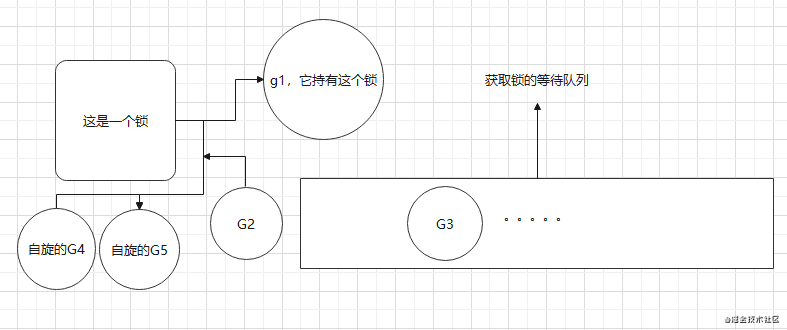
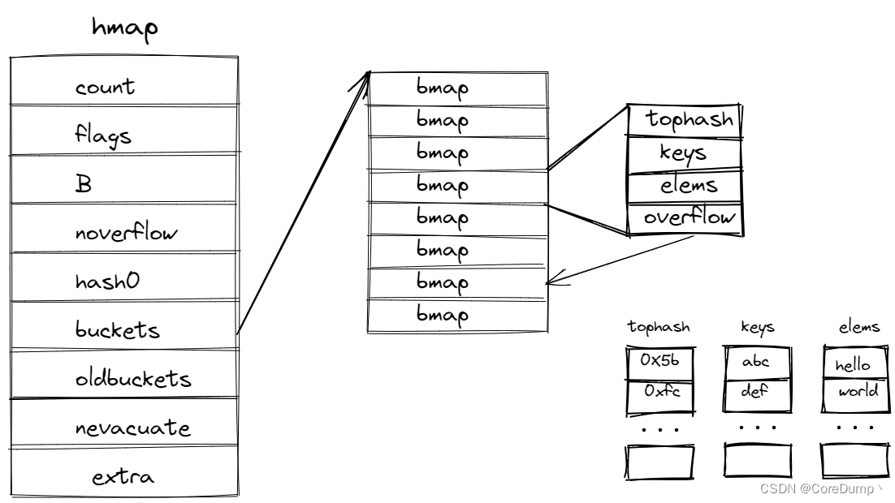
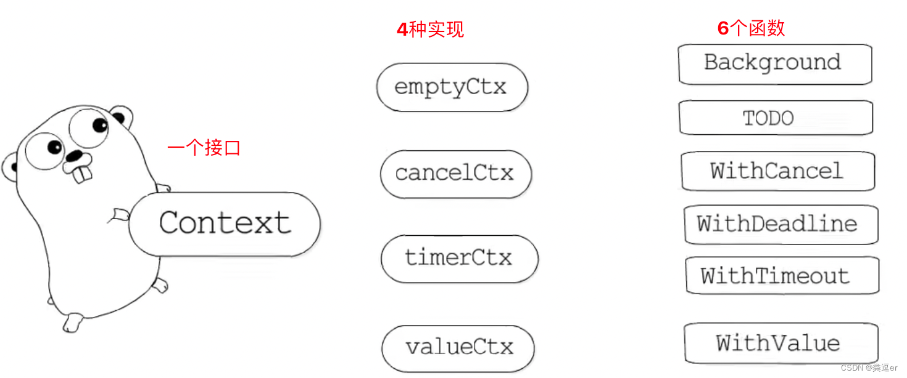
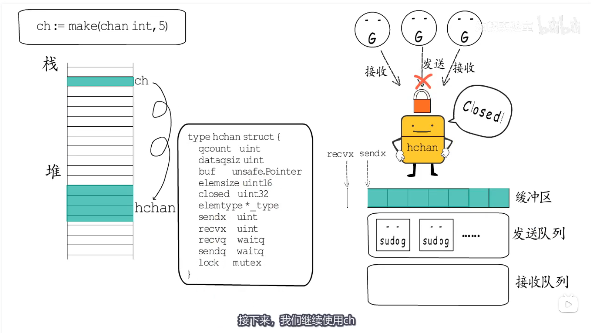

# 一. Mutex

https://www.proyy.com/6979626323081691173.html

https://zhuanlan.zhihu.com/p/501972241

Mutex在Go中是被放在sync包里面的，其中它的结构也非常的简单，大概长这样

```go
type Mutex struct {
	state int32
	sema  uint32
}
```

其中**state置为0的时候为未加锁的状态**，而为1的时候，则是加了锁的状态。另一个参数则是信号量，它的作用主要是用来在争抢锁的失败之后排队用的

## 1. 抢锁的模式

在Go一共可以分为两种抢锁的模式，一种是**正常模式**，另外一种是**饥饿模式**

在正常模式下，程序会让Goroutine有自旋的这一个状态，是因为为了避免频繁的唤起和睡眠Goroutine的过程中带来的大的开销，通过**自旋+队列排队**的方式，来增加更大的一个吞吐量，但是这种方式，很容易会出现一个尾端延迟执行的情况。

而在饥饿模式下，则会把Goroutine加入到队列中去，严格的按照顺序执行，这样就不会带来尾端延迟的问题，但相对应的，程序的吞吐量也就没有正常模式下来的高了。

### 1.1 正常模式

在刚开始的时候，是处于正常模式，也就是，当一个G1持有着一个锁的时候，G2会自旋的去尝试获取这个锁

当**自旋超过4次**还没有能获取到锁的时候，这个G2就会被加入到获取锁的等待队列里面，而这个G在队列中的顺序就是根据信号量来决定的。

这时候，如果G1释放了这个锁，这时候，G2就会被从队列中被唤醒，然后去竞争这个锁，这时候，不只是有一个G2在对锁进行争抢，还会有其他正在自旋中的G也在争抢这把锁。

这时候，因为G2是被唤醒来去抢锁的，相对于在CPU中本身已经的自旋状态的G4和G5，它更不容易获得这个锁，那么这时候，如果它获取锁失败的时候，**G2就会被重新加入到等待队列的头部**，继续下一轮的等待。

但是很明显，这样是不行的，这样会造成队列中的G长时间得不到执行，所以这时候就有了**饥饿模式**。



### 1.2 饥饿模式

**当处于等待队列中的Goroutine超过1ms没有获取到锁的时候，它的状态就会变成饥饿模式**

这个时候，如果G1把锁给释放出来的时候，**G2是可以直接获取到这个锁的**，而不用通过去争抢的方式，同时，**后续的G4和G5也不会进入自旋的状态**，而是直接的就进入到了等待队列后面去了

Mutex会回归到正常模式，那么回归正常模式必须具备的条件有以下几种：

1. G2的等待获取锁的时间小于1ms

2. 处于等待队列已经全部清空了

当满足上述两个条件的任意一个的时候，Mutex会切换回正常模式，而Go的抢锁的过程，就是在这个正常模式和饥饿模式中来回切换进行的。

## 2. Goroutine的自旋

自旋的状态必须满足下面的几个条件：

1. 必须是一个多核的机子
2. gomaxproces必须大于1
3. 除了正在运行的P以外，还必须要有其他的P也在处于running的状态
4. 当前run P的本地队列为空

只有同时满足了这四个条件，这个Goroutine才会进入一个自旋的状态。

# 二. RWMutex

**RWMutex是基于Mutex的，在Mutex的基础之上增加了读、写的信号量，并使用了类似引用计数的读锁数量**

读锁与读锁兼容，读锁与写锁互斥，写锁与写锁互斥，只有在锁释放后才可以继续申请互斥的锁

- **可以同时申请多个读锁**
- **有读锁时申请写锁将阻塞，有写锁时申请读锁将阻塞**
- **只要有写锁，后续申请读锁和写锁都将阻塞**

读写锁问题：

- **读优先**：读进程占有锁时，后来的读进程可以立即获得锁。这样做的好处是可以提高并发性能（后来的读进程不需要等待），坏处是如果读进程过多，会导致写进程一直处于等待中，出现写饥饿现象。
- **写优先**：写优先是指如果有写进程在等待锁，会阻止后来的读进程获得锁（当然也会阻塞写进程）。写优先保证的是新来的进程，这样就避免了写饥饿的问题。
- **不区分优先级**：不区分优先级。这个其实就是正常互斥锁的逻辑。

**强调**：Go 中 RWMutex 使用的是写优先的设计。

# 三. **select** 

https://www.bilibili.com/video/BV1kh411n79h/?spm_id_from=333.999.0.0&vd_source=4a3942c5bb87dd16844ff171c2ceec6c

select结构组成主要是由case语句和执行的函数组成的，select的case和switch不同，只能处理channel。

1. select仅支持channel

2. select出现读写nil的channel，该分支会被忽略

3. 每个case只能处理一个channel，要么读要么写

4. select 在遇到多个 Channel 同时响应时，会随机执行一种情况

5. 存在default语句，select将不会阻塞，但是会影响性能

# 四. Map

https://blog.csdn.net/Peerless__/article/details/125458742

https://www.bilibili.com/video/BV1Sp4y1U7dJ/?spm_id_from=333.999.0.0&vd_source=4a3942c5bb87dd16844ff171c2ceec6c

```go
// Go map 的底层结构体表示
type hmap struct {
    count     int    // map中键值对的个数，使用len()可以获取 
	flags     uint8
	B         uint8  // 哈希桶的数量的log2，比如有8个桶，那么B=3
	noverflow uint16 // 溢出桶的数量
	hash0     uint32 // 哈希种子

	buckets    unsafe.Pointer // 指向哈希桶数组的指针，数量为 2^B 
	oldbuckets unsafe.Pointer // 扩容时指向旧桶的指针，当扩容时不为nil 
	nevacuate  uintptr        

	extra *mapextra  // 可选字段
}

const (
	bucketCntBits = 3
	bucketCnt     = 1 << bucketCntBits     // 桶数量 1 << 3 = 8
)

// Go map 的一个哈希桶，一个桶最多存放8个键值对
type bmap struct {
    // tophash存放了哈希值的最高字节
	tophash [bucketCnt]uint8
    
    // 在这里有几个其它的字段没有显示出来，因为k-v的数量类型是不确定的，编译的时候才会确定
    // keys: 是一个数组，大小为bucketCnt=8，存放Key
    // elems: 是一个数组，大小为bucketCnt=8，存放Value
    // 你可能会想到为什么不用空接口，空接口可以保存任意类型。但是空接口底层也是个结构体，中间隔了一层。因此在这里没有使用空接口。
    // 注意：之所以将所有key存放在一个数组，将value存放在一个数组，而不是键值对的形式，是为了消除例如map[int64]所需的填充整数8（内存对齐）
    
    // overflow: 是一个指针，指向溢出桶，当该桶不够用时，就会使用溢出桶
}
```

## 2. 图解

map的底层为hmap结构体，其中包含了很多字段，buckets是一个数组，大小是2的B次方个。数组中的每一个是一个bmap结构体的哈希桶，bmap包含了4个字段，后面三个字段在编译时才能确定。tophash、keys、elems都是大小为8的数组，它们每个元素一一对应。
tophash存放哈希值的最高字节，keys存放了键，elems存放数据。
每个桶只能存放最多8个键值对，因此当某个桶不够用时，就会使用溢出桶，溢出桶是和普通桶在一起的，都是在buckets指向的bmap数组中，(实际上，当B > 4时，才会创建溢出桶，溢出桶的数量为 1 << (B - 4) )。overflow指向下一个溢出桶。下面为了画图方便，在B < 4时，也画了溢出桶，实际上是没有溢出桶的。

Go语言的map并没有将键值对一起存放，而是将键值分开存放。是因为如果存放在一起可能需要内存对齐，会导致空间的浪费，存放在一起会使内存更紧凑，也不会损失什么性能。



## 3. map的扩容

首先就是当可用空间不足时就需要扩容。其次当哈希碰撞比较严重时，很多数据都会落在同一个桶中，那么就会导致越来越多的溢出桶被链接起来。这样的话，查找的时候最坏的情况就是要遍历整个链表，时间复杂度很高，效率很低。而且当删除了很多元素后，可能会导致虽然有很多溢出桶，但是桶中的元素很稀疏。

map扩容的时机：

+ 达到最大的负载因子（6.5，也就是平均每个桶中k-v的数量大于6.5）
+ 溢出桶的数量太多

map扩容的类型：

- 等量扩容：数据不多但是溢出桶太多了（整理）
- 翻倍扩容：数据太多了

等量扩容，溢出桶太多了，导致查询效率低。扩容时，桶的数量不增加。

翻倍扩容，每个桶的k-v太多了，需要增加普通桶的数量，扩容后桶的数量为原来的两倍。

# 五. context

https://www.bilibili.com/video/BV19K411T7NL/?spm_id_from=333.999.0.0&vd_source=4a3942c5bb87dd16844ff171c2ceec6c



**应用场景**：在多个协程之间，传递截止时间、取消信号、请求相关的数据

**context概括为**：1个接口，4种实现，6个函数 

## 5.1  一个接口

```go
type Context interface {
	Deadline() (deadline time.Time, ok bool)
	Done() <-chan struct{}
	Err() error
	Value(key interface{}) interface{}
}
```

+ Deadline()：返回值(deadline time.Time, ok bool)
  + ok：表示有结束时间，否则表示无结束时间
  + time.Time：表示context的截止时间，通过此时间，函数就可以决定是否进行接下来的操作：①如果时间太短，就可以不往下面做了，否则浪费系统资源 ②也可以使用这个deadline来设置一个IO操作的超时时间

+ Done()
  + 返回一个只读的chan，类型为struct{}
  + 在goroutine中，如果该方法返回的chan可以读取，则意味着parent context已经发起了取消请求，通过Done方法收到这个信号后，就应该做清理操作，然后退出goroutine，释放资源

+ Err()：返回一个错误，表示channel被关闭的原因，例如：被取消、超时等

+ Value()：Value方法获取该Context上绑定的值，是一个键值对，所以要通过一个Key才可以获取对应的值，这个值一般是线程安全的

## 5.2 四种实现 + 六个函数

1. **emptyCtx**：emptyCtx对context的实现，只是简单的返回nil、false，实际上什么也没做

```
func Background() (ctx Context) 
作用：创建一个空ctx
```

2. **cancelCtx — 可取消的context**

```go
func WithCancel(parent Context) (ctx Context, cancel CancelFunc) 
作用：将context包装成cancelCtx，并提供一个取消函数cancel，调用它可以cancel对应的context
```

3.  **timerCtx — 超时取消的context**：timerCtx是在cancelCtx基础上，增加了定时器/截止时间功能，这样，①既可以根据需要主动取消，②也可以到达deadline时，通过timer来调用cancelCtx的取消函数

```
func WithTimeout(parent Context, timeout time.Duration) (Context, CancelFunc)
作用：将context包装成timerCtx ，并提供一个取消函数cancel和定时器，时间到则自动cancel
```

4. **valueCtx — 支持键值对打包**   

```go
func WithValue(parent Context, key, val any) Context
给context附加一个键值对信息，支持context传递数据
```

# 六. channel

https://www.bilibili.com/video/BV1kh411n79h/?spm_id_from=333.999.0.0&vd_source=4a3942c5bb87dd16844ff171c2ceec6c

## 1. 概念

+ channel分为两种类型：有缓存（size不为0）和无缓存（size为0）
+ channel有三种模式：写操作模式（单向通道），读操作模式（单向通道），读写操作模式（双相通道）
+ channel有三种状态：未初始化，正常，关闭

|      | 写操作模式      | 读操作模式       | 读写操作模式     |
| ---- | --------------- | ---------------- | ---------------- |
| 创建 | make(chan<-int) | make(<-chan int) | make（chan int） |

|      | 未初始化         | 正常             | 关闭                          |
| ---- | ---------------- | ---------------- | ----------------------------- |
| 关闭 | panic            | 正常关闭         | panic                         |
| 发送 | 永久阻塞导致死锁 | 阻塞或者发送成功 | panic                         |
| 接收 | 永久阻塞导致死锁 | 阻塞或者成功接收 | 缓冲区为空则为0值，否则继续读 |

注意点：

1. 一个channel不能关闭多次，会导致panic
2. 如果多个goroutine都监听同一个channel，那么channel上的数据随机被某个Goroutine进行消费
3. 如果多个goroutine都监听同一个channel，那么channel关闭，则所有Goroutine会收到退出信号

## 2. 底层数据结构和主要使用场景



channel底层的数据结构是由：一个buf循环数据，发送下标，接受下标，待发送缓存区和待接受缓存区，还有锁组成。

### 2.1 发送流程：

向channel发送数据大概分为两块：检查和数据发送

+ 如果channel的**读等待队列**存在接收者Goroutine。将数据直接发送给第一个等待的Goroutine，唤醒接收的Goroutine

+ 如果channel的**读等待队列**不存在接受者Goroutine
  1. 如果循环数据buf未满，那么将会把数据发送到循环队列的buf尾部
  2. 如果循环数据buf已满，这个时候就会走阻塞发送流程，将当前Goroutine加入**写等待队列**，并挂起等待唤醒

### 2.2 接收流程：

向channel接收数据大概分为两块：检查和数据发送

+ 如果channel的**写等待队列**存在发送至Goroutine
  + 如果是无缓存channel，直接从第一个发送至Goroutine那里把数据拷贝给接收变量，唤醒发送的Goroutine
  + 如果是有缓存channel（已满），将循环数组buf的队首元素拷贝的接收变量，将第一个发送者Goroutine的数据拷贝到buff循环数组队尾
+ 如果channel的**写等待队列**不存在发送者Goroutine
  + 如果循环数据buf非空，将循环数组buf的队首元素拷贝到接收变量
  + 如果循环数组buf为空，这个时候就走阻塞接收流程，将当前Goroutine加入读等待队列，并挂起等待唤醒

# 反射的原理

